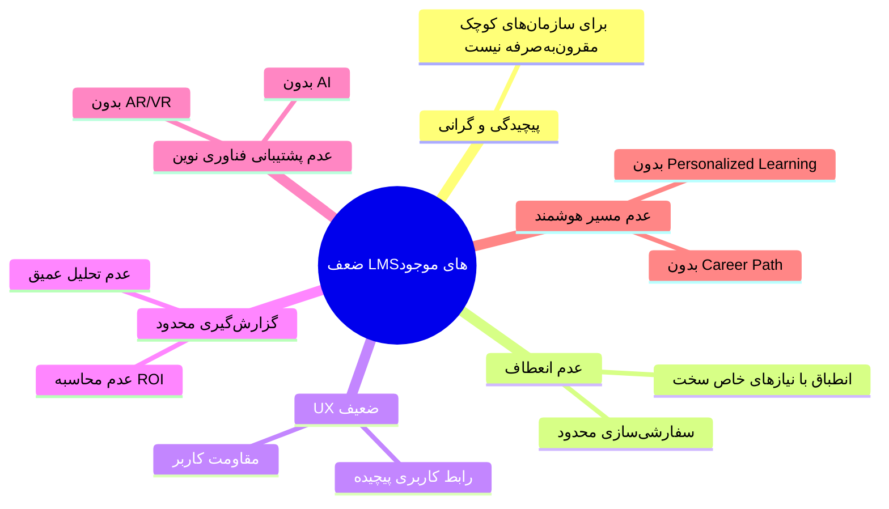

# 📖 ۰۱ — مقدمه و بیان مسئله

> [!abstract] خلاصه
> سند درخواست پیشنهاد (RFP) برای طراحی، پیاده‌سازی و راه‌اندازی سامانه مدیریت یادگیری (LMS) هوشمند برای شرکت مگفا. هدف: دریافت پیشنهادهای فنی و مالی از پیمانکاران واجد شرایط.

---

## ۱. مقدمه

این سند، درخواست پیشنهاد (RFP) جهت طراحی، پیاده‌سازی و راه‌اندازی سامانه مدیریت یادگیری (LMS) می‌باشد. هدف از این RFP، دریافت پیشنهادهای فنی و مالی از پیمانکاران واجد شرایط برای تأمین، توسعه و راه‌اندازی یک سامانه LMS مطابق با نیازهای آموزشی و توسعه‌ای واحد یادگیری الکترونیکی شرکت مگفا است.

---

## ۲. بیان مسئله و ضرورت پروژه

در دنیای کسب‌وکار امروز، تحول دیجیتال و اهمیت آموزش مداوم کارکنان، سازمان‌ها را به سمت استفاده از ابزارهای نوین سوق داده است. در کوچ کردن سازمان‌ها از آموزش‌های حضوری به سمت آموزش‌های مجازی، سامانه‌های مدیریت یادگیری (LMS) ابزاری حیاتی برای توانمندسازی سرمایه‌های انسانی، بهینه‌سازی فرایندهای آموزشی و ارتقای بهره‌وری سازمانی محسوب می‌شوند.

### ۲-۱. مسائل و فرصتهای موجود در بازار

#### ۱. نیاز رو به رشد بازار به ابزارهای آموزش دیجیتال
با افزایش دورکاری کارکنان به دلایل مختلف همچون تعطیلی و شرایط خاص، نیاز به بسترهای آموزشی آنلاین و انعطاف‌پذیر بیش از پیش احساس می‌شود. سازمان‌ها به دنبال راهکارهایی هستند که بتوانند بدون محدودیت زمانی و مکانی، هماهنگی‌ها و جلسات کاری خود را برگزار نمایند.

#### ۲. ناکافی بودن راهکارهای موجود LMS در بازار
بسیاری از LMSهای موجود در بازار که ترجمه و بومی شده نمونه‌های خارجی هستند:

#### ۳. هزینه‌های بالای پیاده‌سازی و نگهداری LMS برای مشتریان
- فرایندهای طولانی مشاوره و نیازسنجی، سفارشی‌سازی عمیق و نیاز به زیرساخت‌های پیچیده → هزینه اولیه بالا
- هزینه‌های جاری نگهداری، به‌روزرسانی و پشتیبانی فنی → بار مالی قابل توجه

---

### ۲-۲. فرصت برای مگفا

ما معتقدیم با طراحی و توسعه یک LMS نسل جدید، می‌توانیم به نیازهای برآورده نشده بازار پاسخ دهیم.

#### ۷ مزیت رقابتی پیشنهادی

| # | مزیت | توضیح |
|---|---|---|
| ۱ | راه‌حل مقرون‌به‌صرفه و مقیاس‌پذیر | هم برای سازمان‌های بزرگ و هم کسب‌وکارهای متوسط |
| ۲ | کاربری ساده و جذاب | تمرکز بر تجربه کاربری، استفاده لذت‌بخش |
| ۳ | انعطاف‌پذیری بالا در سفارشی‌سازی | انطباق با برندینگ، نیازمندی‌ها و فرایندهای خاص |
| ۴ | قابلیت‌های پیشرفته گزارش‌گیری و تحلیل | داشبوردهای مدیریتی هوشمند، سنجش ROI |
| ۵ | امکان توسعه و ادغام | بستر اتصال آسان به سیستم‌های سازمانی/دانشگاهی |
| ۶ | پشتیبانی از فناوری‌های نوین | AR/VR، AI |
| ۷ | هوشمندی | تولید محتوای هوشمند، مسیر یادگیری هوشمند، کارراهه شغلی |

---

### ۲-۳. ضرورت اجرای پروژه

تولید و عرضه این LMS به‌عنوان یک محصول مهم، نه تنها فرصتی برای ایجاد جریان درآمدی جدید و پایدار برای مگفا فراهم می‌کند، بلکه اعتبار و جایگاه ما را به‌عنوان ارائه‌دهنده راه‌حل‌های نوآورانه در حوزه فناوری آموزشی (EdTech) تثبیت خواهد کرد.

#### ۳ هدف استراتژیک
1. در بازار رو به رشد LMS سهم قابل توجهی به دست آوریم
2. با ارائه محصولی متمایز که قابلیت دریافت گواهینامه اَفتا (AFTA) هم دارد، نیازهای بخش بزرگی از بازار را پوشش دهیم
3. نام مگفا را به‌عنوان پیشرو در ارائه راه‌حل‌های نوین آموزشی مطرح سازیم

> [!quote] نتیجه
> این پروژه، گامی استراتژیک برای ورود ما به بازار EdTech و ایجاد یک مزیت رقابتی پایدار است که در بلندمدت، سودآوری و رشد قابل توجهی را برای شرکت به ارمغان خواهد آورد.

---

## 🔗 پیوندها

- بازگشت: [[MOC — RFP LMS مگفا]]
- بعدی: [[02-هدف پروژه]]

---

#مقدمه #بیان-مسئله #ضرورت #فرصت #استراتژی
