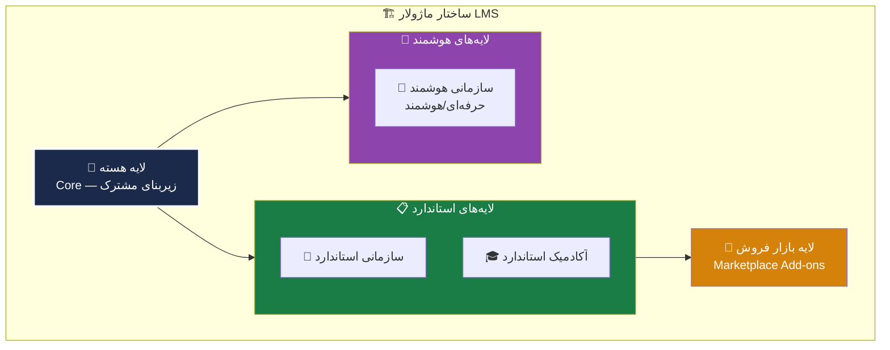

# 🎯 ۰۲ — هدف پروژه و ساختار کلی LMS

> [!abstract] خلاصه
> هدف اصلی: ایجاد یک سامانه مدیریت یادگیری (LMS) با قابلیت ارائه انواع دوره‌های آموزشی و یکپارچگی با سایر پلتفرم‌ها. ساختار: ماژولار با هسته مشترک + لایه‌های تخصصی.

---

## ۳. هدف پروژه

### هدف کلان
ایجاد یک **سامانه مدیریت یادگیری (LMS)** با قابلیت:
- ارائه انواع دوره‌های آموزشی (آفلاین، آنلاین، حضوری و ترکیبی)
- مدیریت فراگیران
- پیگیری پیشرفت آموزشی
- تولید گزارش‌های مدیریتی
- **قابلیت یکپارچگی** با سایر پلتفرم‌ها و سامانه‌های آموزشی و سازمانی

### ۵ هدف تفصیلی
1. هوشمندسازی و دیجیتالی‌سازی فرایند آموزش کارکنان
2. مدیریت منسجم و ساده‌تر دوره‌های آموزشی/سازمانی
3. استانداردسازی فرایندهای آموزش‌های ضمن خدمت
4. امکان ثبت‌نام، آزمون، صدور گواهی، کارنامه و گزارش‌گیری آنلاین
5. کمک به کارکنان در طی کردن کارراهه شغلی (Career Path)

---

## ۴. ساختار کلی این LMS

### تصمیم معماری کلیدی: رویکرد ماژولار

> [!important] تصمیم اصلی
> به لحاظ فنی این امکان وجود دارد که یک LMS واحد تولید شود که هم پاسخگوی نیازهای دانشگاه‌ها باشد و هم شرکت‌ها، اما **نه به‌صورت یک نسخه کاملاً یکسان و ساده**. این ساختار باید به‌صورت **ماژولار** طراحی شود.

### ۴ لایه اصلی

### ۴ لایه به تفکیک

| # | لایه | توضیح |
|---|---|---|
| ۱ | **لایه هسته (Core)** | زیربنای مشترک طرح |
| ۲ | **لایه سازمانی (Enterprise Layer/Add-ons)** | شامل: نسخه استاندارد – نسخه هوشمند حرفه‌ای/هوشمند |
| ۳ | **لایه آکادمیک (Academic Layer/Add-ons)** | ویژه دانشگاه‌ها |
| ۴ | **لایه بازار فروش (Marketplace Add-ons)** | پنل فروش مدرس |

---

## 🆚 تفاوت‌های مهم LMS دانشگاهی و سازمانی

> [!warning] توجه
> توجه به الزامات سازمانی و الزامات آکادمیک بسیار مهم است.

| مشخصه | دانشگاه/آموزشی | سازمان/شرکت |
|---|---|---|
| هدف اصلی | آموزش و ارزیابی تحصیلی | ارتقای عملکرد و انطباق سازمانی |
| ساختار آموزشی | درس، ترم، استاد، واحد درسی | دوره، مسیر یادگیری، نقش شغلی |
| کاربران | دانشجو، استاد | کارمند، مدیر |
| ارزیابی | تکلیف، آزمون، نمره، کارنامه | آزمون، مهارت‌سنجی، گواهی، KPI |
| گزارش‌ها | حضور، نمره | پیشرفت، انطباق، شکاف مهارتی |
| یکپارچگی | سامانه‌های آموزش دانشگاه | سامانه‌های سازمانی |
| سیاست دسترسی | رشته/ترم/کلاس | واحد سازمانی/سطح شغلی |
| مدل استقرار | ساده‌تر و آموزشی‌تر | سفارشی‌تر |

### مزایای این رویکرد ماژولار

| مزیت | توضیح |
|---|---|
| ۱. هزینه توسعه کمتر | به جای تولید دو محصول، یک موتور اصلی داریم |
| ۲. بازار بزرگتر | هم دانشگاه هم سازمان را می‌توانیم هدف بگیریم |
| ۳. پیام برند قوی‌تر | «یک پلتفرم یادگیری منعطف برای آموزش، ارزیابی و توسعه در محیط‌های دانشگاهی و سازمانی» |

---

## 🔗 پیوندها

- بازگشت: [[MOC — RFP LFS مگفا]]
- قبلی: [[01-مقدمه و بیان مسئله]]
- بعدی: [[03-ساختار کلی LMS]] (همین فایل)
- جزئیات معماری: [[04-معماری محصول]]

---

#هدف #ساختار #ماژولار #معماری #Core #Enterprise #Academic #Marketplace
