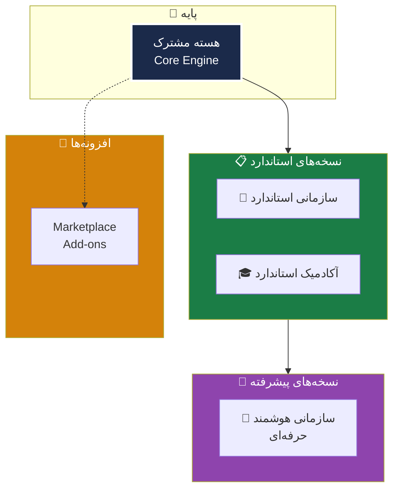
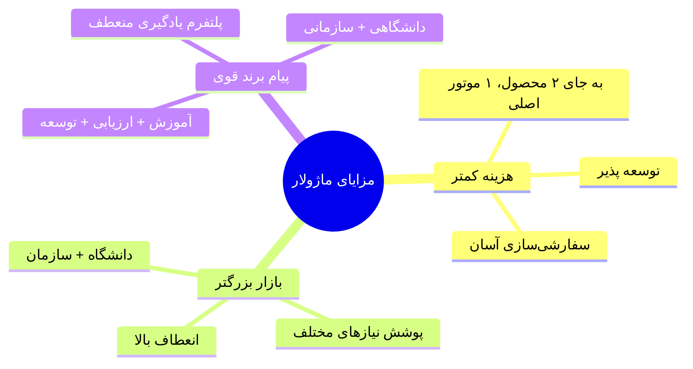

# 🏗️ ۰۳ — ساختار کلی LMS

> [!abstract] خلاصه
> ساختار ماژولار LMS شامل هسته مشترک + لایه‌های تخصصی. این رویکرد به جای تولید دو LMS جداگانه، یک موتور اصلی توسعه‌پذیر با قابلیت سفارشی‌سازی ایجاد می‌کند.

---

## 🎯 تصمیم استراتژیک

به لحاظ فنی این امکان وجود دارد که یک LMS واحد تولید شود که هم پاسخگوی نیازها و خواسته‌های دانشگاه‌ها و مجموعه‌های آموزشی باشد و هم شرکت‌ها و سازمان‌ها، اما **نه به‌صورت یک نسخه کاملاً یکسان و ساده**.

این ساختار باید به‌صورت **ماژولار** طراحی شود شامل:
- یک **هسته** که در عمل هسته بخش مشترک است
- لایه‌های کاربردی، فرایندها، گزارش‌ها و مدل استقرار باید **متفاوت** شوند و بر حسب نیاز در دسترس قرار می‌گیرند

---

## 📊 نمودار ساختار ماژولار

---

## 📦 ۴ لایه اصلی

### ۱. لایه هسته (Core)
- زیربنای مشترک طرح
- **یکبار ساخته می‌شود**
- برای هر دو بازار (دانشگاهی + سازمانی) قابل استفاده

### ۲. لایه سازمانی (Enterprise Layer / Add-ons)
شامل دو نسخه:
- **نسخه استاندارد** — مدیریت پایه یادگیری سازمانی
- **نسخه هوشمند حرفه‌ای/هوشمند** — شامل Gamification + AI + Marketplace

### ۳. لایه آکادمیک (Academic Layer / Add-ons)
- ویژه دانشگاه‌ها و مجموعه‌های آموزشی
- شامل ساختار ترمیک، نمره‌دهی، یکپارچگی SIS

### ۴. لایه بازار فروش (Marketplace Add-ons)
- پنل فروش مستقل توسط مدرسین
- LMS as a Marketplace

---

## 💰 مزایای این رویکرد

---

## 🆚 مقایسه LMS دانشگاهی و سازمانی

| مشخصه | دانشگاه/آموزشی | سازمان/شرکت |
|---|---|---|
| هدف اصلی | آموزش و ارزیابی تحصیلی | ارتقای عملکرد و انطباق سازمانی |
| ساختار آموزشی | درس، ترم، استاد، واحد درسی | دوره، مسیر یادگیری، نقش شغلی |
| کاربران | دانشجو، استاد | کارمند، مدیر |
| ارزیابی | تکلیف، آزمون، نمره، کارنامه | آزمون، مهارت‌سنجی، گواهی، KPI |
| گزارش‌ها | حضور، نمره | پیشرفت، انطباق، شکاف مهارتی |
| یکپارچگی | سامانه‌های آموزش دانشگاه | سامانه‌های سازمانی |
| سیاست دسترسی | رشته/ترم/کلاس | واحد سازمانی/سطح شغلی |
| مدل استقرار | ساده‌تر و آموزشی‌تر | سفارشی‌تر |

---

## 🔗 پیوندها

- بازگشت: [[MOC — RFP LMS مگفا]]
- قبلی: [[02-هدف پروژه]]
- بعدی: [[04-معماری محصول]]
- جزئیات لایه‌ها: [[Core Engine — لایه هسته]]، [[Enterprise Standard Layer — لایه سازمانی استاندارد]]، [[Academic Layer — لایه آکادمیک]]، [[Marketplace Layer — لایه بازار فروش]]

---

#ساختار #ماژولار #معماری #Core #Enterprise #Academic
