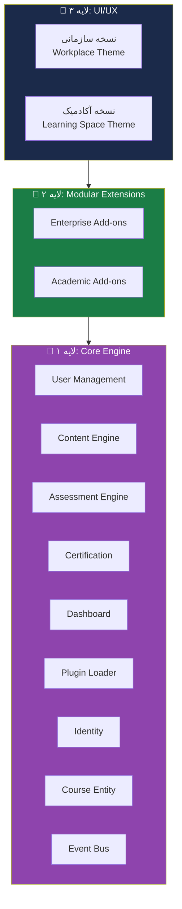
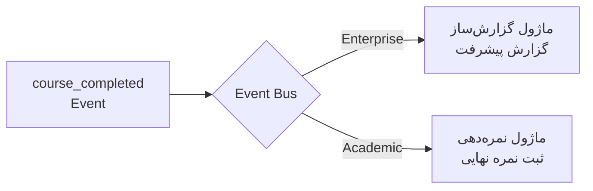
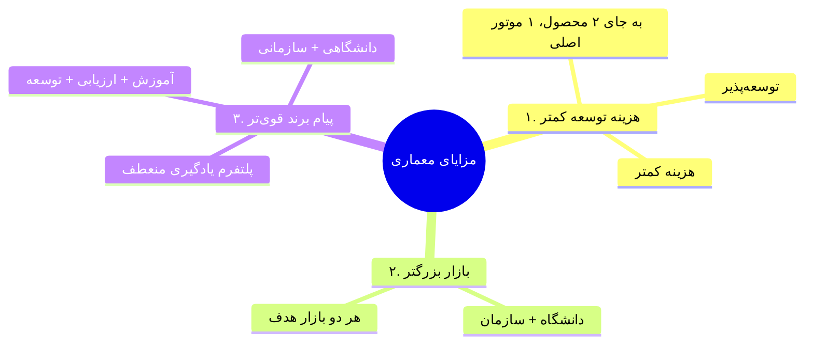

# 🏗️ ۰۴ — معماری محصول (Product Architecture)

> [!abstract] خلاصه
> معماری محصول شامل ۳ لایه اصلی است: لایه هسته (Core Engine)، لایه تخصصی (Modular Extensions) و لایه UI/UX. این معماری اجازه می‌دهد ماژول‌های مختلف روی هسته سوار شوند.

---

## 📐 ۳ لایه معماری

---

## ۵-۱. لایه هسته (Core Engine) — زیربنای مشترک

> [!important] نکته کلیدی
> این بخش «موتور اصلی» پلتفرم است که در هر دو LMS (دانشگاهی و سازمانی) **بدون تغییر** باقی می‌ماند.

### ۵ مؤلفه اصلی لایه هسته

| # | مؤلفه | توضیح |
|---|---|---|
| ۱ | مدیریت کاربران (User Management) | نقش‌ها، پروفایل، احراز هویت، دسته‌بندی |
| ۲ | موتور محتوا (Content Delivery Engine) | آپلودر، پلیر ویدیو/پادکست، PDF، SCORM، H5P |
| ۳ | سیستم ارزیابی (Assessment Engine) | بانک سؤال، انواع سؤال، آزمون‌ساز |
| ۴ | صدور گواهی (Certification Engine) | گواهی دیجیتال با استعلام و بارکد |
| ۵ | داشبورد تعاملی | پیشرفت کاربر، اعلان‌ها، یادآوری |

### ۴ جزء فنی راهبردی لایه هسته

#### ۱. مدیریت ماژولار (Plugin Loader)
- اجازه می‌دهد Enterprise و Academic روی هسته سوار شوند
- هنگام بوت، ماژول‌های فعال را در Routes قرار می‌دهد

#### ۲. لایه هویت و دسترسی (Access & Identity)
- سیستم Identity عمومی (نه فقط دانشجو/کارمند)
- در فاز سازمانی: `Organization ID`
- در فاز آکادمیک: `Student Number`

#### ۳. ساختار محتوا (Course Entity)
- مفهوم «دوره» به‌صورت Generic
- یک Container برای انواع محتوا (SCORM، متن، ویدیو، فایل)
- در فاز سازمانی: دوره ضمن خدمت
- در فاز آکادمیک: کلاس درسی ترمیک

#### ۴. زیرساخت ایونت (Event-Driven Architecture)
> [!warning] مهم‌ترین بخش برای آینده
> وقتی کاربر دوره‌ای را تمام کرد، سیستم ایونت `course_completed` منتشر می‌کند.

→ جزئیات کامل: [[Core Engine — لایه هسته]]

---

## ۵-۲. لایه تخصصی (Modular Extensions) — کلید تمایز

> [!info] تعریف
> این لایه‌ها «پلاگین‌هایی» هستند که بسته به نوع مشتری، روی هسته فعال می‌شوند.

### ۵-۲-۱. لایه سازمانی (Enterprise Add-ons)

#### ۴ مؤلفه اصلی سازمانی
1. مسیرهای یادگیری (Learning Paths)
2. پنل گزارش مدیریتی (Compliance + Skill Gap)
3. یکپارچگی سطح بالا (ERP + HRIS)
4. مدیریت واحدها (Organizational Hierarchy)

#### ۴ جزء فنی راهبردی سازمانی
1. **ساختار سازمانی (Org Hierarchy)** — کاربر در چارت سازمانی (مدیر → واحد → تیم → کارشناس)
2. **مسیرهای یادگیری و شایستگی (Competency Management)** — آموزش گره خورده به شغل
3. **گزارش‌دهی هوشمند (BI/Analytics)** — نرخ تکمیل، اثربخشی، صرفه‌جویی
4. **یکپارچگی HRIS** — ساخت خودکار اکانت برای کارمند جدید، مسدودسازی اکانت اخراج‌شده

→ جزئیات کامل: [[Enterprise Standard Layer — لایه سازمانی استاندارد]]

### ۵-۲-۲. لایه آموزشی (Academic Add-ons)

#### ۵ مؤلفه اصلی آکادمیک
1. سیستم مدیریت ترم و کلاس (تعریف ترم، واحد درسی، پیش‌نیاز، همنیاز)
2. سیستم تکالیف و ارزیابی کیفی
3. نمرات (محاسبه معدل، سقف واحد بر اساس معدل)
4. تعاملات کلاسیک (Forum، گروه‌بندی، تقویم کلاسی)
5. یکپارچگی با سیستم‌های مدیریت آموزشی دانشگاه

#### ۴ جزء فنی راهبردی آکادمیک
1. **ساختار ترمیک و بازه‌های زمانی** — کاربر همیشه در «ترم فعال»
2. **مدیریت قوانین درسی (Rules Engine)** — بررسی پیش‌نیاز قبل از ثبت‌نام
3. **سیستم نمره‌دهی** — فرمول‌ساز با وزن قابل تنظیم (۳۰٪ امتحان + ۴۰٪ تکلیف + ۳۰٪ حضور)
4. **یکپارچگی با SIS** — Import از گلستان/سجاد، Export نمرات

→ جزئیات کامل: [[Academic Layer — لایه آکادمیک]]

---

## ۵-۳. لایه UI/UX — ظاهر و تجربه کاربری

> [!important] تفاوت UI در دو نسخه
> بسته به اینکه مشتری سازمان است یا دانشگاه، رابط کاربری و تجربه کاربری متفاوت می‌شود.

| نسخه | تمرکز UI |
|---|---|
| **دانشگاهی** | فضای یادگیری (Learning Space)، کلاس‌محوری، تعامل دانشجو و استاد |
| **سازمانی** | فضای کار (Workplace)، مدیریت‌محوری، دسترسی سریع به دوره‌های اجباری |

---

## 💡 ۳ مزیت این رویکرد معماری

---

## 🔗 پیوندها

- بازگشت: [[MOC — RFP LMS مگفا]]
- قبلی: [[03-ساختار کلی LMS]]
- بعدی: [[05-فعالیت‌های کلیدی و تحویلی]]
- جزئیات لایه‌ها: [[Core Engine — لایه هسته]]، [[Enterprise Standard Layer — لایه سازمانی استاندارد]]، [[Academic Layer — لایه آکادمیک]]، [[Marketplace Layer — لایه بازار فروش]]
- دیاگرام‌ها: [[دیاگرام معماری کلی]]

---

#معماری #Product-Architecture #Core #Enterprise #Academic #UI-UX
