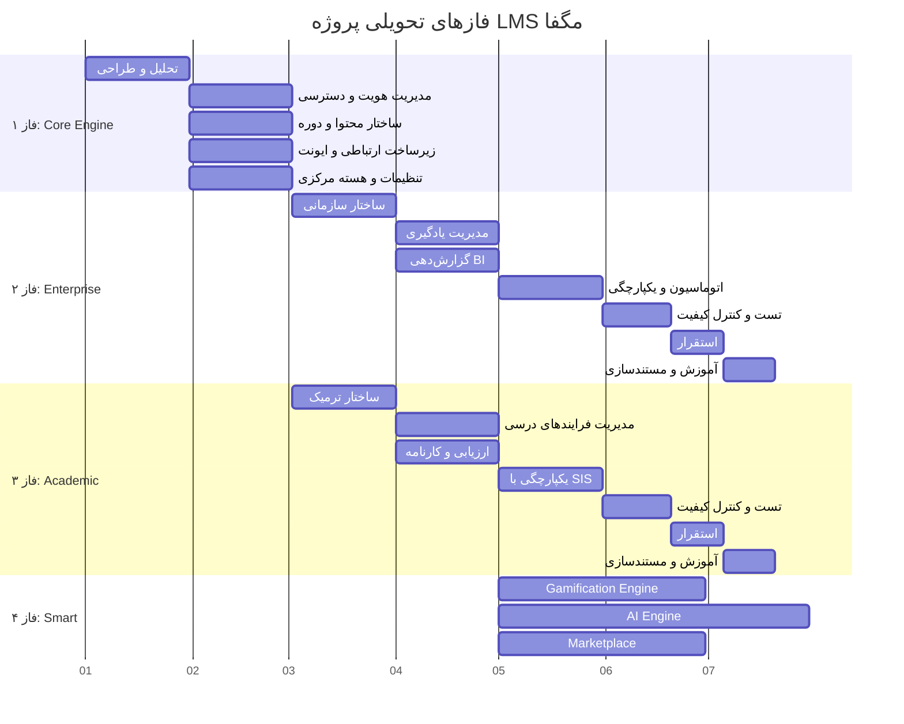

# 📦 ۰۵ — فعالیت‌های کلیدی و اقلام تحویلی

> [!abstract] خلاصه
> این بخش مواردی که مجری باید در هر قسمت پروژه تحویل دهد را به تفصیل و با جزییات ذکر می‌کند. شامل ۳ فاز اصلی + ۱ فاز هوشمند.

---

## 📊 ۴ فاز تحویلی

---

## ۱. فاز ۱: زیرساخت هسته (Core Engine)

| # | لایه | فعالیت‌های کلیدی | خروجی‌های اصلی |
|---|---|---|---|
| ۱ | تحلیل و طراحی | جمع‌آوری و تحلیل نیازمندی‌ها، طراحی معماری سیستم | سند نیازمندی‌های محصول، سند معماری سیستم |
| ۲ | مدیریت هویت و دسترسی | طراحی User/Role/Permission، JWT، احراز هویت عمومی | سرویس Auth، APIهای login/register |
| ۳ | ساختار محتوا و دوره | طراحی Course Entity، انواع محتوا، گروهبندی | ساختار دیتابیس منعطف، CRUD دوره |
| ۴ | زیرساخت ارتباطی و ایونت | Event Bus، لاگینگ مرکزی، Webhook | Audit Log، API Gateway |
| ۵ | تنظیمات و هسته مرکزی | Tenant/Config، Plugin Loader | پنل System Admin، فعال/غیرفعال ماژول‌ها |

→ جزئیات: [[Core Engine — لایه هسته]]

---

## ۲. فاز ۲: توسعه ماژول سازمانی (Enterprise) — نسخه استاندارد

| # | لایه | فعالیت‌های کلیدی | خروجی‌های اصلی |
|---|---|---|---|
| ۱ | ساختار سازمانی و دسترسی | تعریف دپارتمان‌ها، RBAC چندلایه، SSO/LDAP | ساختار درختی سازمان، اتصال AD/LDAP |
| ۲ | مدیریت یادگیری و مسیر شغلی | Learning Paths، Skills | داشبورد پیشرفت فردی |
| ۳ | گزارش‌دهی و BI | موتور گزارش‌ساز داینامیک | داشبوردهای مدیریتی، تحلیل شکاف مهارت |
| ۴ | اتوماسیون و یکپارچگی | Webhook، ERP/HRIS، Workflow | Connector اختصاصی، اتوماسیون انتساب دوره |
| ۵ | تست و کنترل کیفیت | Unit/Integration Tests، UAT | گزارش نتایج تست‌ها |
| ۶ | استقرار و راه‌اندازی | نصب، انتقال داده | محیط LMS عملیاتی |
| ۷ | آموزش و مستندسازی | جلسات آموزشی | User Manual + Admin Guide |

→ جزئیات: [[Enterprise Standard Layer — لایه سازمانی استاندارد]]

---

## ۳. فاز ۳: توسعه ماژول آکادمیک (Academic)

| # | لایه | فعالیت‌های کلیدی | خروجی‌های اصلی |
|---|---|---|---|
| ۱ | ساختار ترمیک و زمانی | تعریف چارت تحصیلی، مدیریت ترم‌ها | تقویم آموزشی، ماژول مدیریت بازه‌های زمانی |
| ۲ | مدیریت فرایندهای درسی | تعریف دروس، پیش‌نیاز/همنیاز، ظرفیت | سیستم Courses Catalog، قوانین پیش‌نیاز |
| ۳ | ارزیابی و کارنامه | تعریف روش‌های نمره‌دهی، اعتراض | سیستم محاسبه نمره، پنل نمره‌دهی استاد، کارنامه دانشجو |
| ۴ | یکپارچگی با SIS | درگاه تبادل داده با گلستان/سجاد/... | کانکتور اختصاصی SIS، سرویس انتقال نمرات |
| ۵ | تست و کنترل کیفیت | Unit/Integration Tests، UAT | گزارش نتایج تست‌ها |
| ۶ | استقرار و راه‌اندازی | نصب، انتقال داده | محیط LMS عملیاتی |
| ۷ | آموزش و مستندسازی | جلسات آموزشی | User Manual + Admin Guide |

→ جزئیات: [[Academic Layer — لایه آکادمیک]]

---

## ۴. فاز ۴: توسعه ماژول‌های هوشمند

### ۴-۱. Gamification Engine (۹ زیرماژول)

| # | زیرماژول | خروجی‌های اصلی |
|---|---|---|
| ۱ | موتور امتیازدهی (Point Engine) | موتور امتیازدهی قابل پیکربندی، Rule Table، API |
| ۲ | سیستم نشان (Badge/Achievement) | ماژول صدور Badge، کتابخانه قالب گرافیکی |
| ۳ | سطح‌بندی و پیشرفت (Level/Progress) | سیستم Level Up، نوار پیشرفت، API |
| ۴ | رتبه‌بندی و لیدربورد | ماژول رتبه‌بندی، فیلترهای زمانی |
| ۵ | قوانین پاداش (Reward Rules) | موتور قواعد پاداش، پنل تنظیمات |
| ۶ | شخصی‌سازی تجربه | موتور شخصی‌سازی، فعال/غیرفعال‌سازی |
| ۷ | داشبورد مدیران | داشبورد مدیریتی، گزارش تحلیلی |
| ۸ | اعلان‌ها و محرک‌های رفتاری | ماژول اعلان هوشمند، الگوهای پیام |
| ۹ | قوانین ضدتقلب | مکانیزم کنترل تقلب، گزارش رخدادهای مشکوک |

### ۴-۲. AI Engine (۵ زیرماژول)

| # | زیرماژول | خروجی‌های اصلی |
|---|---|---|
| ۱ | موتور پیشنهاددهی (Recommender) | API سرویس پیشنهاد دوره، Content-based + Collaborative filtering |
| ۲ | تحلیل شکاف مهارتی (Skill-Gap) | داشبورد Skill-Gap، خروجی JSON |
| ۳ | پشتیبانی هوشمند (AI Tutor/Chatbot) | ربات پشتیبان هوشمند، مستندات Fine-tuning |
| ۴ | ارزیابی و تشخیص تقلب (Proctoring) | سیستم Anomaly Detection، گزارش‌های هشدار |
| ۵ | داشبورد پیش‌بینی (Predictive) | مدل Risk Scoring، نمودارهای تحلیلی |

### ۴-۳. Marketplace (۷ قابلیت)

| # | قابلیت |
|---|---|
| ۱ | تعریف درصد کمیسیون طرفین |
| ۲ | تسویه حساب با مدرس |
| ۳ | گزارشات فروش |
| ۴ | کوپن تخفیف |
| ۵ | امتیازدهی و نظرات کاربران |
| ۶ | سبد خرید مشتری |
| ۷ | پرداخت آنلاین |

→ جزئیات: [[Enterprise Smart Layer — لایه سازمانی هوشمند]]، [[Marketplace Layer — لایه بازار فروش]]

---

## 📊 خلاصه آماری

| فاز | تعداد لایه‌ها | مدت تخمینی |
|---|---|---|
| فاز ۱: Core | ۵ لایه | ۵-۶ ماه |
| فاز ۲: Enterprise Std | ۷ لایه | ۵-۶ ماه |
| فاز ۳: Academic | ۷ لایه | ۵-۶ ماه |
| فاز ۴: Smart (Gamif + AI + MP) | ۹ + ۵ + ۷ = ۲۱ زیرماژول | ۶-۸ ماه |
| **جمع کل** | **۴۰ لایه/زیرماژول** | **۱۸-۲۴ ماه** |

---

## 🔗 پیوندها

- بازگشت: [[MOC — RFP LMS مگفا]]
- قبلی: [[04-معماری محصول]]
- بعدی: [[06-ویژگی‌های نسخه استاندارد]]
- جزئیات فازها: [[Core Engine — لایه هسته]]، [[Enterprise Standard Layer — لایه سازمانی استاندارد]]، [[Academic Layer — لایه آکادمیک]]، [[Enterprise Smart Layer — لایه سازمانی هوشمند]]

---

#تحویلی #فاز #Deliverables #Phases #Gamification #AI #Marketplace
