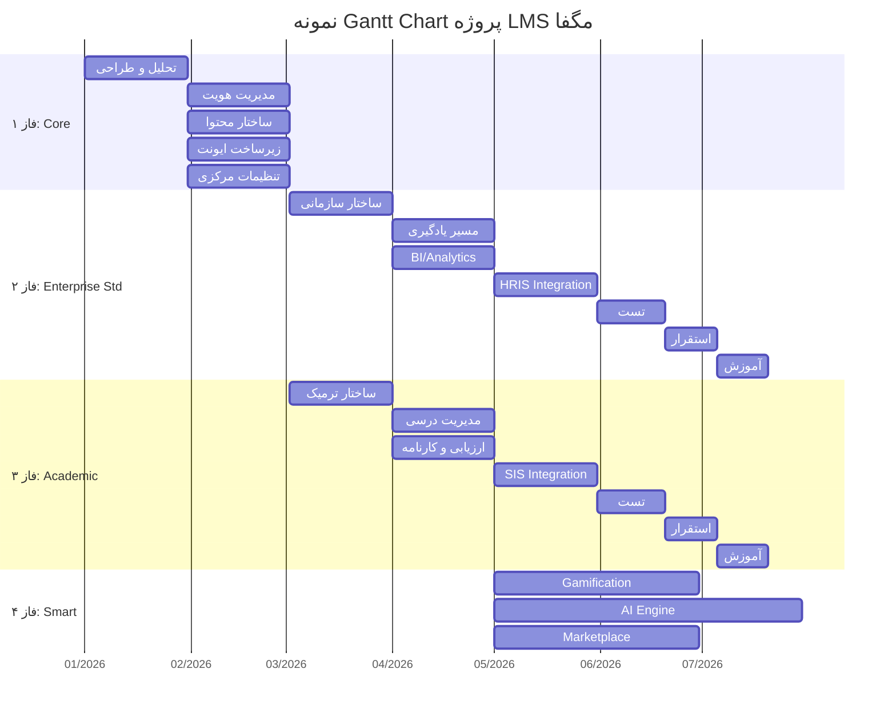

# 📝 ۰۸ — ارائه پیشنهاد

> [!abstract] خلاصه
> پیشنهاددهندگان باید علاوه بر ارائه توضیحات لازم، مبسوط و مرتبط با جزییات پروژه، نسبت به ارائه **برنامه زمان‌بندی (Gantt Chart)** و **برآورد هزینه پروژه به تفکیک مراحل (فازها)** اقدام نمایند.

---

## 📋 الزامات پیشنهاد

### ۱. توضیحات فنی
- تطابق با نیازهای RFP
- حتی بهینه‌سازی پروژه
- مبسوط و مرتبط با جزییات

### ۲. برنامه زمان‌بندی (Gantt Chart)

قالب نمونه Gantt Chart:

| ردیف | فعالیت | وزن (ماه) | مدت زمان (ماه) | ۱ | ۲ | ۳ | ۴ | ۵ | ۶ | ۷ | ۸ | ۹ | ۱۰ | ۱۱ | ۱۲ | ۱۳ | ۱۴ | ۱۵ | ... |
|---|---|---|---|---|---|---|---|---|---|---|---|---|---|---|---|---|---|---|

### ۳. برآورد هزینه به تفکیک فازها
- فاز ۱: Core Engine
- فاز ۲: Enterprise Standard
- فاز ۳: Academic
- فاز ۴: Enterprise Smart (Gamification + AI + Marketplace)

---

## 📊 نمونه Gantt Chart پیشنهادی

---

## 📝 چک‌لیست پیشنهاد

> [!check] قبل از تحویل پیشنهاد، موارد زیر را بررسی کنید

- [ ] توضیحات فنی مبسوط و مرتبط با جزییات پروژه
- [ ] تطابق با نیازهای RFP
- [ ] بهینه‌سازی پیشنهادی برای پروژه
- [ ] Gantt Chart با قالب نمونه
- [ ] برآورد هزینه به تفکیک فازها
- [ ] وزن هر فعالیت (ماه)
- [ ] مدت زمان هر فعالیت (ماه)
- [ ] زمان‌بندی ۱۵ ماهه (یا متناسب با پیشنهاد)

---

## 🔗 پیوندها

- بازگشت: [[MOC — RFP LMS مگفا]]
- قبلی: [[07-ویژگی‌های نسخه هوشمند سازمانی]]

---

#پیشنهاد #Gantt #هزینه #زمان‌بندی #Proposal
