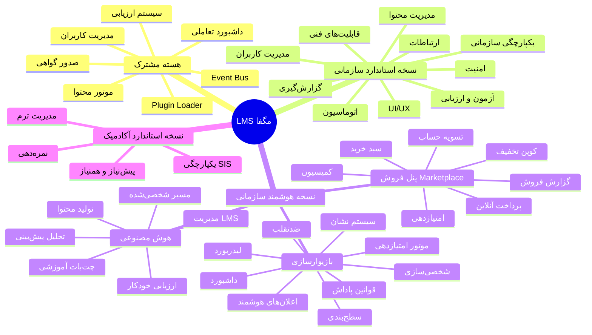
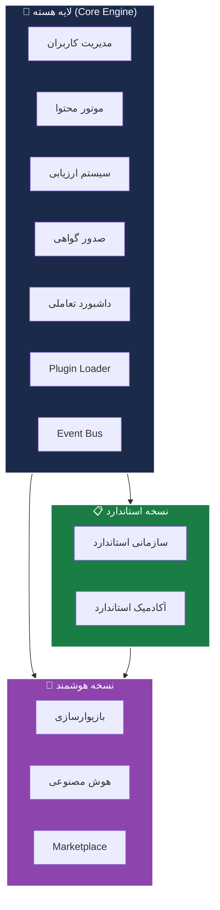

# 🗺️ MOC — RFP سامانه مدیریت یادگیری هوشمند مگفا

> [!info] اطلاعات سند
> - **صادرکننده:** مرکز گسترش فناوری اطلاعات (مگفا) — www.magamooz.com
> - **نسخه:** 3.0
> - **تاریخ:** تیر ۱۴۰۵
> - **عنوان:** طراحی و توسعه LMS هوشمند
> - **هدف:** دریافت پیشنهاد فنی و مالی از پیمانکاران واجد شرایط

---

## 🎯 ورود سریع (Quick Navigation)

این نقشه محتوا، نقطه ورود اصلی برای درک RFP است. روی هر لینک کلیک کنید تا به جزئیات آن بخش بروید.

### 📋 بخش‌های اصلی RFP
- [[01-مقدمه و بیان مسئله]]
- [[02-هدف پروژه]]
- [[03-ساختار کلی LMS]]
- [[04-معماری محصول]]
- [[05-فعالیت‌های کلیدی و تحویلی]]
- [[06-ویژگی‌های نسخه استاندارد]]
- [[07-ویژگی‌های نسخه هوشمند سازمانی]]
- [[08-ارائه پیشنهاد]]

---

## 🏗️ نقشه معماری (Architecture Map)

---

## 🔄 فلوچارت کلی معماری

---

## 📊 آمار کلیدی RFP

| شاخص | مقدار |
|---|---|
| **تعداد فاز تحویلی** | ۳ فاز + ۱ فاز هوشمند |
| **تعداد لایه معماری** | ۴ لایه (Core, Enterprise Std, Enterprise Smart, Academic) |
| **بخش‌های ویژگی استاندارد** | ۱۰ بخش |
| **بخش‌های ویژگی هوشمند** | ۳ بخش (Gamification, AI, Marketplace) |
| **زیرماژول‌های گیمفیکیشن** | ۹ زیرماژول |
| **زیرماژول‌های AI** | ۵ زیرماژول |
| **استانداردهای پشتیبانی** | SCORM 1.2, SCORM 2004, xAPI, HTML5 |
| **گواهینامه رسمی** | اَفتا (AFTA) |

---

## 🔗 پیوندهای متقابل (Cross-References)

### لایه‌ها
- [[Core Engine — لایه هسته]]
- [[Enterprise Standard Layer — لایه سازمانی استاندارد]]
- [[Enterprise Smart Layer — لایه سازمانی هوشمند]]
- [[Academic Layer — لایه آکادمیک]]
- [[Marketplace Layer — لایه بازار فروش]]

### فازهای تحویلی
- [[فاز ۱ — Core Engine]]
- [[فاز ۲ — Enterprise Standard]]
- [[فاز ۳ — Academic]]
- [[فاز ۴ — Enterprise Smart]]

### ویژگی‌ها
- [[مدیریت محتوای آموزشی]]
- [[مدیریت کاربران و نقش‌ها]]
- [[آزمون تکلیف و ارزیابی]]
- [[گزارش‌گیری و آنالیز]]
- [[ارتباطات و تعامل]]
- [[خودکارسازی فرایندها]]
- [[یکپارچگی سازمانی]]
- [[UI/UX]]
- [[امنیت و کنترل دسترسی]]
- [[قابلیت‌های فنی]]
- [[بازیوارسازی]]
- [[هوش مصنوعی]]
- [[پنل فروش Marketplace]]

### دیاگرام‌ها
- [[دیاگرام معماری کلی]]
- [[دیاگرام گیمفیکیشن]]
- [[دیاگرام هوش مصنوعی]]
- [[دیاگرام Event Flow]]
- [[Canvas گرافیکی RFP]]

---

## 📚 راهنمای استفاده از این Vault

> [!tip] برای کارکنان
> 1. از این صفحه شروع کنید
> 2. روی هر لینک کلیک کنید تا به جزئیات بروید
> 3. از **Graph View** (Ctrl+G) برای دیدن ارتباطات استفاده کنید
> 4. از **Canvas** برای دیدن بصری کلی استفاده کنید

> [!warning] پلاگین‌های مورد نیاز
> برای تجربه کامل، پلاگین‌های زیر را نصب کنید:
> - **Mermaid** (توضیح در [[راهنمای پلاگین‌های Obsidian]])
> - **Markmap** (نقشه ذهنی)
> - **Dataview** (جداول پویا)
> - **Excalidraw** (دیاگرام دستی)
> - **Canvas** (داخلی — نیاز به نصب ندارد)

---

## 🏷️ برچسب‌ها (Tags)

#RFP #LMS #مگفا #معماری #هسته #سازمانی #آکادمیک #هوشمند #گیمفیکیشن #هوش-مصنوعی #marketplace

---

> [!quote] هدف پروژه
> «ایجاد یک سامانه مدیریت یادگیری با قابلیت ارائه انواع دوره‌های آموزشی (آفلاین، آنلاین، حضوری و ترکیبی)، مدیریت فراگیران، پیگیری پیشرفت آموزشی و تولید گزارش‌های مدیریتی با قابلیت یکپارچگی با سایر پلتفرم‌ها و سامانه‌های آموزشی و سازمانی»
> — RFP مگفا، نسخه ۳.۰
