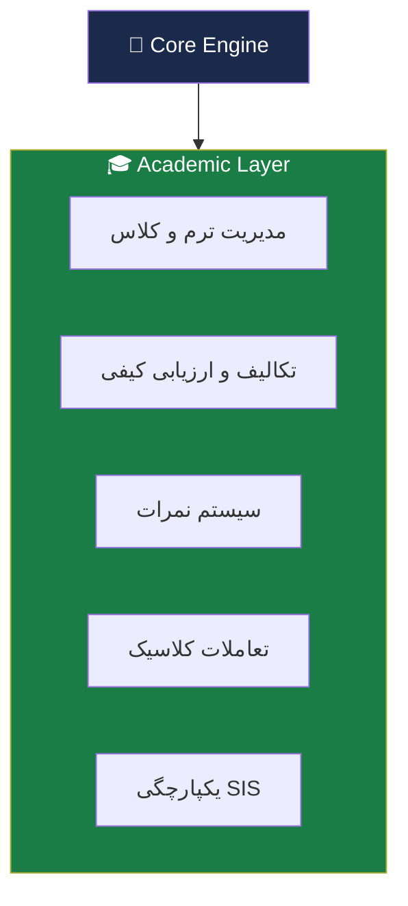
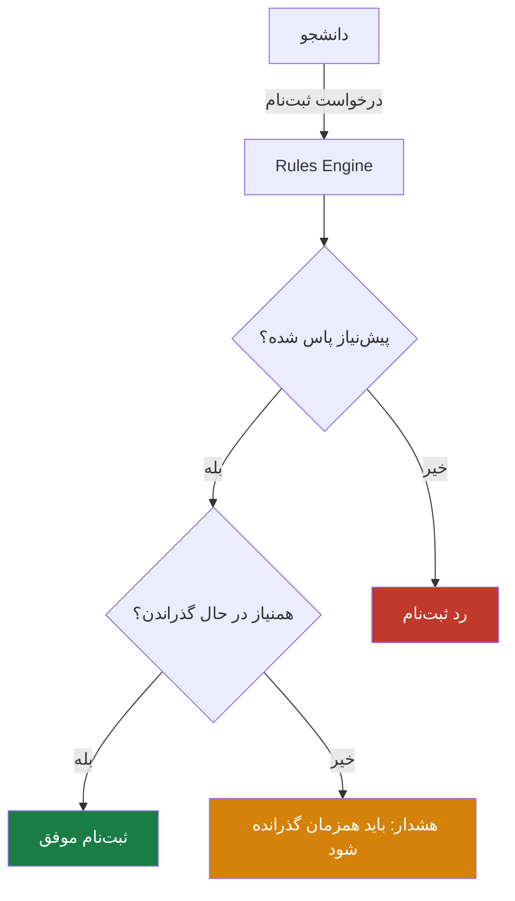
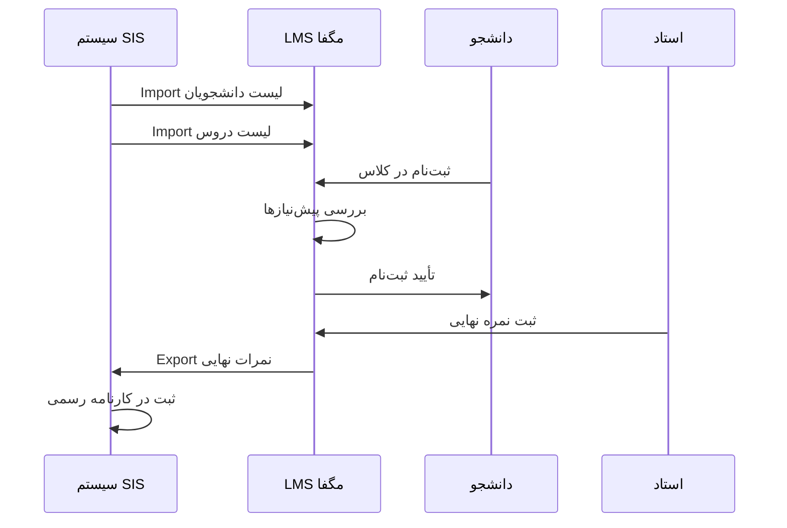

# 🎓 Academic Layer — لایه آکادمیک

> [!abstract] خلاصه
> لایه تخصصی برای دانشگاه‌ها و مجموعه‌های آموزشی با تمرکز بر ساختار ترمیک، پیش‌نیاز/همنیاز، نمره‌دهی و یکپارچگی با SIS.

---

## 🎯 هدف لایه آکادمیک

ارائه پلتفرم آموزشی برای دانشگاه‌ها با تمرکز بر:
- آموزش و ارزیابی تحصیلی
- ساختار درس/ترم/استاد/واحد درسی
- یکپارچگی با سیستم‌های آموزشی دانشگاه

---

## 📦 مؤلفه‌های لایه آکادمیک

---

## 📋 جزئیات فنی و راهبردی

### ۱. ساختار ترمیک و بازه‌های زمانی

> [!important] اهمیت زمان
> در محیط آکادمیک، «زمان» اهمیت حیاتی دارد. معمولاً نمی‌توان در «ترم بهار» نمره «ترم پاییز» را ثبت کرد.

**خروجی:** سیستم باید به‌گونه‌ای طراحی شود که کاربر (دانشجو یا استاد) در هر لحظه در **«ترم فعال»** قرار داشته باشد و تمام عملیات‌ها (انتخاب واحد، آزمون) محدود به زمان‌بندی همان ترم باشد.

### ۲. مدیریت قوانین درسی (پیش‌نیاز/همنیاز)

> [!warning] تفاوت با سازمانی
> برخلاف LMS سازمانی که آموزش‌ها پیشنهادی هستند، در آکادمیک، سیستم باید **«اجبار»** داشته باشد.

**خروجی:** یک «موتور قوانین» (Rules Engine) که قبل از ثبت‌نام دانشجو در یک درس، بررسی می‌کند آیا پیش‌نیازها پاس شده‌اند یا خیر.

### ۳. سیستم نمره‌دهی

سیستم مدیریت نمرات باید **منعطف** باشد:
- برخی دروس فقط نمره پایانی دارند
- برخی شامل حضور و غیاب، تکلیف و میان‌ترم هستند

**خروجی:** یک فرمول‌ساز نمره که استاد بتواند وزن هر بخش را مشخص کند (مثلاً ۳۰٪ امتحان، ۴۰٪ تکلیف، ۳۰٪ حضور در کلاس).

### ۴. یکپارچگی با SIS (Student Information System)

> [!note] نکته
> از آنجا که SIS سیستم مرجع است، LMS باید بتواند لیست دانشجوها و دروس را از آن «دریافت» (Import) و نمرات نهایی را به آن «ارسال» (Export) کند. این یکپارچگی باید کاملاً امن و ضدخطا باشد.

---

## 📊 تحویل‌های فاز ۳ (Academic)

| # | لایه | فعالیت‌های کلیدی | خروجی‌های اصلی |
|---|---|---|---|
| ۱ | ساختار ترمیک و زمانی | تعریف چارت تحصیلی، مدیریت ترم‌ها | تقویم آموزشی، ماژول مدیریت بازه‌های زمانی |
| ۲ | مدیریت فرایندهای درسی | تعریف دروس، پیش‌نیاز/همنیاز، ظرفیت | سیستم Courses Catalog، قوانین پیش‌نیاز |
| ۳ | ارزیابی و کارنامه | تعریف روش‌های نمره‌دهی، اعتراض | سیستم محاسبه نمره، پنل نمره‌دهی استاد، کارنامه دانشجو |
| ۴ | یکپارچگی با SIS | درگاه تبادل داده با گلستان/سجاد/... | کانکتور اختصاصی SIS، سرویس انتقال نمرات |
| ۵ | تست و کنترل کیفیت | Unit/Integration Tests، UAT | گزارش نتایج تست‌ها |
| ۶ | استقرار و راه‌اندازی | نصب، انتقال داده | محیط LMS عملیاتی |
| ۷ | آموزش و مستندسازی | جلسات آموزشی | User Manual + Admin Guide |

---

## 🔗 ویژگی‌های استاندارد آکادمیک

این لایه شامل تمام ویژگی‌های [[06-ویژگی‌های نسخه استاندارد]] است با تأکید بر موارد آکادمیک:

- [[مدیریت محتوای آموزشی]] — تعریف همنیاز، ترم تحصیلی، سقف واحد، حذف و اضافه
- [[مدیریت کاربران و نقش‌ها]] — دسته‌بندی بر اساس رشته، گرایش، درس
- [[آزمون تکلیف و ارزیابی]] — VR در آزمون
- [[گزارش‌گیری و آنالیز]] — کارنامه درسی
- [[ارتباطات و تعامل]] — تالار گفتگو (Forum)
- [[خودکارسازی فرایندها]] — گواهینامه، تاریخ انقضا
- [[یکپارچگی سازمانی]] — گلستان، مروارید، سجاد
- [[UI/UX]]
- [[امنیت و کنترل دسترسی]]
- [[قابلیت‌های فنی]]

---

## 🔗 ارتباط با سایر لایه‌ها

- پایه: [[Core Engine — لایه هسته]]
- مقایسه: [[Enterprise Standard Layer — لایه سازمانی استاندارد]]
- پشتیبانی: [[Marketplace Layer — لایه بازار فروش]] (اختیاری برای آکادمیک)

---

## 🆚 تفاوت‌های مهم LMS دانشگاهی و سازمانی

| مشخصه | دانشگاهی/آموزشی | سازمانی/شرکت |
|---|---|---|
| هدف اصلی | آموزش و ارزیابی تحصیلی | ارتقای عملکرد و انطباق سازمانی |
| ساختار آموزشی | درس، ترم، استاد، واحد درسی | دوره، مسیر یادگیری، نقش شغلی |
| کاربران | دانشجو، استاد | کارمند، مدیر |
| ارزیابی | تکلیف، آزمون، نمره، کارنامه | آزمون، مهارت‌سنجی، KPI، گواهی |
| گزارش‌ها | حضور، نمره | پیشرفت، انطباق، شکاف مهارتی |
| یکپارچگی | سامانه‌های آموزش دانشگاه | سامانه‌های سازمانی |
| سیاست دسترسی | رشته، ترم، کلاس | واحد سازمانی، سطح شغلی |
| مدل استقرار | ساده‌تر و آموزشی‌تر | سفارشی‌تر |

---

#آکادمیک #دانشگاه #SIS #Term #RulesEngine #Grade
