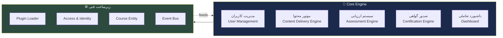
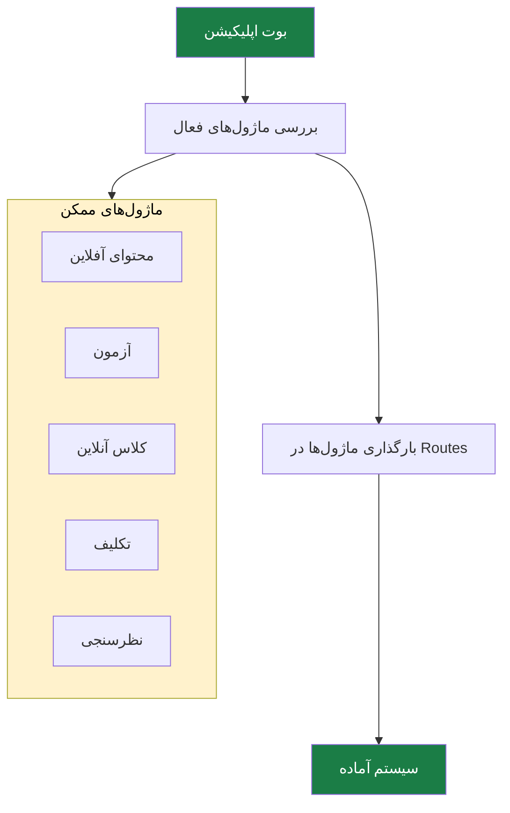
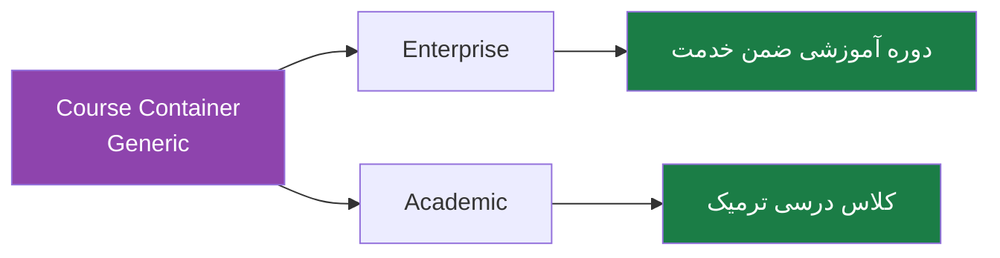
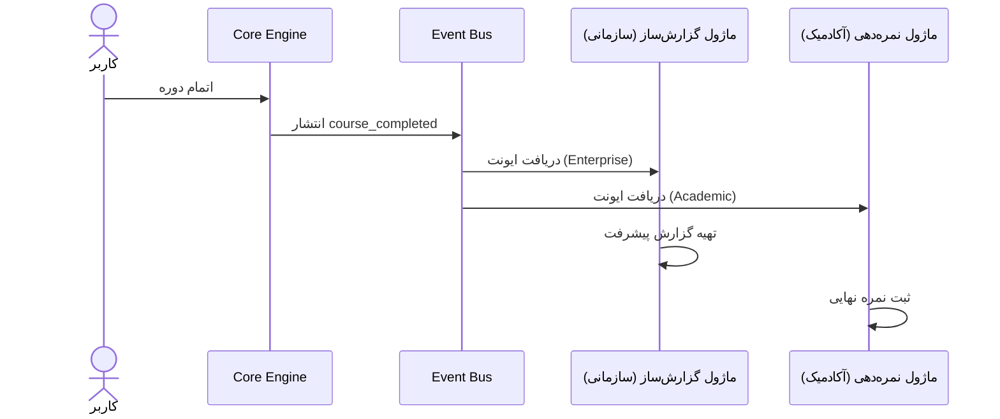

# 🧠 Core Engine — لایه هسته

> [!abstract] خلاصه
> «موتور اصلی» پلتفرم که در هر دو نسخه (دانشگاهی و سازمانی) **بدون تغییر** باقی می‌ماند. این بخش یک‌بار ساخته می‌شود و برای هر دو بازار قابل استفاده است.

---

## 🎯 هدف لایه هسته

این لایه **زیربنای مشترک** طرح است. تمام قابلیت‌های پایه‌ای که هر دو نسخه سازمانی و آکادمیک به آن نیاز دارند در اینجا پیاده‌سازی می‌شود.

---

## 📦 مؤلفه‌های لایه هسته

---

## 📋 جزئیات هر مؤلفه

### ۱. مدیریت کاربران (User Management)
- سیستم مدیریت نقش‌ها
- پروفایل‌های کاربری
- احراز هویت
- دسته‌بندی کاربران بر اساس فاکتورهای مختلف

### ۲. موتور محتوا (Content Delivery Engine)
- آپلودر
- پلیر ویدیو
- پلیر پادکست
- مدیریت PDF
- پشتیبانی SCORM و H5P

### ۳. سیستم ارزیابی (Assessment Engine)
- بانک سؤالات
- انواع سؤالات:
  - درست و غلط
  - چهارگزینه‌ای
  - تشریحی
  - Drag & Drop
  - ...
- موتور آزمون‌ساز

### ۴. صدور گواهی (Certification Engine)
- تولید خودکار گواهینامه‌های دیجیتال
- قابلیت استعلام
- بارکد

### ۵. داشبورد تعاملی
- نمایش وضعیت پیشرفت برای کاربر
- اعلان‌ها
- یادآوری‌های سیستمی

---

## ⚙️ جزئیات فنی و راهبردی

### ۱. مدیریت ماژولار (Plugin Loader)

> [!important] خروجی
> سیستمی که هنگام بالا آمدن اپلیکیشن، بررسی می‌کند کدام ماژول‌ها فعال هستند و آنها را در مسیرهای (Routes) سیستم قرار می‌دهد. این اجازه می‌دهد Enterprise و Academic به‌صورت دو لایه مجزا روی هسته سوار شوند.

### ۲. لایه هویت و دسترسی (Access & Identity)

> [!warning] تصمیم کلیدی
> در این مرحله نباید سیستم فقط برای «دانشجو» یا «کارمند» ساخته شود. یک سیستم Identity عمومی نیاز است که:
> - در فاز سازمانی → `Organization ID` اضافه شود
> - در فاز آکادمیک → `Student Number` اضافه شود

**خروجی:** سرویسی که هویت کاربر را تأیید کند و بگوید این کاربر «چه کسی» است، نه «چه نقشی» دارد.

### ۳. ساختار محتوا (Course Entity)

مفهوم «دوره» به‌صورت **Generic** پیاده می‌گردد:

> [!note] نکته مهم
> دیتابیس تغییر نمی‌کند، فقط «رفتار» آن در ماژول‌های بعدی غنی‌تر می‌شود.

### ۴. زیرساخت ایونت (Event-Driven Architecture)

**مهم‌ترین بخش برای آینده پروژه!**

> [!important] چرا مهم است؟
> - در فاز سازمانی: ماژول گزارش‌ساز به این ایونت گوش می‌دهد
> - در فاز آکادمیک: ماژول نمره‌دهی به این ایونت گوش می‌دهد
> - این معماری جدایی کامل Core از Extensions را تضمین می‌کند

---

## 📊 تحویل‌های فاز ۱ (Core Engine)

| # | لایه | فعالیت‌های کلیدی | خروجی‌های اصلی |
|---|---|---|---|
| ۱ | تحلیل و طراحی | جمع‌آوری و تحلیل نیازمندی‌ها، طراحی معماری | سند نیازمندی‌های محصول، سند معماری سیستم |
| ۲ | مدیریت هویت و دسترسی | طراحی User/Role/Permission، JWT، احراز هویت عمومی | سرویس Auth، APIهای login/register |
| ۳ | ساختار محتوا و دوره | طراحی Course Entity، انواع محتوا، گروهبندی | ساختار دیتابیس منعطف، CRUD دوره |
| ۴ | زیرساخت ارتباطی و ایونت | Event Bus، لاگینگ مرکزی، Webhook | Audit Log، API Gateway |
| ۵ | تنظیمات و هسته مرکزی | Tenant/Config، Plugin Loader | پنل System Admin، فعال/غیرفعال ماژول‌ها |

---

## 🔗 ارتباط با سایر لایه‌ها

- [[Enterprise Standard Layer — لایه سازمانی استاندارد]] — سوار می‌شود روی Core
- [[Enterprise Smart Layer — لایه سازمانی هوشمند]] — سوار می‌شود روی Core
- [[Academic Layer — لایه آکادمیک]] — سوار می‌شود روی Core
- [[Marketplace Layer — لایه بازار فروش]] — سوار می‌شود روی Core

---

## 🏷️ برچسب‌ها
#Core #هسته #معماری #PluginLoader #EventBus #Identity #CourseEntity
