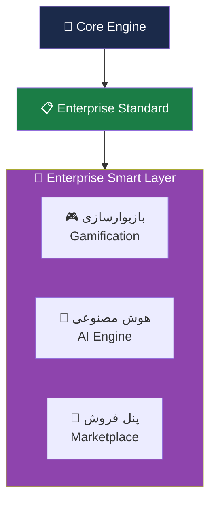
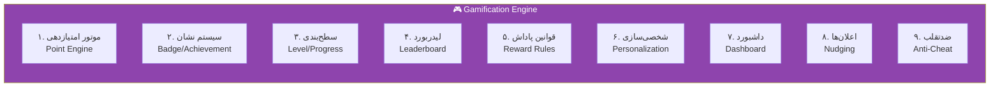
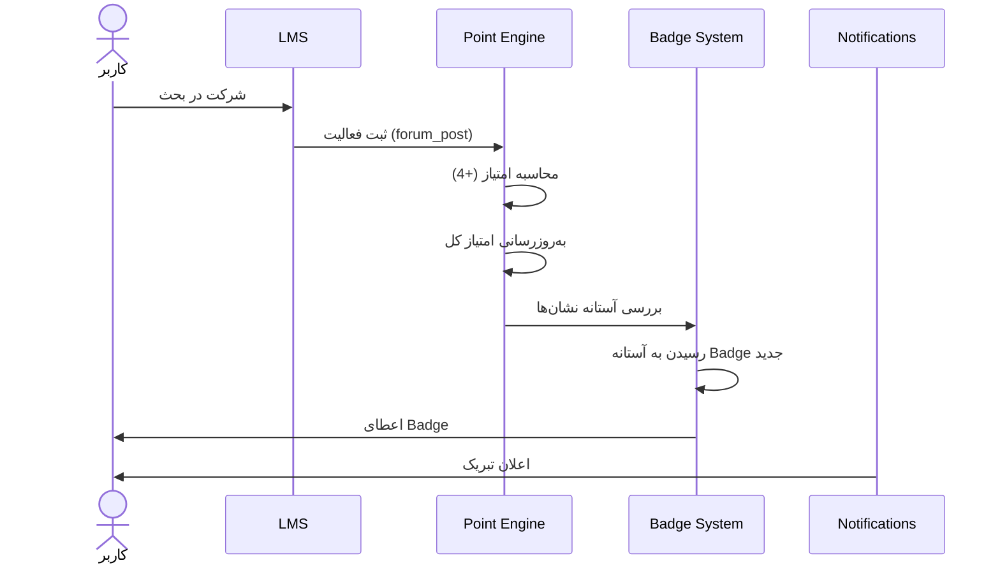
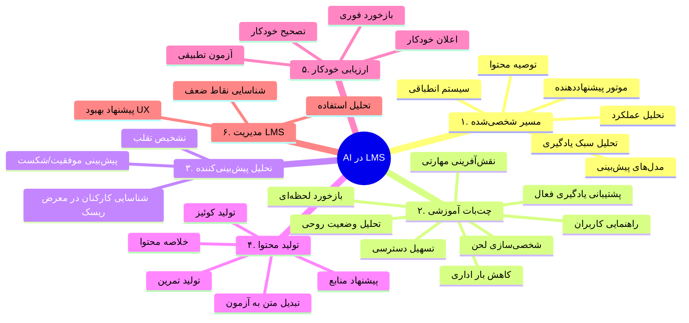
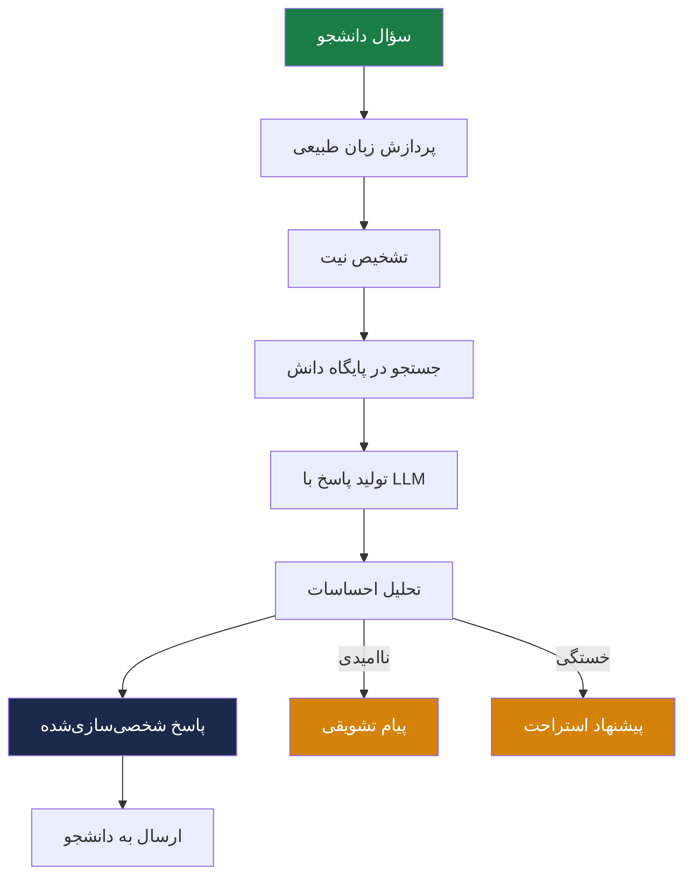
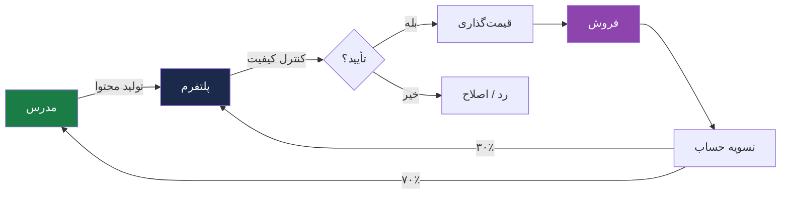
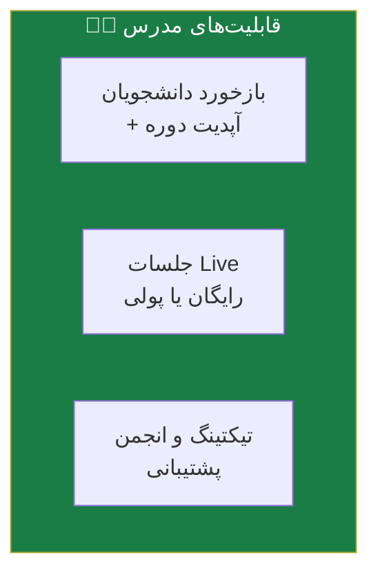

# 🚀 Enterprise Smart Layer — لایه سازمانی هوشمند

> [!abstract] خلاصه
> لایه پیشرفته و هوشمند سازمانی شامل سه مؤلفه متمایزکننده:
> 1. **بازیوارسازی (Gamification)** — افزایش انگیزه و مشارکت
> 2. **هوش مصنوعی (AI)** — شخصی‌سازی و خودکارسازی
> 3. **پنل فروش (Marketplace)** — امکان فروش دوره توسط مدرسین

---

## 🎯 هدف لایه هوشمند

تبدیل LMS از یک پلتفرم آموزشی به یک **پلتفرم هوشمند، مشارکتی و تجاری**. این لایه مزیت رقابتی اصلی محصول است.

---

## 📦 معماری لایه هوشمند

---

## 🎮 ۱. بازیوارسازی (Gamification)

> [!info] تعریف
> افزودن عناصر بازی به فرآیند آموزش، تا انگیزه و مشارکت کاربران را بالا ببرد. شامل امتیاز، نشان و رتبه‌بندی با کمک سیستم‌های ردیابی LMS به‌صورت خودکار و شخصی‌سازی‌شده.

### مزایای گیمفیکیشن
1. افزایش انگیزه و میزان مشارکت کاربران
2. ایجاد رقابت سالم و قابل اندازه‌گیری
3. بالا رفتن نرخ تکمیل دوره‌های ضمن خدمت

### ۹ زیرماژول گیمفیکیشن

### جزئیات هر زیرماژول

| # | زیرماژول | فعالیت‌های کلیدی | خروجی‌های اصلی |
|---|---|---|---|
| ۱ | **موتور امتیازدهی** | تعریف قوانین امتیازدهی برای فعالیت‌های آموزشی (حضور، تکمیل درس، مشارکت، تمرین، آزمون) | موتور امتیازدهی قابل پیکربندی، Rule Table، API |
| ۲ | **سیستم نشان و دستاورد** | طراحی منطق صدور Badge بر اساس آستانه‌ها و شرایط | ماژول صدور Badge، کتابخانه قالب گرافیکی |
| ۳ | **سطح‌بندی و پیشرفت** | سطح‌بندی کاربران بر اساس امتیاز یا فعالیت | سیستم Level Up، نوار پیشرفت، API |
| ۴ | **رتبه‌بندی و لیدربورد** | محاسبه رتبه بر اساس امتیاز/فعالیت/ترکیبی | ماژول رتبه‌بندی، فیلترهای زمانی |
| ۵ | **قوانین پاداش و انگیزش** | تعریف پاداش برای رفتارهای مطلوب (استمرار حضور، تکمیل مسیر) | موتور قواعد پاداش، پنل تنظیمات |
| ۶ | **شخصی‌سازی تجربه** | تنظیم قوانین بر اساس نقش/دوره/سازمان | موتور شخصی‌سازی، فعال/غیرفعال‌سازی |
| ۷ | **داشبورد مدیران** | نمایش وضعیت مشارکت، امتیاز، نشان، اثربخشی | داشبورد مدیریتی، گزارش تحلیلی، خروجی Excel/CSV/PDF |
| ۸ | **اعلان‌ها و محرک‌های رفتاری** | ارسال خودکار اعلان برای نزدیک شدن به Badge/ارتقای سطح | ماژول اعلان هوشمند، الگوهای پیام انگیزشی |
| ۹ | **قوانین ضدتقلب** | شناسایی فعالیت‌های غیرواقعی، جلوگیری از امتیازگیری تکراری | مکانیزم کنترل تقلب، گزارش رخدادهای مشکوک |

### فلوچارت منطق امتیازدهی

---

## 🤖 ۲. هوش مصنوعی (AI)

> [!info] تعریف
> استفاده از AI برای بهبود تجربه یادگیری، شخصی‌سازی محتوا و خودکارسازی وظایف. تمام سرویس‌های AI باید به‌صورت **میکروسرویس‌محور** و قابل فراخوانی از طریق API پیاده‌سازی شوند.

### ۶ کاربرد AI در LMS

### ۵ زیرماژول AI (تحویلی)

| # | زیرماژول | فعالیت‌های کلیدی | خروجی‌های اصلی |
|---|---|---|---|
| ۱ | **موتور پیشنهاددهی** | تحلیل رفتار کاربران، آموزش مدل‌های یادگیری ماشین | API سرویس پیشنهاد دوره، Content-based + Collaborative filtering |
| ۲ | **تحلیل شکاف مهارتی** | پیاده‌سازی تحلیلگر انطباق مهارت‌های کاربر با نیازهای شغلی | داشبورد Skill-Gap، خروجی JSON |
| ۳ | **پشتیبانی هوشمند** | آموزش مدل LLM روی دیتابیس محتوای آموزشی، پیاده‌سازی RAG | ربات پشتیبان هوشمند، مستندات Fine-tuning |
| ۴ | **ارزیابی و تشخیص تقلب** | تحلیل الگوهای فعالیت و مدت زمان پاسخ‌دهی به آزمون | سیستم Anomaly Detection، گزارش‌های هشدار |
| ۵ | **داشبورد پیش‌بینی** | تحلیل داده‌های تاریخی برای پیش‌بینی نرخ ریزش | مدل Risk Scoring، نمودارهای تحلیلی |

### الزامات AI برای مسیر شخصی‌شده

#### الف) داده‌های جامع و باکیفیت
- **پروفایل کاربر**: داده‌های دموگرافیک، نقش شغلی، اهداف یادگیری
- **تاریخچه تعاملات**: ثبت دقیق رفتارهای گذشته
- **ماتریس مهارت‌ها**: مقایسه مهارت‌های فعلی با مهارت‌های مورد نیاز

#### ب) ساختاردهی و برچسب‌گذاری محتوا
- **تگ‌گذاری دقیق**: هر محتوا باید تگ‌هایی برای سطح دشواری، موضوع، پیش‌نیازها، زمان یادگیری داشته باشد
- **درخت دانش (Knowledge Graph)**: روابط بین مفاهیم (مثلاً «برای درک A، باید B و C را بدانید»)

#### ج) زیرساخت الگوریتمی
- **موتور پیشنهاددهنده (Recommendation Engine)**: فیلتر و اولویت‌بندی محتوا
- **مدل‌های پیش‌بینی (Predictive Models)**: تشخیص چالش کاربر
- **سیستم انطباقی (Adaptive Learning Engine)**: تغییر مسیر در لحظه

### فلوچارت چت‌بات آموزشی

---

## 🛒 ۳. پنل فروش Marketplace

> [!info] تعریف
> پلتفرم به‌عنوان **LMS as a Marketplace** عمل می‌کند. مدرس می‌تواند دوره تولید، بارگذاری و به فروش برساند.

### فرآیند کلی Marketplace

### قابلیت‌های Marketplace

| # | قابلیت | توضیح |
|---|---|---|
| ۱ | تعریف درصد کمیسیون طرفین | مثلاً ۷۰٪ مدرس / ۳۰٪ پلتفرم |
| ۲ | تسویه حساب با مدرس | خودکار یا دستی |
| ۳ | گزارشات فروش | به تفکیک سال، ماه، نام مدرس، عنوان دوره |
| ۴ | کوپن تخفیف | ایجاد و مدیریت |
| ۵ | امتیازدهی و نظرات کاربران | سیستم بازخورد |
| ۶ | سبد خرید مشتری | مدیریت سبد |
| ۷ | پرداخت آنلاین | درگاه پرداخت |

### قابلیت‌های مدرس در Marketplace

- مشاهده بازخورد دانشجویان و آپدیت دوره بر اساس بازخوردها
- برگزاری جلسات پرسش و پاسخ آنلاین (Live) — رایگان یا با پرداخت هزینه
- ابزارهای پاسخگویی و پشتیبانی (تیکتینگ یا انجمن داخلی)

---

## 🔗 ارتباط با سایر لایه‌ها

- پایه: [[Core Engine — لایه هسته]]
- پیش‌نیاز: [[Enterprise Standard Layer — لایه سازمانی استاندارد]]
- مقایسه: [[Academic Layer — لایه آکادمیک]]
- جزئیات ویژگی‌ها: [[بازیوارسازی]]، [[هوش مصنوعی]]، [[پنل فروش Marketplace]]

---

#هوشمند #گیمفیکیشن #هوش-مصنوعی #Marketplace #Smart #AI #Gamification
