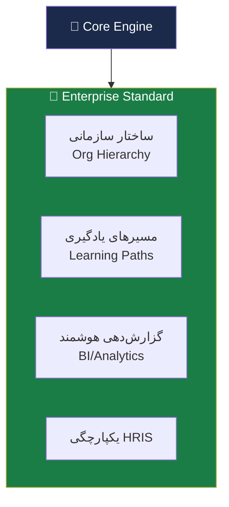
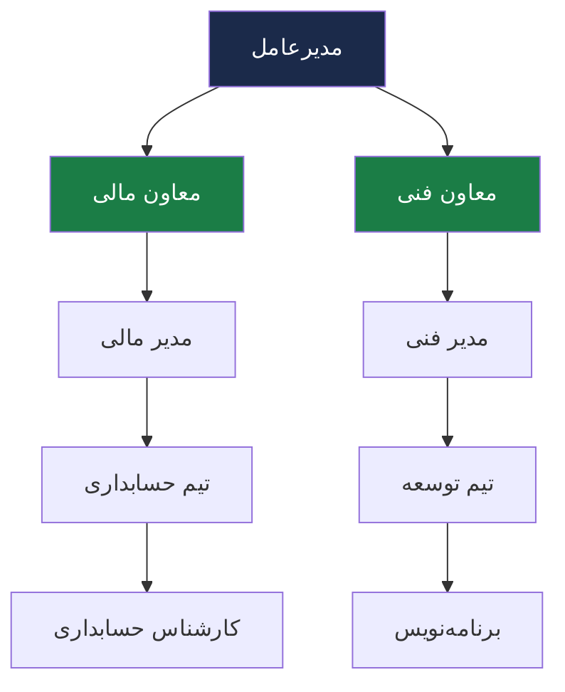
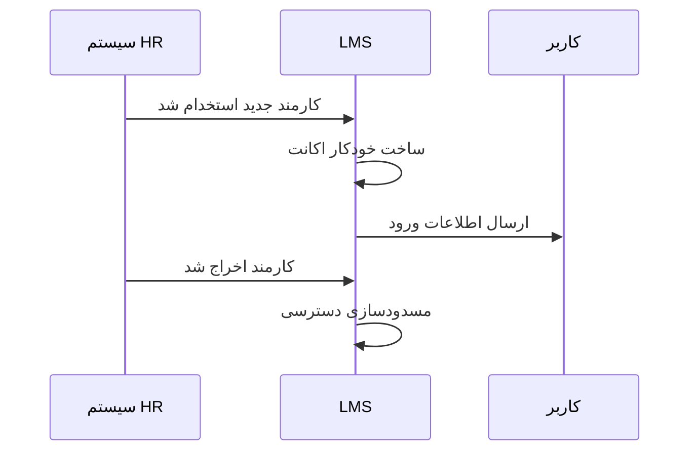

# 🏢 Enterprise Standard Layer — لایه سازمانی استاندارد

> [!abstract] خلاصه
> لایه تخصصی برای شرکت‌ها و سازمان‌ها با قابلیت‌های استاندارد مدیریت یادگیری سازمانی. شامل مسیرهای یادگیری، گزارش‌های مدیریتی، یکپارچگی ERP/HRIS و ساختار سازمانی.

---

## 🎯 هدف لایه

ارائه پلتفرم آموزشی برای سازمان‌ها با تمرکز بر:
- ارتقای عملکرد کارکنان
- انطباق سازمانی (Compliance)
- مدیریت مسیر شغلی

---

## 📦 مؤلفه‌های لایه سازمانی استاندارد

---

## 📋 جزئیات فنی و راهبردی

### ۱. ساختار سازمانی (Organizational Hierarchy)

> [!important] تفاوت با آکادمیک
> برخلاف محیط آکادمیک که دانشجو «عضو دانشکده» است، در محیط سازمانی، کاربر باید **«در چارت»** باشد.

**خروجی:** گزارش‌های مدیریتی باید به‌صورت سلسله مراتبی فیلتر شوند (مدیر یک واحد، فقط گزارش زیرمجموعه خود را ببیند).

### ۲. مسیرهای یادگیری و شایستگی (Competency Management)

> [!important] تفاوت با آکادمیک
> در سازمان، آموزش باید به **«شغل»** گره بخورد.

کاربر باید ببیند برای ارتقا به رتبه بعدی، چه دوره‌هایی (یا چه مهارت‌هایی) را باید بگذراند. سیستم باید `Requirement` های هر پست سازمانی را در دیتابیس ذخیره کند.

### ۳. گزارش‌دهی هوشمند (BI/Analytics)

مدیران HR به دنبال:
- نرخ تکمیل دوره‌ها
- اثربخشی آموزش
- صرفه‌جویی در هزینه
- گزارش‌های مقایسه‌ای بین دپارتمان‌ها
- گزارش وضعیت انطباق (مثلاً چند درصد پرسنل دوره HSE را گذرانده‌اند؟)

### ۴. یکپارچگی HRIS

---

## 📊 تحویل‌های فاز ۲ (Enterprise Standard)

| # | لایه | فعالیت‌های کلیدی | خروجی‌های اصلی |
|---|---|---|---|
| ۱ | ساختار سازمانی و دسترسی | تعریف دپارتمان‌ها، RBAC چندلایه، SSO/LDAP | ساختار درختی سازمان، اتصال AD/LDAP |
| ۲ | مدیریت یادگیری و مسیر شغلی | Learning Paths، Skills | داشبورد پیشرفت فردی |
| ۳ | گزارش‌دهی و BI | موتور گزارش‌ساز داینامیک | داشبوردهای مدیریتی، تحلیل شکاف مهارت |
| ۴ | اتوماسیون و یکپارچگی | Webhook، ERP/HRIS، Workflow | Connector اختصاصی، اتوماسیون انتساب دوره |
| ۵ | تست و کنترل کیفیت | Unit/Integration Tests، UAT | گزارش نتایج تست‌ها |
| ۶ | استقرار و راه‌اندازی | نصب، انتقال داده | محیط LMS عملیاتی |
| ۷ | آموزش و مستندسازی | جلسات آموزشی | User Manual + Admin Guide |

---

## 🔗 ویژگی‌های استاندارد سازمانی

این لایه شامل تمام ویژگی‌های [[06-ویژگی‌های نسخه استاندارد]] است با تاکید بر موارد سازمانی:

- [[مدیریت محتوای آموزشی]] — شامل VR، پادکست
- [[مدیریت کاربران و نقش‌ها]] — دسته‌بندی بر اساس دپارتمان
- [[آزمون تکلیف و ارزیابی]] — فیدبک آموزشی
- [[گزارش‌گیری و آنالیز]] — گزارش آموزش‌های اجباری
- [[ارتباطات و تعامل]] — نظرات و امتیازدهی
- [[خودکارسازی فرایندها]] — صدور گواهینامه، تاریخ انقضا
- [[یکپارچگی سازمانی]] — ERP/HRM
- [[UI/UX]]
- [[امنیت و کنترل دسترسی]]
- [[قابلیت‌های فنی]]

---

## 🔗 ارتباط با سایر لایه‌ها

- پایه: [[Core Engine — لایه هسته]]
- ارتقا: [[Enterprise Smart Layer — لایه سازمانی هوشمند]] (شامل گیمفیکیشن + AI + Marketplace)
- مقایسه: [[Academic Layer — لایه آکادمیک]]

---

## 🆚 مقایسه نسخه سازمانی و آکادمیک

| مشخصه | سازمانی | آکادمیک |
|---|---|---|
| هدف اصلی | ارتقای عملکرد و انطباق | آموزش و ارزیابی تحصیلی |
| ساختار آموزشی | دوره، مسیر یادگیری، نقش شغلی | درس، ترم، استاد، واحد درسی |
| کاربران | کارمند، مدیر | دانشجو، استاد |
| ارزیابی | آزمون، مهارت‌سنجی، KPI، گواهی | تکلیف، آزمون، نمره، کارنامه |
| گزارش‌ها | پیشرفت، انطباق، شکاف مهارتی | حضور، نمره |
| یکپارچگی | سامانه‌های سازمانی | سامانه‌های آموزش دانشگاه |
| سیاست دسترسی | واحد سازمانی، سطح شغلی | رشته، ترم، کلاس |
| مدل استقرار | سفارشی‌تر | ساده‌تر و آموزشی‌تر |

---

#Enterprise #سازمانی #استاندارد #HRIS #OrgChart #LearningPaths
