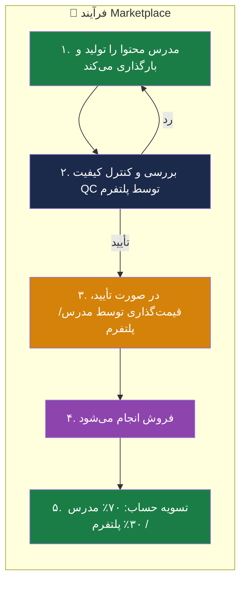
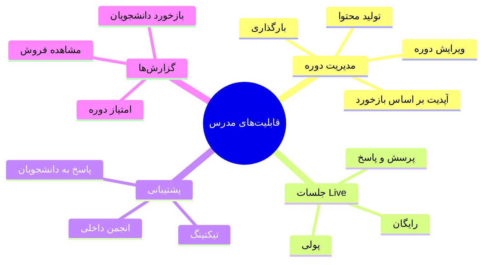
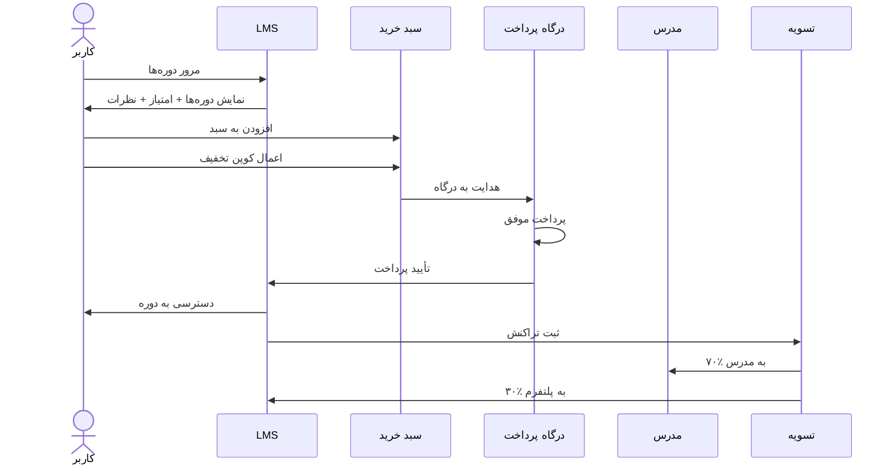
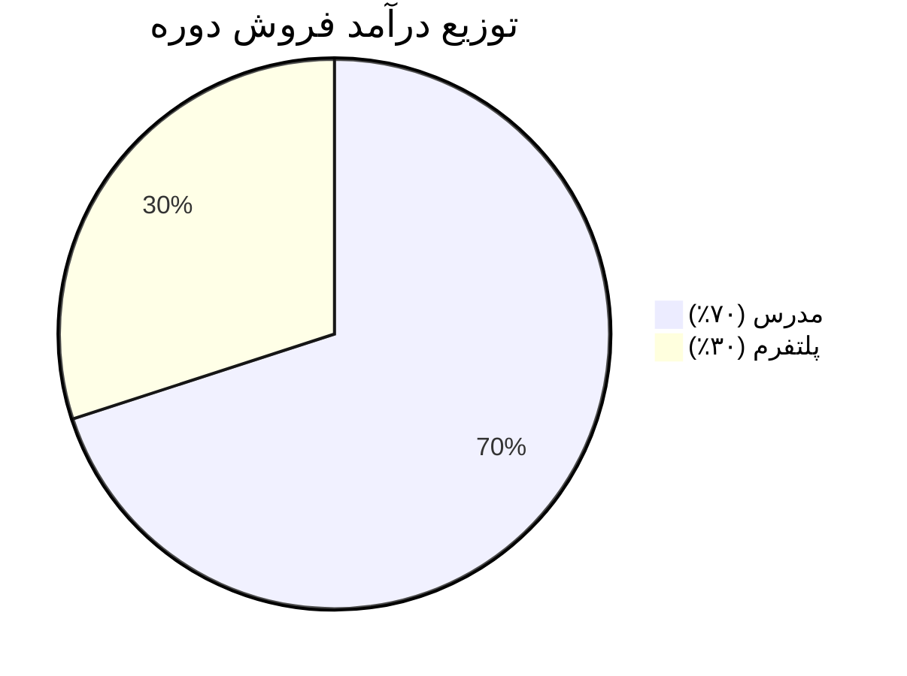

# 🛒 Marketplace Layer — لایه بازار فروش

> [!abstract] خلاصه
> پنلی برای فروش مستقل توسط مدرس (LMS as a Marketplace). مدرس دوره تولید، پلتفرم کنترل کیفیت می‌کند، دوره قیمت‌گذاری و فروخته می‌شود و درآمد بین مدرس و پلتفرم تسویه می‌شود.

---

## 🎯 هدف لایه Marketplace

ایجاد یک **بازار دو طرفه** که در آن:
- مدرسین محتوا تولید و بارگذاری می‌کنند
- پلتفرم کنترل کیفیت انجام می‌دهد
- کاربران دوره می‌خرند
- درآمد به‌صورت درصدی تسویه می‌شود

---

## 📦 فرآیند کلی Marketplace

---

## 📋 قابلیت‌های اصلی Marketplace

| # | قابلیت | توضیح | اولویت |
|---|---|---|---|
| ۱ | **تعریف درصد کمیسیون طرفین** | قابل تنظیم (مثلاً ۷۰/۳۰) | بالا |
| ۲ | **تسویه حساب با مدرس** | خودکار یا دستی، دوره‌ای | بالا |
| ۳ | **گزارشات فروش** | به تفکیک سال، ماه، نام مدرس، عنوان دوره | بالا |
| ۴ | **کوپن تخفیف** | ایجاد و مدیریت کوپن‌ها | متوسط |
| ۵ | **امتیازدهی و نظرات کاربران** | سیستم بازخورد و review | بالا |
| ۶ | **سبد خرید مشتری** | مدیریت سبد خرید و checkout | بالا |
| ۷ | **پرداخت آنلاین** | اتصال به درگاه پرداخت | بالا |

---

## 👨‍🏫 قابلیت‌های مدرس در Marketplace

### جزئیات قابلیت‌های مدرس

1. **بازخورد دانشجویان**: مدرس بازخورد را ببیند و در صورت نیاز دوره خود را بر اساس بازخوردها آپدیت کند
2. **جلسات پرسش و پاسخ آنلاین (Live)**: برگزاری جلسات Live — رایگان یا با پرداخت هزینه
3. **ابزارهای پاسخگویی و پشتیبانی**: تیکتینگ یا انجمن داخلی در اختیار داشته باشد

> [!important] ارزیابی مدرس
> چون مدرس در فرآیند پشتیبانی هم نقش دارد، سیستم ارزیابی برای مدرس مهم است و باید ابزارهای لازم برای پاسخگویی داشته باشد.

---

## 🔄 فلوچانت خرید کاربر

---

## 📊 مدل درآمدی Marketplace

### سناریوهای درآمدی

| سناریو | قیمت دوره | سهم مدرس | سهم پلتفرم |
|---|---|---|---|
| دوره ارزان | ۱۰۰٬۰۰۰ تومان | ۷۰٬۰۰۰ | ۳۰٬۰۰۰ |
| دوره متوسط | ۵۰۰٬۰۰۰ تومان | ۳۵۰٬۰۰۰ | ۱۵۰٬۰۰۰ |
| دوره گران | ۲٬۰۰۰٬۰۰۰ تومان | ۱٬۴۰۰٬۰۰۰ | ۶۰۰٬۰۰۰ |

---

## 🔗 ارتباط با سایر لایه‌ها

- پایه: [[Core Engine — لایه هسته]]
- پیش‌نیاز: [[Enterprise Smart Layer — لایه سازمانی هوشمند]]
- یکپارچه با: [[Enterprise Standard Layer — لایه سازمانی استاندارد]]

---

## 🎯 نقاط متمایزکننده Marketplace

1. **مدل دو طرفه** — هم مدرس هم دانشجو
2. **کنترل کیفیت پلتفرم** — محتوای تأیید نشده فروخته نمی‌شود
3. **پشتیبانی مدرس** — مدرس مسئول پشتیبانی دوره خود است
4. **سیستم امتیازدهی** — اعتماد کاربران به امتیاز دوره
5. **جلسات Live** — امکان آموزش تعاملی پولی/رایگان

---

#Marketplace #فروش #مدرس #کمیسیون #تسویه-حساب #LMS-as-Marketplace
