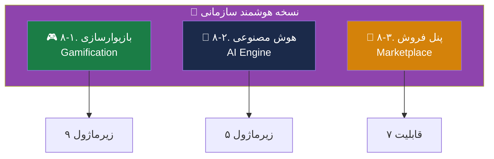

# 🚀 07 — ویژگی‌های نسخه سازمانی هوشمند

> [!abstract] خلاصه
> این بخش شامل قابلیت‌های متمایزکننده نسخه هوشمند سازمانی است که در نسخه استاندارد وجود ندارد. شامل سه موتور اصلی:
> 1. **بازیوارسازی (Gamification)** — ۹ زیرماژول
> 2. **هوش مصنوعی (AI)** — ۵ زیرماژول تحویلی
> 3. **پنل فروش (Marketplace)** — ۷ قابلیت اصلی

---

## 📦 نقشه کلی

---

## 🎮 ۸-۱. بازیوارسازی (Gamification)

### تعریف
گیمفیکیشن یا بازی‌وارسازی یعنی افزودن عناصر بازی به فرآیند آموزش، تا انگیزه و مشارکت کاربران را بالا ببرد. این موضوع می‌تواند شامل امتیاز، نشان و رتبه‌بندی باشد که با کمک سیستم‌های ردیابی و مدیریت LMS به‌صورت خودکار و شخصی‌سازی‌شده اجرا می‌شود.

### ۳ مزیت اصلی
1. افزایش انگیزه و میزان مشارکت کاربران به دلیل جذابیت فرآیند یادگیری
2. ایجاد رقابت سالم و قابل اندازه‌گیری در محیط یادگیری
3. بالا رفتن نرخ تکمیل دوره‌های ضمن خدمت

### ۹ زیرماژول گیمفیکیشن

| # | زیرماژول | فعالیت‌های کلیدی | خروجی‌های اصلی |
|---|---|---|---|
| ۱ | **موتور امتیازدهی** (Point Engine) | تعریف قوانین امتیازدهی برای فعالیت‌های آموزشی (حضور، تکمیل درس، مشارکت در بحث، ارسال تمرین، پاسخ صحیح به آزمون) | موتور امتیازدهی قابل پیکربندی، پنل مدیریت قوانین، Rule Table، API امتیازدهی |
| ۲ | **سیستم نشان و دستاورد** (Badge/Achievement) | طراحی منطق صدور Badge بر اساس آستانه‌ها و شرایط؛ تعریف نشان‌های عمومی و اختصاصی | ماژول صدور Badge، پنل تعریف نشان‌ها، کتابخانه/قالب گرافیکی Badge |
| ۳ | **سطح‌بندی و پیشرفت کاربر** (Level/Progress) | طراحی سیستم سطح‌بندی بر اساس امتیاز یا فعالیت؛ نمایش میزان پیشرفت در دوره یا مسیر یادگیری | سیستم Level Up، نوار پیشرفت کاربر، قواعد ارتقای سطح، API دریافت وضعیت |
| ۴ | **رتبه‌بندی و لیدربورد** (Leaderboard/Ranking) | محاسبه رتبه کاربران بر اساس امتیاز، فعالیت یا ترکیبی؛ فیلترهای زمانی (هفتگی، ماهانه، دوره‌ای) | ماژول رتبه‌بندی، لیدربورد قابل تنظیم، گزارش رتبه‌ها، API |
| ۵ | **قوانین پاداش و انگیزش** (Reward Rules) | تعریف پاداش‌های سیستمی برای رفتارهای مطلوب (استمرار حضور، تکمیل مسیر، عملکرد عالی)؛ پاداش‌های مادی/غیرمادی/مجازی | موتور قواعد پاداش، پنل تنظیم پاداش‌ها، گزارش اعمال پاداش‌ها |
| ۶ | **شخصی‌سازی تجربه گیمفیکیشن** | تنظیم قوانین بر اساس نقش کاربر، سطح، دوره یا گروه؛ فعال/غیرفعال‌سازی گیمفیکیشن در برخی دوره‌ها | موتور شخصی‌سازی، تنظیمات مبتنی بر نقش/دوره/سازمان |
| ۷ | **داشبورد گیمفیکیشن برای مدیران** | نمایش وضعیت مشارکت، امتیازها، نشان‌ها و میزان اث‌گذاری گیمفیکیشن | داشبورد مدیریتی، گزارش تحلیلی مشارکت، خروجی Excel/CSV/PDF یا API |
| ۸ | **اعلان‌ها و محرک‌های رفتاری** (Notification/Nudging) | ارسال اعلان خودکار برای نزدیک شدن به دریافت Badge، ارتقای سطح یا از دست دادن فرصت | ماژول اعلان هوشمند، الگوهای پیام انگیزشی، تنظیمات ارسال پیام‌ها |
| ۹ | **قوانین ضدتقلب و کنترل سوءاستفاده** | شناسایی فعالیت‌های غیرواقعی برای کسب امتیاز؛ جلوگیری از امتیازگیری تکراری یا رفتارهای اسپم | مکانیزم کنترل تقلب، مستندات Validation Rules، گزارش رخدادهای مشکوک |

### جمع‌بندی گیمفیکیشن
ماژول گیمفیکیشن شامل طراحی و پیاده‌سازی موتور امتیازدهی، سیستم نشان و دستاورد، سطح‌بندی و پیشرفت کاربر، لیدربورد، قوانین پاداش، شخصی‌سازی تجربه انگیزشی، داشبورد مدیریتی، اعلان‌های هوشمند و مکانیزم کنترل سوءاستفاده خواهد بود. کلیه این اجزا باید به‌صورت **قابل پیکربندی از پنل مدیریت** و **قابل فراخوانی از طریق API** تحویل شوند.

→ جزئیات بیشتر: [[بازیوارسازی]]

---

## 🤖 ۸-۲. هوش مصنوعی (AI)

### تعریف
در سیستم‌های مدیریت یادگیری، هوش مصنوعی (AI) می‌تواند در مواردی همچون بهبود تجربه یادگیری، شخصی‌سازی محتوا و خودکارسازی وظایف به کار گرفته شود.

### ۶ کاربرد AI در LMS

#### ۸-۲-۱. مسیر یادگیری شخصی‌شده (Personalized Learning)
- AI عملکرد و سبک یادگیری هر کاربر را تحلیل می‌کند
- محتوا، تمرین‌ها و مسیر یادگیری را متناسب با نیازهای او تنظیم می‌کند
- ارائه توصیه‌های محتوایی مشابه نتفلیکس/آمازون

**الزامات:**
- **الف) داده‌های جامع و باکیفیت**: پروفایل کاربر، تاریخچه تعاملات، ماتریس مهارت‌ها
- **ب) ساختاردهی محتوا**: تگ‌گذاری دقیق، درخت دانش (Knowledge Graph)
- **ج) زیرساخت الگوریتمی**: موتور پیشنهاددهنده، مدل‌های پیش‌بینی، سیستم انطباقی

#### ۸-۲-۲. چت‌بات‌ها و دستیارهای آموزشی هوشمند (Chatbots)
دستیارهای آموزشی به‌صورت ۷×۲۴ در دسترس هستند و بار کاری مدرسان را کاهش می‌دهند.

**کارکردهای کلیدی:**
- راهنمایی کاربران در استفاده از سیستم
- ارائه بازخورد سازنده و لحظه‌ای
- شخصی‌سازی لحن و سرعت آموزش
- پشتیبانی از یادگیری فعال (نقش Coach)
- تسهیل دسترسی (text-to-speech و برعکس)
- تحلیل وضعیت روحی و سطح درگیری
- نقش‌آفرینی مهارت‌محور (مثلاً ایفای نقش مشتری/بیمار)
- کاهش بار اداری مدرسان (پاسخ به FAQ)

#### ۸-۲-۳. تحلیل پیش‌بینی‌کننده
- پیش‌بینی احتمال موفقیت یا شکست کاربران
- شناسایی کارکنانی که دوره‌ها را با موفقیت سپری نمی‌کنند
- شناسایی تقلب در آزمون از طریق تحلیل زمان پاسخ‌گویی و الگوهای رفتاری

#### ۸-۲-۴. تولید و پیشنهاد محتوا
- تولید خودکار محتوای آموزشی جدید (کوئیز، تمرین، خلاصه محتوای متنی)
- تبدیل متن به آزمون بر اساس محتوای موجود
- پیشنهاد منابع آموزشی مرتبط و تکمیلی

> [!note] از ساده تا پیشرفته
> - **ساده‌ترین حالت**: Rule-based — «اگر نمره در درس X کمتر از ۶۰ شد، ویدئوی تقویتی Y را نمایش بده»
> - **پیشرفته**: مدل‌های پیشنهاددهنده برای شخصی‌سازی خودکار

#### ۸-۲-۵. ارزیابی، اعلام و بازخورد خودکار
- آزمون‌های تطبیقی (Adaptive)
- تصحیح خودکار آزمون‌ها و تکالیف (چندگزینه‌ای، صحیح/غلط، برخی انواع تشریحی)
- ارائه بازخورد فوری و سازنده
- ارسال اعلان‌ها و یادآوری‌های خودکار

#### ۸-۲-۶. مدیریت و بهینه‌سازی LMS
- تحلیل نحوه استفاده از LMS
- شناسایی نقاط ضعف و قوت سیستم
- ارائه پیشنهاداتی برای بهبود تجربه کاربری

### ۵ زیرماژول AI (تحویلی)

| # | زیرماژول | فعالیت‌های کلیدی | خروجی‌های اصلی |
|---|---|---|---|
| ۱ | **موتور پیشنهاددهی** (Recommender System) | تحلیل رفتار کاربران، آموزش مدل‌های یادگیری ماشین بر اساس محتوای درسی و علائق | API سرویس پیشنهاد دوره، داکیومنت الگوریتم Content-based + Collaborative filtering |
| ۲ | **تحلیل مهارت و شکاف آموزشی** (Skill-Gap Analysis) | پیاده‌سازی تحلیلگر انطباق مهارت‌های کاربر با نیازهای شغلی | داشبورد تحلیل شکاف مهارت، خروجی گزارش JSON |
| ۳ | **پشتیبانی هوشمند** (AI Tutor / Chatbot) | آموزش مدل LLM روی دیتابیس محتوای آموزشی سازمان، پیاده‌سازی RAG | ربات پشتیبان هوشمند (متصل به منابع آموزشی)، مستندات Fine-tuning |
| ۴ | **ارزیابی و تشخیص تقلب** (Proctoring/Security) | تحلیل الگوهای فعالیت و مدت زمان پاسخ‌دهی به آزمون | سیستم Anomaly Detection، گزارش‌های هشدار و اعلان خودکار |
| ۵ | **داشبورد پیش‌بینی** (Predictive Analytics) | تحلیل داده‌های تاریخی برای پیش‌بینی نرخ ریزش یا احتمال عدم موفقیت در دوره‌ها | مدل Risk Scoring، نمودارهای تحلیلی |

### جمع‌بندی AI
تمامی سرویس‌های هوشمند به‌صورت **میکروسرویس‌محور** (Micro-services) و قابل فراخوانی از طریق API پیاده‌سازی شوند تا امکان یکپارچگی با سایر بخش‌های سیستم و به‌روزرسانی مدل‌ها بدون اختلال در عملکرد اصلی LMS فراهم باشد.

→ جزئیات بیشتر: [[هوش مصنوعی]]

---

## 🛒 ۸-۳. پنل فروش برای مدرس (Marketplace)

### تعریف
پنل برای فروش مستقل توسط مدرس می‌تواند یکی از موارد مزیت رقابتی باشد (LMS as a Marketplace) برای مواردی که مدرس بتواند طبق یک چارچوب دوره‌هایی را تهیه و بارگذاری کند و به فروش برساند.

### فرآیند کلی
1. مدرس محتوا را تولید و بارگذاری می‌کند
2. بررسی و کنترل کیفیت (QC) توسط پلتفرم انجام می‌شود
3. در صورت تأیید، محتوا توسط مدرس/پلتفرم قیمت‌گذاری می‌شود
4. فروش انجام می‌شود و مدرس درصدی از فروش را از پلتفرم دریافت می‌کند (مثلاً ۷۰٪ مدرس / ۳۰٪ پلتفرم)

### ۷ قابلیت اصلی Marketplace

| # | قابلیت | توضیح |
|---|---|---|
| ۱ | تعریف درصد کمیسیون طرفین | قابل تنظیم |
| ۲ | تسویه حساب با مدرس | خودکار یا دستی |
| ۳ | گزارشات فروش | به تفکیک سال، ماه، نام مدرس و عنوان دوره |
| ۴ | کوپن تخفیف | ایجاد و مدیریت |
| ۵ | امتیازدهی و نظرات کاربران | سیستم بازخورد |
| ۶ | سبد خرید مشتری | مدیریت سبد و checkout |
| ۷ | پرداخت آنلاین | اتصال به درگاه پرداخت |

### قابلیت‌های مدرس در Marketplace

> [!important] چون مدرس در فرآیند پشتیبانی هم نقش دارد، سیستم ارزیابی برای مدرس مهم است.

1. **بازخورد دانشجویان**: مدرس بازخورد را ببیند و در صورت نیاز دوره خود را بر اساس بازخوردها آپدیت کند
2. **جلسات پرسش و پاسخ آنلاین (Live)**: رایگان یا با پرداخت هزینه
3. **ابزارهای پاسخگویی و پشتیبانی**: تیکتینگ یا انجمن داخلی

→ جزئیات بیشتر: [[پنل فروش Marketplace]]

---

## 📊 آمار کلی نسخه هوشمند

| مؤلفه | تعداد زیرماژول | 备注 |
|---|---|---|
| گیمفیکیشن | ۹ | همه قابل پیکربندی + API |
| هوش مصنوعی | ۵ | میکروسرویس + API |
| Marketplace | ۷ | قابلیت فروش مدرس |
| **جمع** | **۲۱** | **زیرماژول تحویلی** |

---

## 🔗 پیوندها

- بازگشت: [[MOC — RFP LMS مگفا]]
- مرحله قبل: [[06-ویژگی‌های نسخه استاندارد]]
- مرحله بعد: [[08-ارائه پیشنهاد]]

---

#هوشمند #گیمفیکیشن #هوش-مصنوعی #Marketplace #Smart
