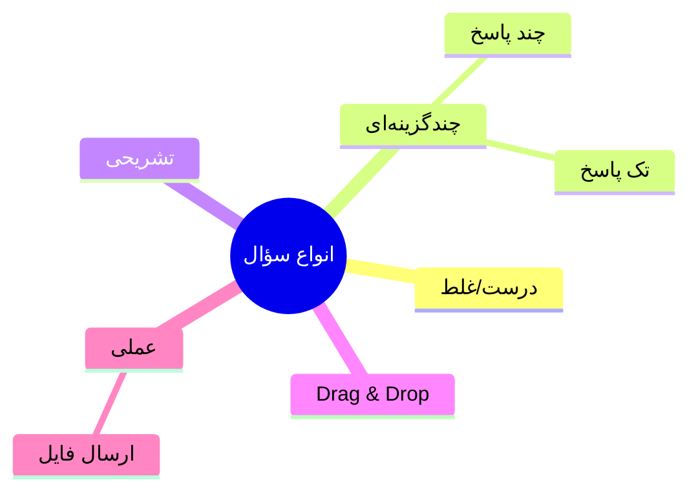

# 📝 آزمون، تکلیف و ارزیابی

> [!info] بخش ۷.۳ — ۱۲ ویژگی

## جدول ویژگی‌ها

| # | ویژگی | سازمانی | آکادمیک |
|---|---|---|---|
| ۱ | پشتیبانی انواع آزمون | ✅ | ✅ |
| ۲ | درجه سختی سؤالات (ساده/متوسط/دشوار) | ✅ | ✅ |
| ۳ | بانک سؤال با گزینش بر اساس سختی + تغییر چیدمان | ✅ | ✅ |
| ۴ | محدود کردن تعداد دفعات آزمون | ✅ | ✅ |
| ۵ | احراز هویت بصری آزمون‌دهندگان | ✅ | ✅ |
| ۶ | پشتیبانی فرمت‌های متنی/صوتی/تصویری/ویدئویی | ✅ | ✅ |
| ۷ | PDF تعاملی در آزمون‌ها و تمرین‌ها | ✅ | ✅ |
| ۸ | VR در آزمون | ✅ | ❌ |
| ۹ | بارگذاری تکلیف/پروژه با مهلت و محدودیت حجم | ✅ | ✅ |
| ۱۰ | ارسال فایل توسط فراگیر | ✅ | ✅ |
| ۱۱ | ارزیابی توسط استاد و ثبت نمره | ✅ | ✅ |
| ۱۲ | ارائه فیدبک آموزشی به فراگیر | ✅ | ❌ |

## انواع سؤالات

## پیوندها
- بازگشت: [[06-ویژگی‌های نسخه استاندارد]]
- مرتبط: [[Core Engine — لایه هسته]] (Assessment Engine)

#آزمون #ارزیابی #Assessment #Quiz
