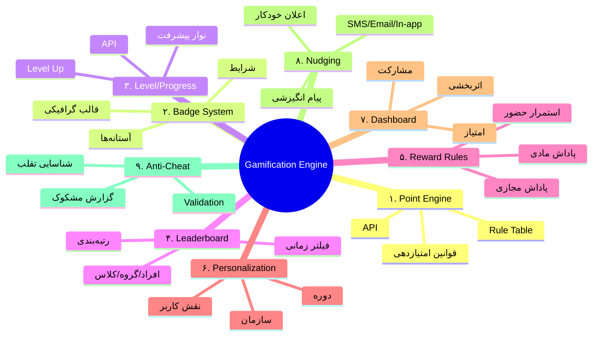
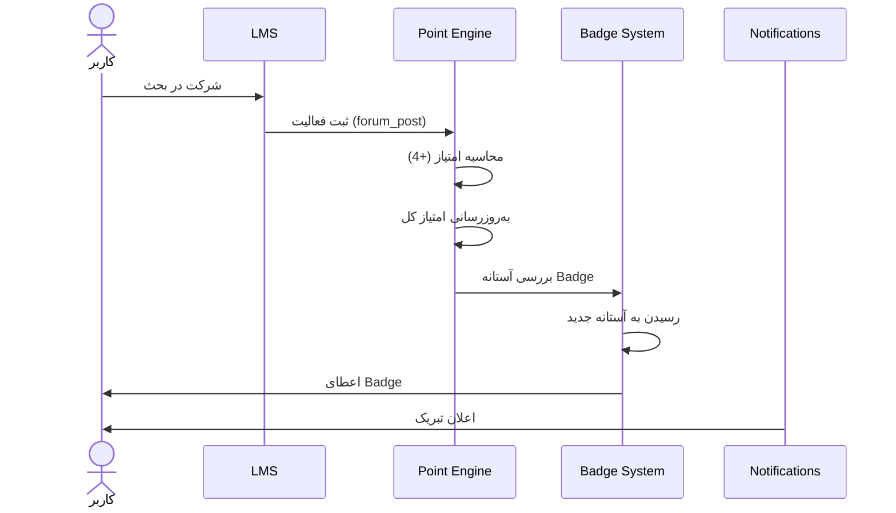

# 🎮 بازیوارسازی (Gamification)

> [!info] بخش ۸.۱ — ۹ زیرماژول

## تعریف
گیمفیکیشن یا بازی‌وارسازی یعنی افزودن عناصر بازی به فرآیند آموزش، تا انگیزه و مشارکت کاربران را بالا ببرد. شامل امتیاز، نشان و رتبه‌بندی با کمک سیستم‌های ردیابی و مدیریت LMS به‌صورت خودکار و شخصی‌سازی‌شده.

## ۳ مزیت اصلی
1. افزایش انگیزه و مشارکت کاربران
2. ایجاد رقابت سالم و قابل اندازه‌گیری
3. بالا رفتن نرخ تکمیل دوره‌های ضمن خدمت

## ۹ زیرماژول

## جدول جزئیات

| # | زیرماژول | فعالیت‌های کلیدی | خروجی‌های اصلی |
|---|---|---|---|
| ۱ | **موتور امتیازدهی** | تعریف قوانین امتیازدهی (حضور، تکمیل، مشارکت، تمرین، آزمون) | موتور قابل پیکربندی، Rule Table، API |
| ۲ | **سیستم نشان** | صدور Badge بر اساس آستانه؛ نشان عمومی/اختصاصی | ماژول صدور Badge، کتابخانه قالب |
| ۳ | **سطح‌بندی** | سطح‌بندی بر اساس امتیاز/فعالیت؛ نوار پیشرفت | Level Up، قواعد ارتقا، API |
| ۴ | **لیدربورد** | رتبه بر اساس امتیاز/فعالیت/ترکیبی؛ فیلتر زمانی | لیدربورد، گزارش رتبه‌ها، API |
| ۵ | **پاداش** | پاداش برای استمرار/تکمیل/عملکرد؛ مادی/غیرمادی | موتور قواعد پاداش، پنل تنظیم |
| ۶ | **شخصی‌سازی** | تنظیم بر اساس نقش/دوره/سازمان؛ فعال/غیرفعال | موتور شخصی‌سازی |
| ۷ | **داشبورد** | نمایش مشارکت/امتیاز/اثربخشی | داشبورد مدیریتی، خروجی Excel/CSV/PDF |
| ۸ | **اعلان‌ها** | اعلان خودکار برای نزدیک شدن به Badge/ارتقا | ماژول اعلان، الگوهای پیام |
| ۹ | **ضدتقلب** | شناسایی فعالیت غیرواقعی؛ جلوگیری از تکرار | مکانیزم کنترل، گزارش رخداد مشکوک |

## فلوچانت منطق امتیازدهی

## الزامات
- تمام اجزا **قابل پیکربندی از پنل مدیریت**
- تمام اجزا **قابل فراخوانی از طریق API**

## پیوندها
- بازگشت: [[07-ویژگی‌های نسخه هوشمند سازمانی]]
- لایه: [[Enterprise Smart Layer — لایه سازمانی هوشمند]]

#گیمفیکیشن #Gamification #Badge #Point #Leaderboard
