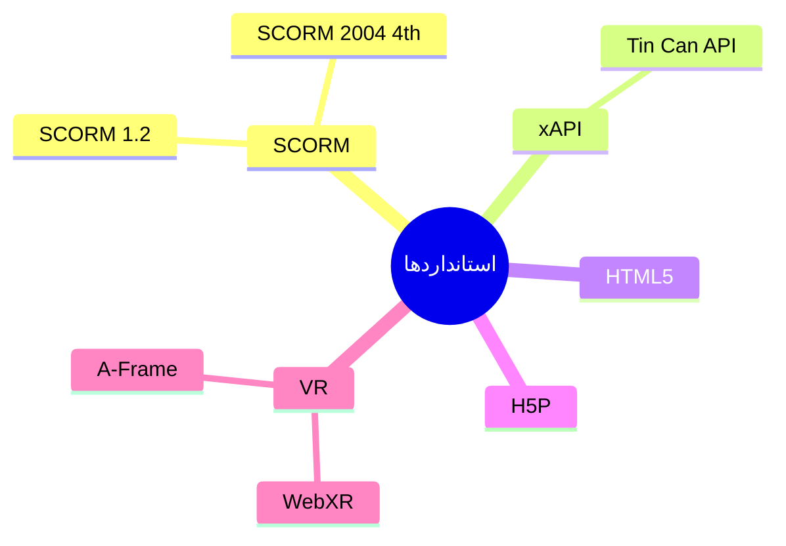

# ⚙️ قابلیت‌های فنی

> [!info] بخش ۷.۱۰ — ۱۱ ویژگی

## جدول ویژگی‌ها

| # | ویژگی | سازمانی | آکادمیک |
|---|---|---|---|
| ۱ | معماری مقیاس‌پذیر و قابل توسعه | ✅ | ✅ |
| ۲ | API برای اتصال به سیستم‌های دیگر | ✅ | ✅ |
| ۳ | استقرار On-Premise یا Cloud | ✅ | ✅ |
| ۴ | سفارشی‌سازی با پوسته‌های اختصاصی | ✅ | ✅ |
| ۵ | عملکرد پایدار برای کاربر همزمان بالا (MOOC) | ✅ | ✅ |
| ۶ | طراحی واکنش‌گرا (Responsive) | ✅ | ✅ |
| ۷ | سازگاری با مرورگرهای مختلف | ✅ | ✅ |
| ۸ | پشتیبانی از SCORM 1.2 و SCORM 2004 4th | ✅ | ✅ |
| ۹ | پشتیبانی از محتوای واقعیت مجازی | ✅ | ✅ |
| ۱۰ | پشتیبانی از xAPI (Tin Can) | ✅ | ✅ |
| ۱۱ | پشتیبانی از HTML5 | ✅ | ✅ |

## استانداردهای فنی پشتیبانی‌شده

## پیوندها
- بازگشت: [[06-ویژگی‌های نسخه استاندارد]]

#فنی #SCORM #xAPI #HTML5 #MOOC
