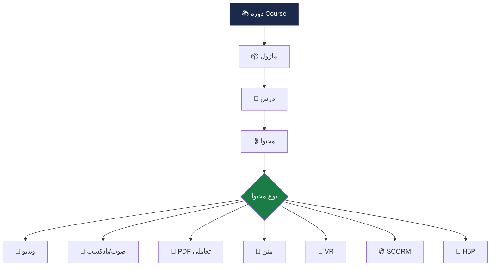

# 📚 مدیریت محتوای آموزشی

> [!info] بخش ۷.۱ — ۱۵ ویژگی

## جدول ویژگی‌ها

| # | ویژگی | سازمانی | آکادمیک |
|---|---|---|---|
| ۱ | تعریف دوره‌های آفلاین، آنلاین، حضوری و ترکیبی (Blended) | ✅ | ✅ |
| ۲ | تعریف ساختار دوره (اهداف، سرفصل، درس، ماژول، آزمون) | ✅ | ✅ |
| ۳ | تعریف پیش‌نیاز دوره | ✅ | ✅ |
| ۴ | تعریف همنیاز دوره | ❌ | ✅ |
| ۵ | تنظیم تاریخ شروع و پایان | ✅ | ✅ |
| ۶ | مدیریت ظرفیت کلاس و ثبت‌نام‌ها | ✅ | ✅ |
| ۷ | تعریف ترم تحصیلی و واحدهای درسی | ❌ | ✅ |
| ۸ | تعیین سقف واحد | ❌ | ✅ |
| ۹ | فرایند حذف و اضافه واحدهای درسی | ❌ | ✅ |
| ۱۰ | ضبط خودکار جلسات زنده → منبع قابل دانلود | ✅ | ✅ |
| ۱۱ | ایجاد دسته‌بندی و برچسب‌گذاری دوره‌ها | ✅ | ✅ |
| ۱۲ | پشتیبانی از فرمت‌های متنی، صوتی، تصویری و ویدئویی | ✅ | ✅ |
| ۱۳ | پشتیبانی از PDFهای تعاملی (لینک داخلی) | ✅ | ✅ |
| ۱۴ | پشتیبانی از نمایش محتوای واقعیت مجازی (VR) | ✅ | ❌ |
| ۱۵ | پشتیبانی از محتوای صوتی در قالب پادکست | ✅ | ✅ |

## ساختار محتوا

## استانداردهای پشتیبانی‌شده

- **SCORM 1.2** و **SCORM 2004 4th Edition**
- **H5P** — محتوای تعاملی HTML5
- **xAPI (Tin Can)** — ردیابی یادگیری
- **HTML5** — پشتیبانی پایه

## پیوندها
- بازگشت: [[06-ویژگی‌های نسخه استاندارد]]
- مرتبط: [[Core Engine — لایه هسته]] (Content Delivery Engine)

#محتوا #SCORM #H5P #VR #پادکست
