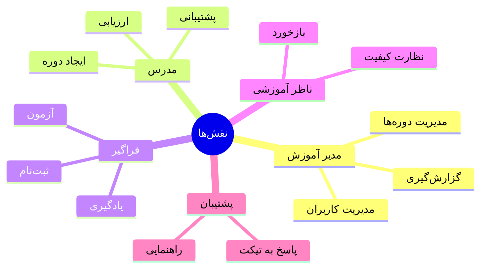

# 👥 مدیریت کاربران و نقش‌ها

> [!info] بخش ۷.۲ — ۶ ویژگی

## جدول ویژگی‌ها

| # | ویژگی | سازمانی | آکادمیک |
|---|---|---|---|
| ۱ | پروفایل کاربری کامل | ✅ | ✅ |
| ۲ | تعریف نقش‌ها (مدیر آموزش، مدرس، فراگیر، ناظر آموزشی، پشتیبان) | ✅ | ✅ |
| ۳ | دسته‌بندی بر اساس دپارتمان، شغل، سطح مهارت، شیفت، جنسیت | ✅ | ❌ |
| ۴ | دسته‌بندی بر اساس رشته، گرایش، درس، جنسیت | ❌ | ✅ |
| ۵ | ثبت‌نام انفرادی و گروهی | ✅ | ✅ |
| ۶ | تعیین دوره‌های اجباری برای گروه‌ها | ✅ | ❌ |

## ۵ نقش اصلی

## پیوندها
- بازگشت: [[06-ویژگی‌های نسخه استاندارد]]
- مرتبط: [[Core Engine — لایه هسته]] (User Management)

#کاربران #نقش‌ها #RBAC #User-Management
