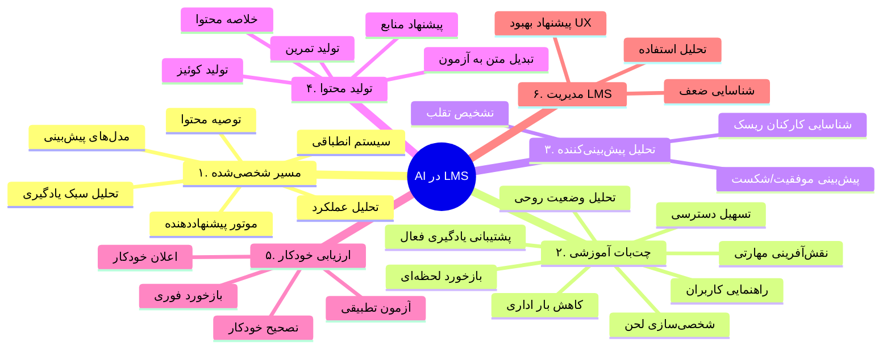
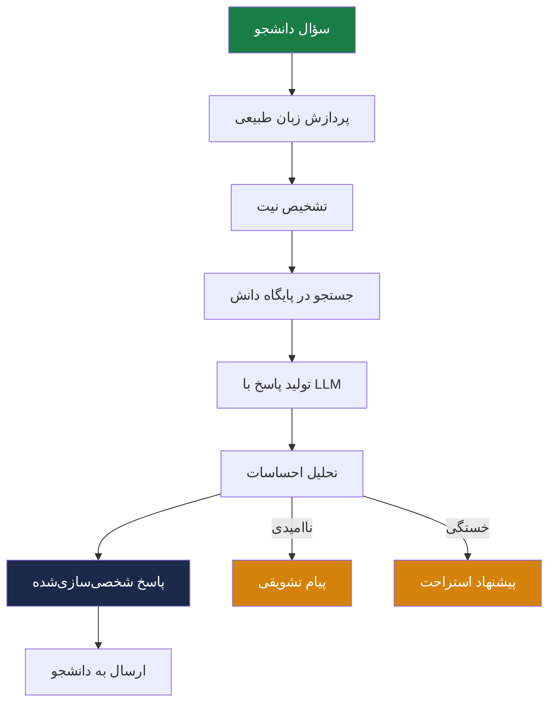

# 🤖 هوش مصنوعی (AI)

> [!info] بخش ۸.۲ — ۶ کاربرد + ۵ زیرماژول تحویلی

## تعریف
در سیستم‌های مدیریت یادگیری، هوش مصنوعی (AI) می‌تواند در مواردی همچون بهبود تجربه یادگیری، شخصی‌سازی محتوا و خودکارسازی وظایف به کار گرفته شود.

## ۶ کاربرد AI

## ۵ زیرماژول تحویلی

| # | زیرماژول | فعالیت‌های کلیدی | خروجی‌های اصلی |
|---|---|---|---|
| ۱ | **موتور پیشنهاددهی** | تحلیل رفتار، آموزش ML | API سرویس پیشنهاد، Content-based + Collaborative filtering |
| ۲ | **تحلیل شکاف مهارتی** | تحلیلگر انطباق مهارت با نیاز شغلی | داشبورد Skill-Gap، خروجی JSON |
| ۳ | **پشتیبانی هوشمند** | آموزش LLM روی محتوای آموزشی، RAG | ربات پشتیبان، مستندات Fine-tuning |
| ۴ | **تشخیص تقلب** | تحلیل الگوهای فعالیت و زمان پاسخ | سیستم Anomaly Detection، گزارش هشدار |
| ۵ | **داشبورد پیش‌بینی** | تحلیل داده‌های تاریخی | مدل Risk Scoring، نمودارهای تحلیلی |

## الزامات AI برای مسیر شخصی‌شده

### الف) داده‌های جامع و باکیفیت
- **پروفایل کاربر**: دموگرافیک، نقش شغلی، اهداف یادگیری
- **تاریخچه تعاملات**: رفتارهای گذشته (محتوا دیده شده، آزمون‌ها، نمرات)
- **ماتریس مهارت‌ها**: مقایسه مهارت‌های فعلی با مهارت‌های مورد نیاز

### ب) ساختاردهی و برچسب‌گذاری محتوا
- **تگ‌گذاری دقیق**: سطح دشواری، موضوع، پیش‌نیازها، زمان یادگیری
- **درخت دانش (Knowledge Graph)**: روابط بین مفاهیم

### ج) زیرساخت الگوریتمی
- **موتور پیشنهاددهنده** (Recommendation Engine)
- **مدل‌های پیش‌بینی** (Predictive Models)
- **سیستم انطباقی** (Adaptive Learning Engine)

## فلوچانت چت‌بات آموزشی

## ۸ کارکرد چت‌بات آموزشی
1. راهنمایی کاربران در استفاده از سیستم
2. ارائه بازخورد سازنده و لحظه‌ای (توضیح اشتباه به جای فقط «غلط»)
3. شخصی‌سازی لحن و سرعت آموزش
4. پشتیبانی از یادگیری فعال (نقش Coach)
5. تسهیل دسترسی (text-to-speech و برعکس)
6. تحلیل وضعیت روحی و سطح درگیری
7. نقش‌آفرینی مهارت‌محور (مشتری/بیمار)
8. کاهش بار اداری (پاسخ به FAQ)

## الزام نهایی
> [!important] معماری
> تمامی سرویس‌های هوشمند به‌صورت **میکروسرویس‌محور** و قابل فراخوانی از طریق **API** پیاده‌سازی شوند تا:
> - امکان یکپارچگی با سایر بخش‌های سیستم
> - به‌روزرسانی مدل‌ها بدون اختلال در عملکرد اصلی LMS

## پیوندها
- بازگشت: [[07-ویژگی‌های نسخه هوشمند سازمانی]]
- لایه: [[Enterprise Smart Layer — لایه سازمانی هوشمند]]

#هوش-مصنوعی #AI #Recommender #Chatbot #Proctoring #RAG #LLM
