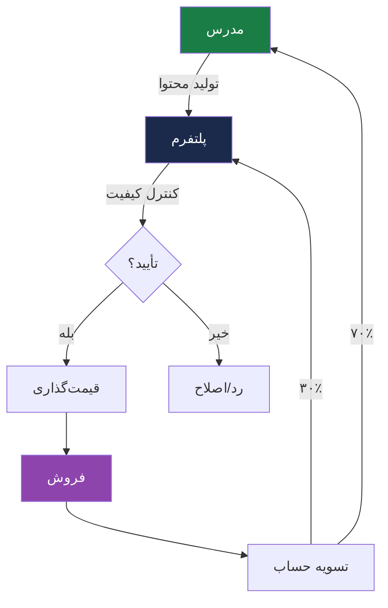
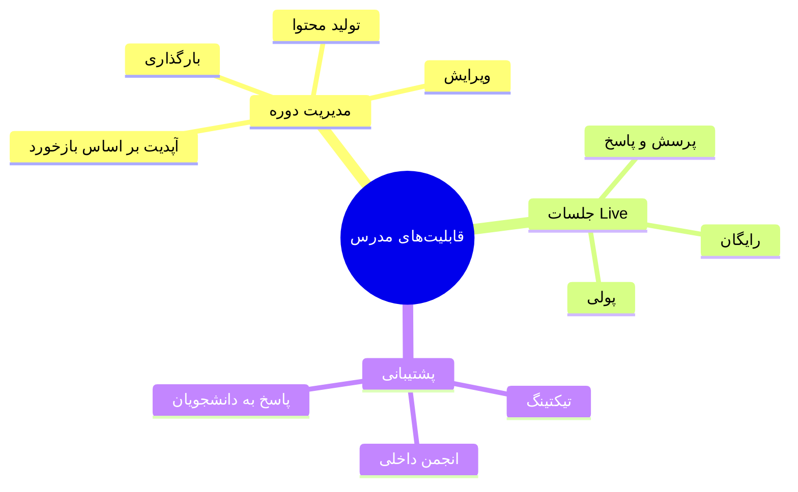
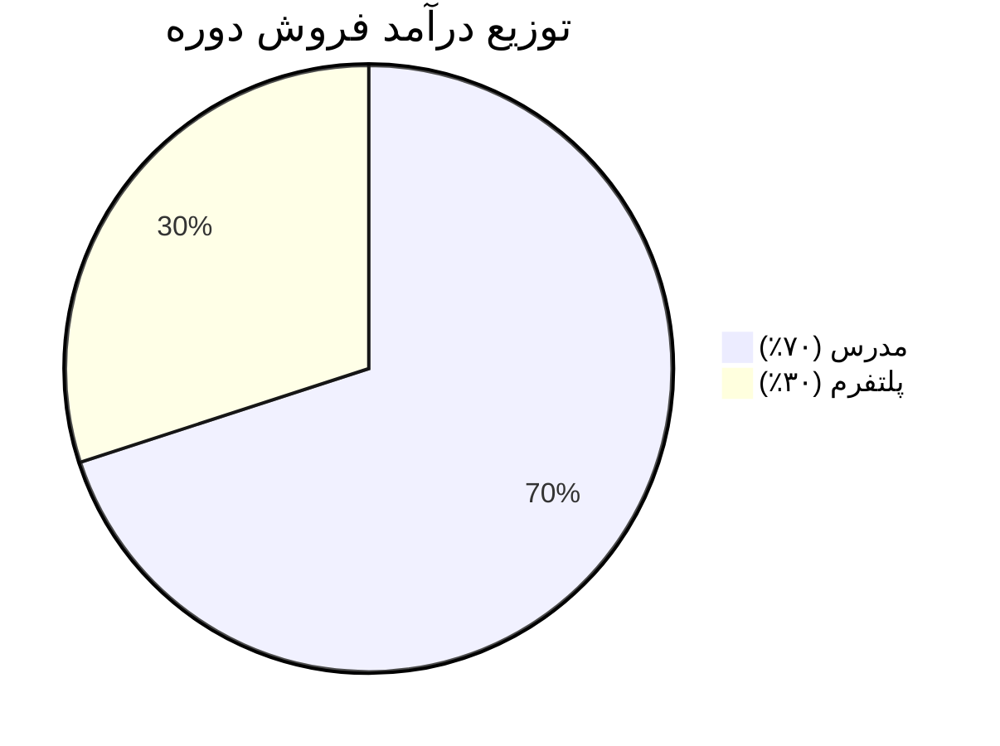
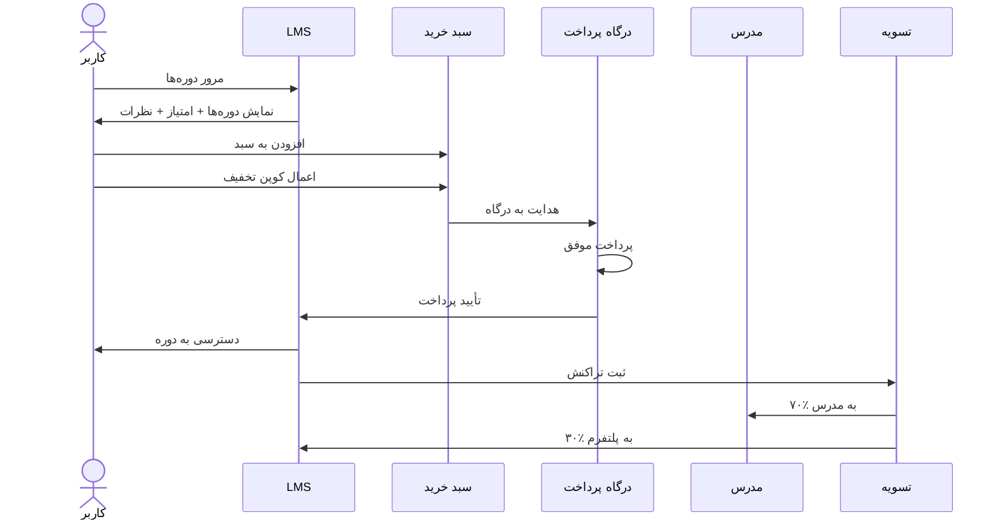

# 🛒 پنل فروش Marketplace

> [!info] بخش ۸.۳ — ۷ قابلیت اصلی + قابلیت‌های مدرس

## تعریف
پنل برای فروش مستقل توسط مدرس (LMS as a Marketplace). مدرس دوره تولید، پلتفرم کنترل کیفیت می‌کند، دوره قیمت‌گذاری و فروخته می‌شود.

## فرآیند کلی

## ۷ قابلیت اصلی

| # | قابلیت | توضیح |
|---|---|---|
| ۱ | **تعریف درصد کمیسیون طرفین** | قابل تنظیم (مثلاً ۷۰/۳۰) |
| ۲ | **تسویه حساب با مدرس** | خودکار یا دستی |
| ۳ | **گزارشات فروش** | به تفکیک سال، ماه، نام مدرس، عنوان دوره |
| ۴ | **کوپن تخفیف** | ایجاد و مدیریت |
| ۵ | **امتیازدهی و نظرات کاربران** | سیستم بازخورد و review |
| ۶ | **سبد خرید مشتری** | مدیریت سبد و checkout |
| ۷ | **پرداخت آنلاین** | اتصال به درگاه پرداخت |

## قابلیت‌های مدرس

> [!important] چون مدرس در فرآیند پشتیبانی هم نقش دارد، سیستم ارزیابی برای مدرس مهم است.

## مدل درآمدی

## سناریوهای درآمدی

| سناریو | قیمت دوره | سهم مدرس | سهم پلتفرم |
|---|---|---|---|
| دوره ارزان | ۱۰۰٬۰۰۰ تومان | ۷۰٬۰۰۰ | ۳۰٬۰۰۰ |
| دوره متوسط | ۵۰۰٬۰۰۰ تومان | ۳۵۰٬۰۰۰ | ۱۵۰٬۰۰۰ |
| دوره گران | ۲٬۰۰۰٬۰۰۰ تومان | ۱٬۴۰۰٬۰۰۰ | ۶۰۰٬۰۰۰ |

## فلوچانت خرید کاربر

## پیوندها
- بازگشت: [[07-ویژگی‌های نسخه هوشمند سازمانی]]
- لایه: [[Marketplace Layer — لایه بازار فروش]]

#Marketplace #فروش #مدرس #کمیسیون #تسویه-حساب
