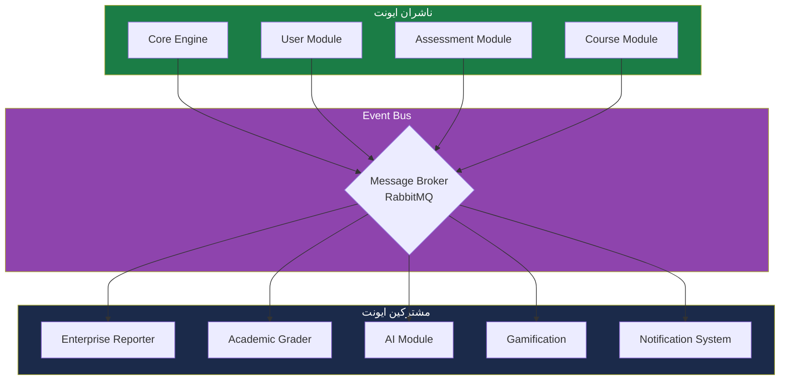
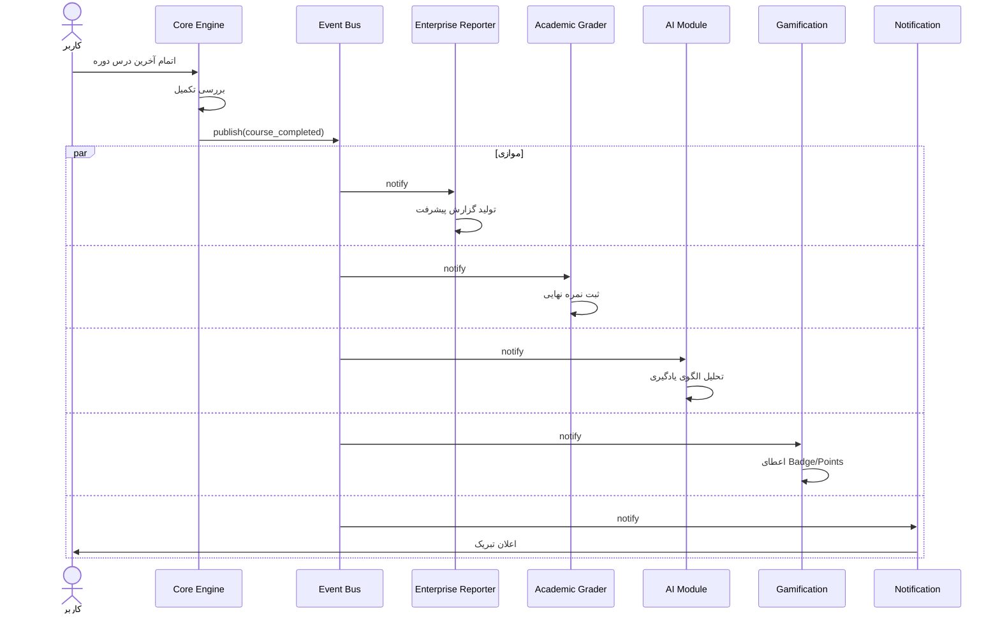
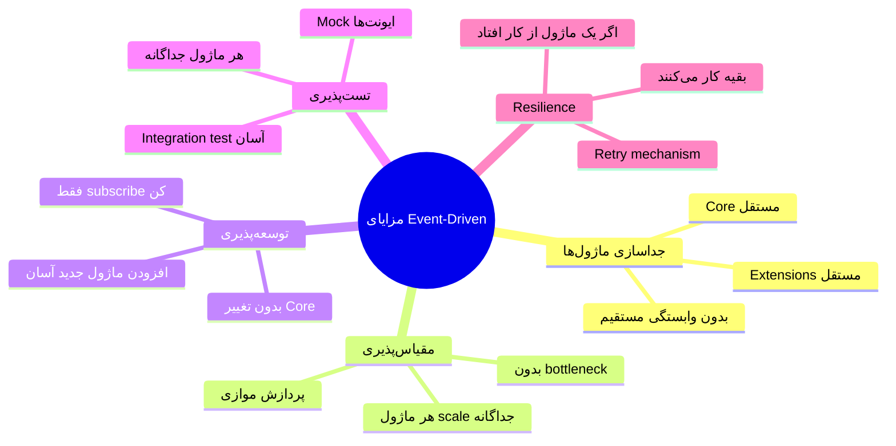
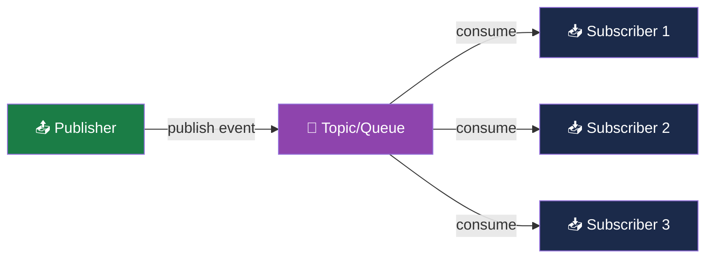

# 🔄 دیاگرام Event Flow

> [!abstract] خلاصه
> معماری Event-Driven که مهم‌ترین بخش Core Engine برای آینده است.

---

## ۱. معماری Event Bus



---

## ۲. ایونت course_completed



---

## ۳. ایونت‌های اصلی سیستم

| ایونت | ناشر | مشترکین | توضیح |
|---|---|---|---|
| `course_completed` | Core Engine | Reporter, Grader, AI, Gamif | کاربر دوره را تمام کرد |
| `user_registered` | User Module | Notif, Gamif | کاربر جدید ثبت‌نام کرد |
| `quiz_submitted` | Assessment | Grader, AI, Gamif | کاربر آزمون را ثبت کرد |
| `lesson_completed` | Course Module | Gamif, AI | کاربر یک درس را تمام کرد |
| `badge_earned` | Gamification | Notif | کاربر Badge جدید گرفت |
| `level_up` | Gamification | Notif, AI | کاربر به سطح بالاتر رفت |
| `enrollment_created` | Enrollment | Notif, Gamif | کاربر در دوره ثبت‌نام کرد |
| `certificate_issued` | Certification | Notif | گواهی صادر شد |
| `fraud_detected` | AI/Proctoring | Notif (Admin) | تقلب تشخیص داده شد |
| `payment_completed` | Marketplace | Notif, Course (Unlock) | پرداخت موفق |

---

## ۴. چرا Event-Driven؟



---

## ۵. الگوی پیاده‌سازی

### Pattern: Publish-Subscribe



### نمونه کد (مفهومی)

```csharp
// Publish
await _eventBus.PublishAsync(new CourseCompletedEvent {
    UserId = userId,
    CourseId = courseId,
    CompletedAt = DateTime.UtcNow
});

// Subscribe (in Enterprise Reporter)
public class CourseCompletedEventHandler : IEventHandler<CourseCompletedEvent>
{
    public async Task HandleAsync(CourseCompletedEvent @event)
    {
        await _reportService.GenerateProgressReport(@event.UserId, @event.CourseId);
    }
}
```

---

## 🔗 پیوندها

- بازگشت: [[دیاگرام معماری کلی]]
- جزئیات: [[Core Engine — لایه هسته]] (Event Bus)
- مرتبط: [[Enterprise Smart Layer — لایه سازمانی هوشمند]] (AI, Gamification)

---

#دیاگرام #Event-Driven #EventBus #Architecture #Mermaid
