# 🏗️ دیاگرام معماری کلی RFP

> [!abstract] خلاصه
> این فایل شامل تمام دیاگرام‌های اصلی معماری RFP است که با Mermaid پیاده‌سازی شده‌اند.

---

## ۱. نقشه ذهنی کلی (Mind Map)

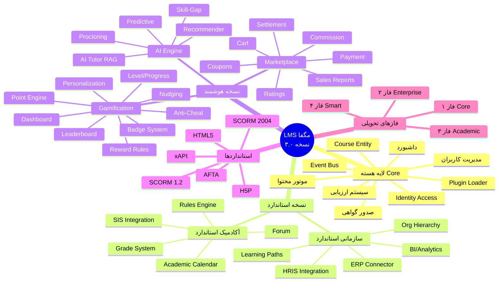

---

## ۲. فلوچارت معماری سه‌لایه

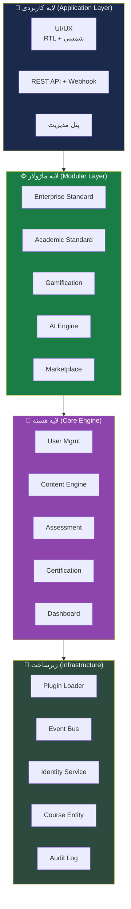

---

## ۳. دیاگرام روابط لایه‌ها

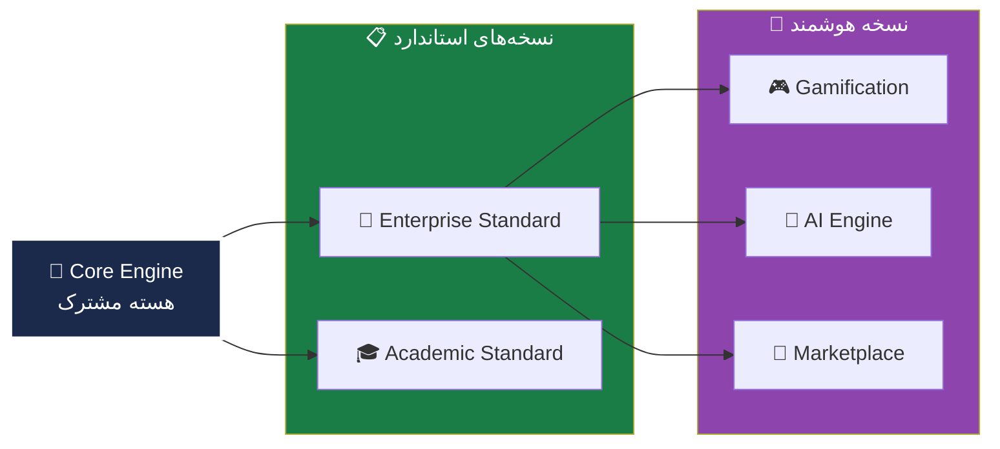

---

## ۴. معماری Event-Driven

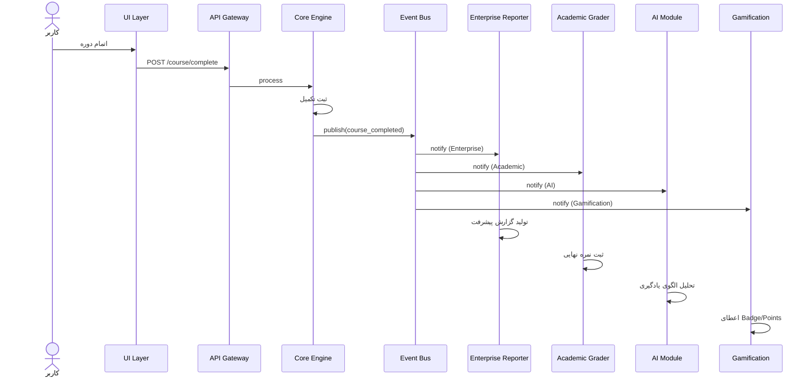

---

## ۵. معماری Plugin Loader

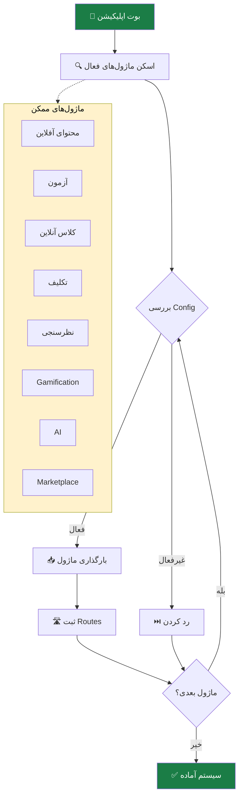

---

## ۶. فرآیند Course Entity Generic

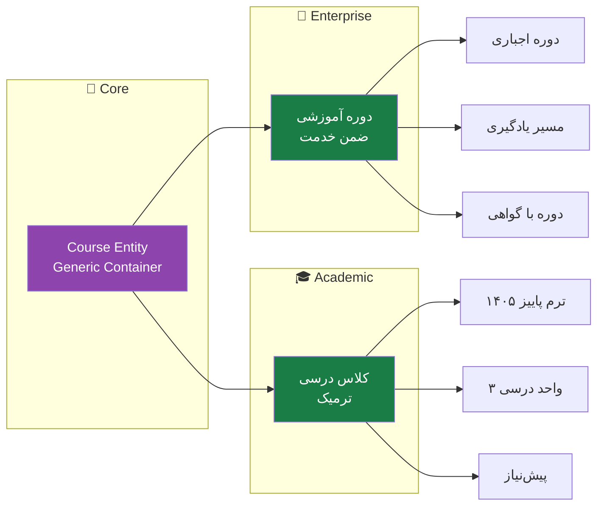

---

## ۷. فرآیند یکپارچگی HRIS

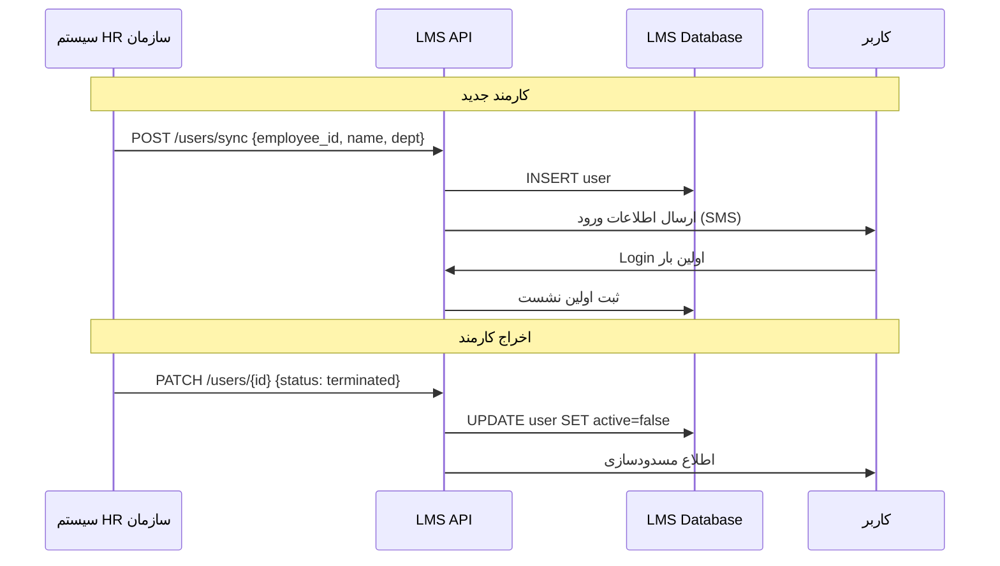

---

## ۸. فرآیند یکپارچگی SIS

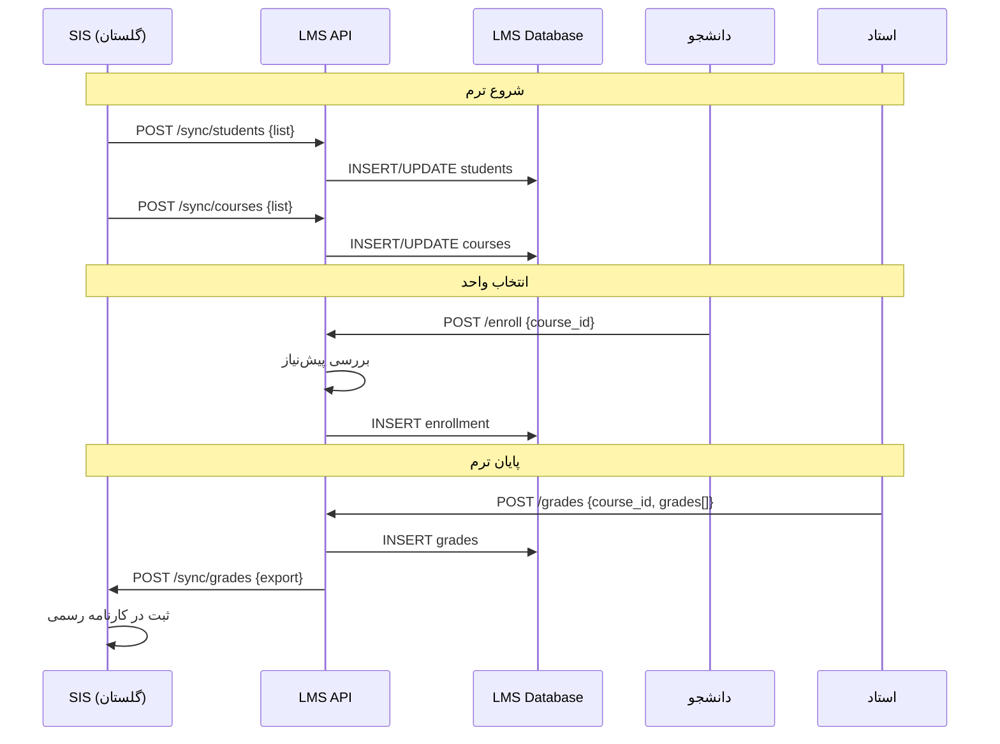

---

## ۹. معماری Gamification Engine

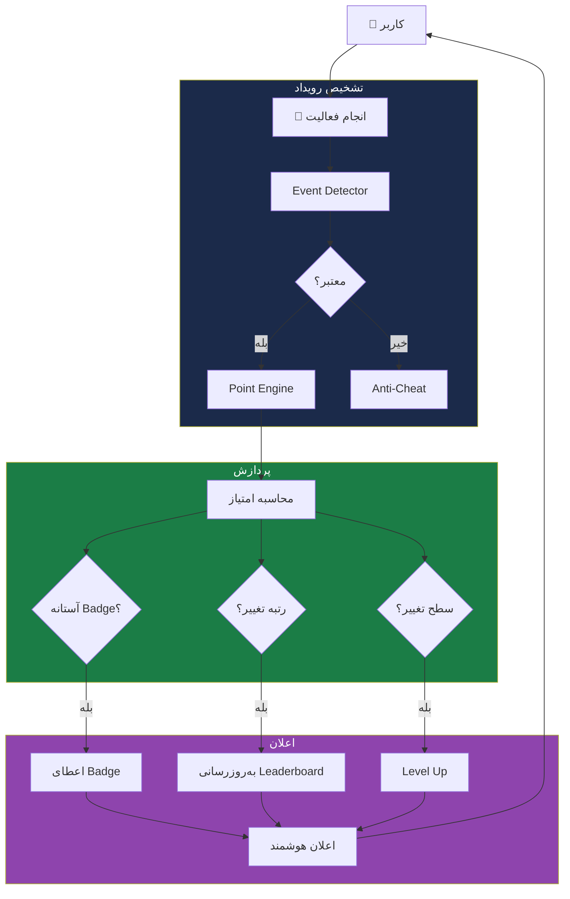

---

## ۱۰. معماری AI Engine

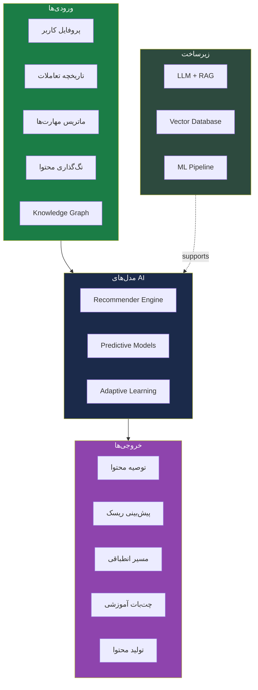

---

## ۱۱. فرآیند Marketplace

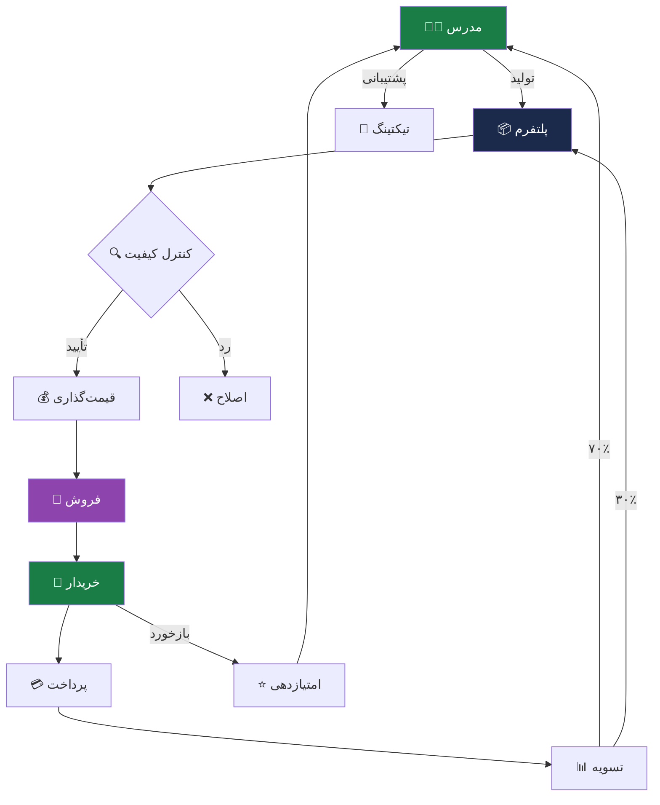

---

## ۱۲. فازهای تحویلی پروژه

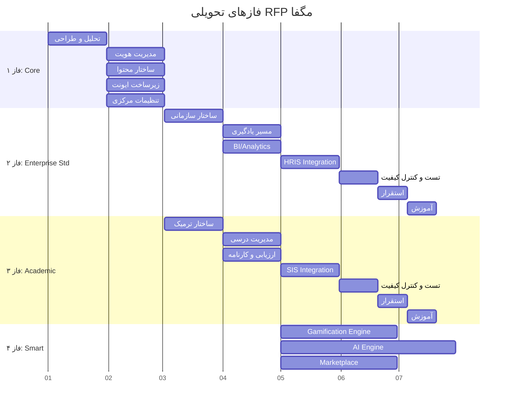

---

## 🔗 پیوندها

- بازگشت: [[MOC — RFP LMS مگفا]]
- جزئیات بیشتر: [[Core Engine — لایه هسته]]، [[Enterprise Standard Layer — لایه سازمانی استاندارد]]، [[Enterprise Smart Layer — لایه سازمانی هوشمند]]، [[Academic Layer — لایه آکادمیک]]، [[Marketplace Layer — لایه بازار فروش]]

---

#دیاگرام #معماری #Mermaid #Architecture #Flowchart #Mindmap
