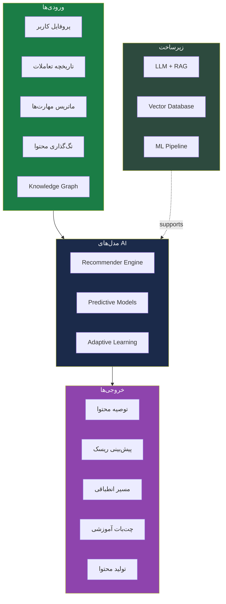
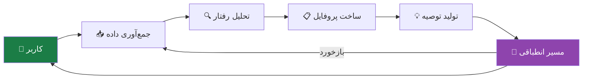
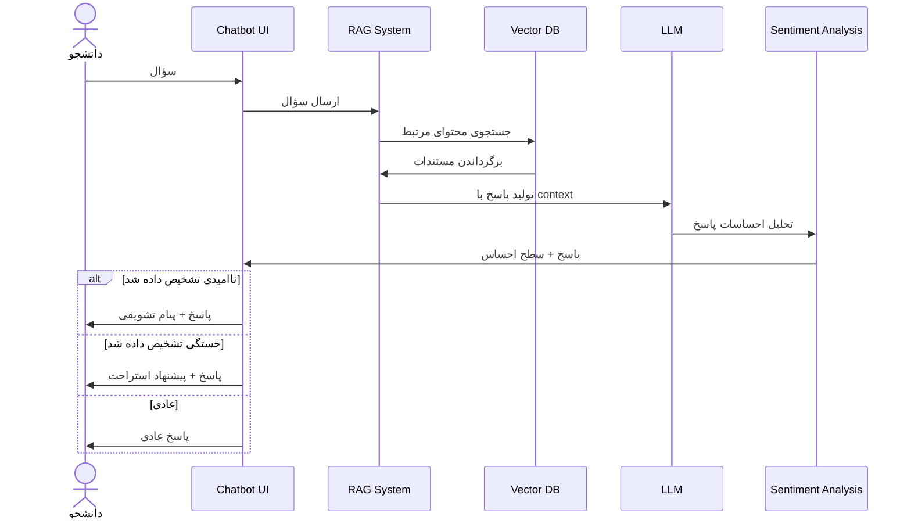
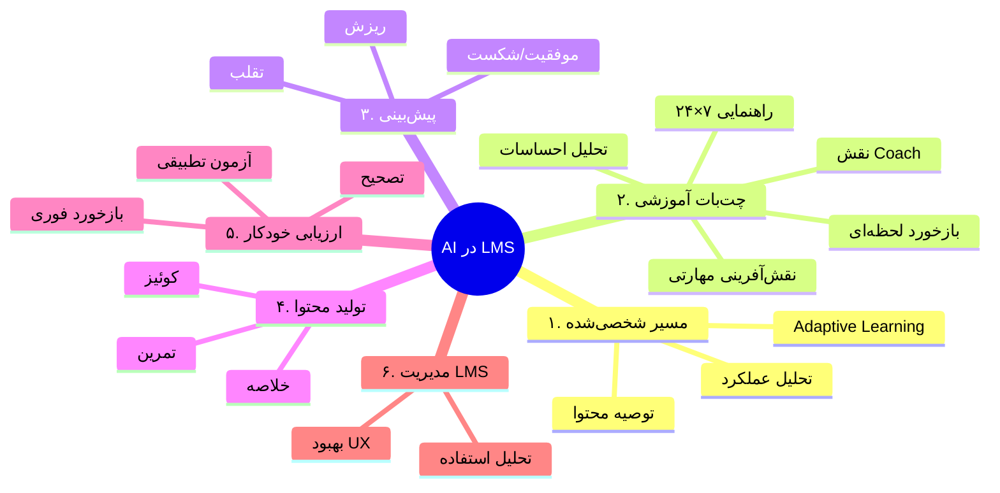
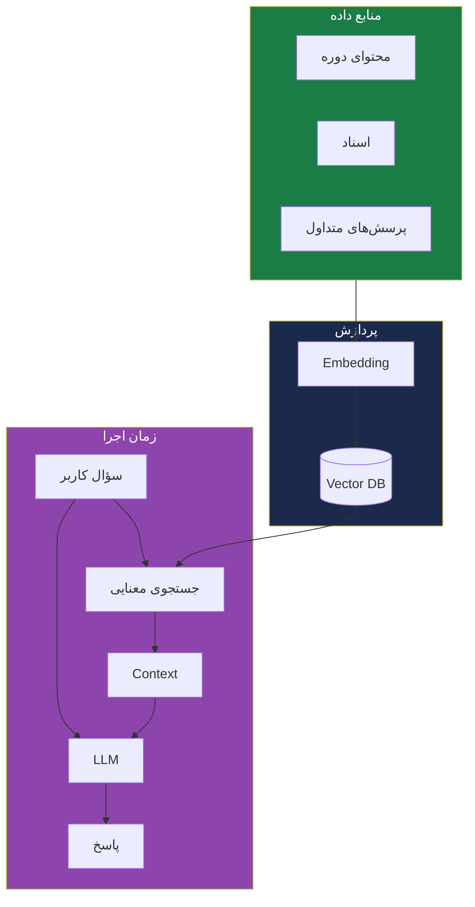
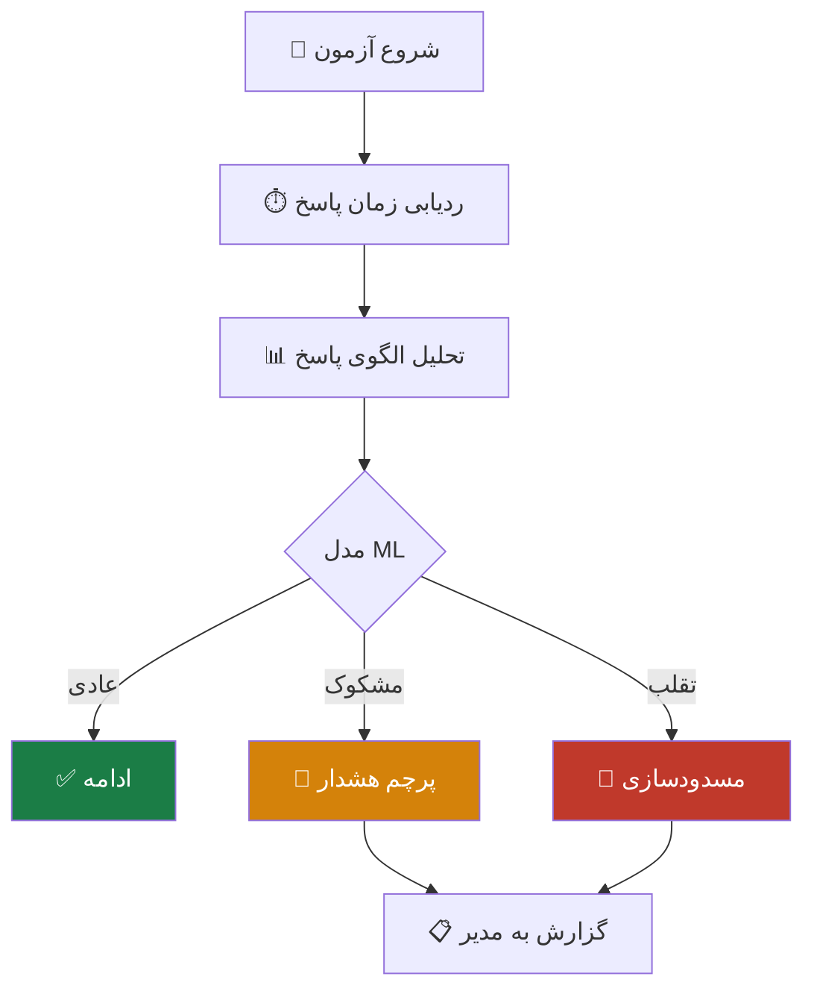
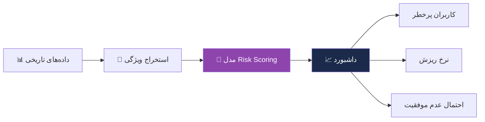

# 🤖 دیاگرام هوش مصنوعی

> [!abstract] خلاصه
> این فایل شامل دیاگرام‌های مربوط به موتور AI است.

---

## ۱. معماری AI Engine

---

## ۲. چرخه Personalized Learning

---

## ۳. فلوچانت چت‌بات آموزشی (RAG)

---

## ۴. ۶ کاربرد AI

---

## ۵. زیرساخت LLM + RAG

---

## ۶. مدل تشخیص تقلب

---

## ۷. داشبورد پیش‌بینی ریسش

---

## 🔗 پیوندها

- بازگشت: [[دیاگرام معماری کلی]]
- جزئیات: [[هوش مصنوعی]]
- لایه: [[Enterprise Smart Layer — لایه سازمانی هوشمند]]

---

#دیاگرام #هوش-مصنوعی #AI #RAG #LLM #Mermaid
