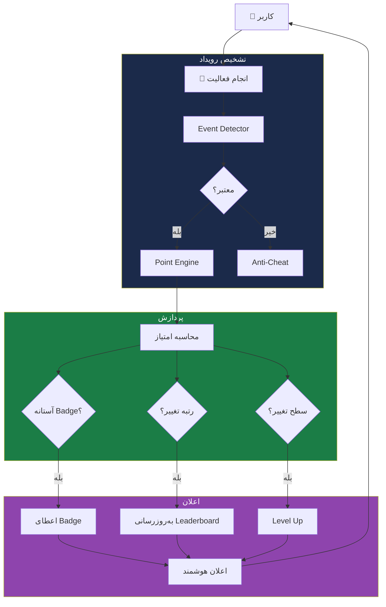
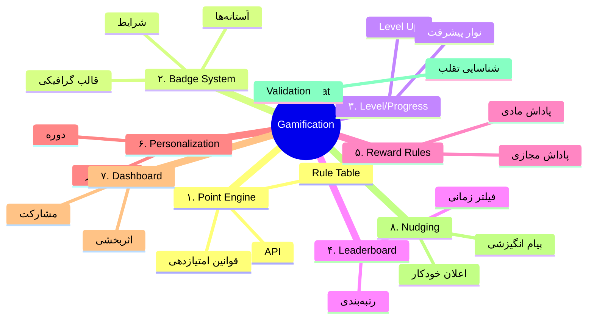
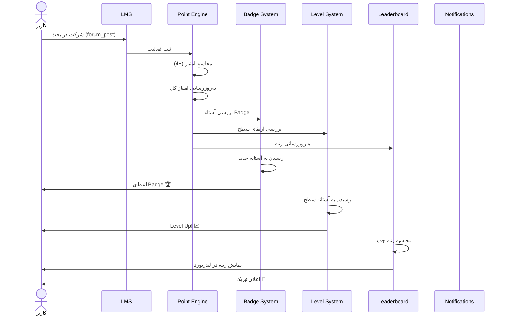

# 🎮 دیاگرام گیمفیکیشن

> [!abstract] خلاصه
> این فایل شامل دیاگرام‌های مربوط به موتور Gamification است.

---

## ۱. معماری Gamification Engine

---

## ۲. نقشه ذهنی ۹ زیرماژول

---

## ۳. فرآیند امتیازدهی

---

## ۴. فعالیت‌های قابل امتیازدهی

| فعالیت | امتیاز معمول |
|---|---|
| شرکت در بحث (Forum Post) | +۴ |
| پاسخ صحیح به آزمون | +۱۰ |
| تکمیل درس | +۵ |
| حضور در کلاس | +۲ |
| ارسال تمرین | +۳ |
| تکمیل مسیر یادگیری | +۵۰ |
| عملکرد عالی | +۲۰ |

---

## 🔗 پیوندها

- بازگشت: [[دیاگرام معماری کلی]]
- جزئیات: [[بازیوارسازی]]
- لایه: [[Enterprise Smart Layer — لایه سازمانی هوشمند]]

---

#دیاگرام #گیمفیکیشن #Gamification #Mermaid
