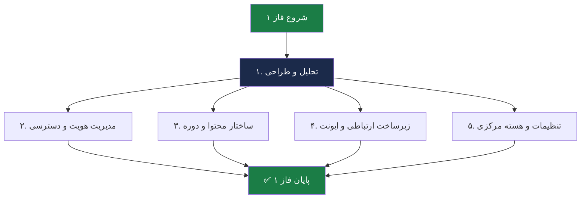
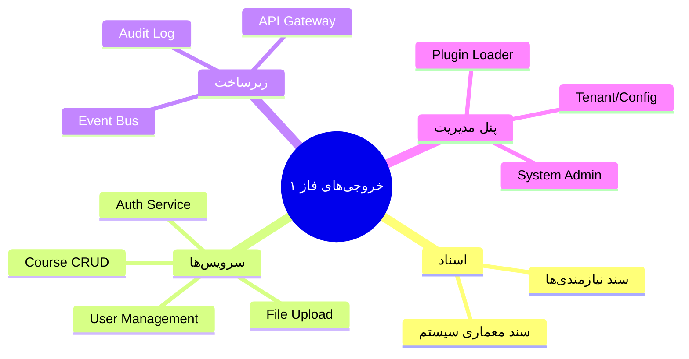

# 📦 فاز ۱ — Core Engine

> [!abstract] خلاصه
> فاز ۱ شامل توسعه زیرساخت هسته (Core Engine) است که پایه تمام لایه‌های دیگر خواهد بود.

---

## ۵ لایه تحویلی فاز ۱

| # | لایه | فعالیت‌های کلیدی | خروجی‌های اصلی |
|---|---|---|---|
| ۱ | تحلیل و طراحی | جمع‌آوری و تحلیل نیازمندی‌ها، طراحی معماری سیستم | سند نیازمندی‌های محصول، سند معماری سیستم |
| ۲ | مدیریت هویت و دسترسی | طراحی User/Role/Permission، پیاده‌سازی سرویس JWT، طراحی مکانیزم احراز هویت عمومی | سرویس Auth، سیستم مدیریت پروفایل کاربر، APIهای login/register |
| ۳ | ساختار محتوا و دوره | طراحی مدل انتزاعی دوره (Course Entity)، تعریف انواع محتوا، سیستم گروهبندی محتوا | ساختار دیتابیسی منعطف برای انواع Course، سیستم آپلود و مدیریت فایل، CRUDهای اصلی دوره |
| ۴ | زیرساخت ارتباطی و ایونت | پیاده‌سازی Event Bus داخلی، تنظیم سیستم لاگینگ مرکزی، طراحی لایه Integration و مکانیزم اطلاع‌رسانی بین سیستمی (وبهوک) | زیرساخت اطلاع‌رسانی داخلی، سیستم ثبت الگِ فعالیتهای کاربر (Audit Log)، لایه واسط API |
| ۵ | تنظیمات و هسته مرکزی | طراحی جدول تنظیمات سراسری (Tenant/Config)، سیستم مدیریت نقش‌های پایه، معماری ماژولار (Plugin Loader) | پنل مدیریت پایه (System Admin)، قابلیت فعال/غیرفعال کردن ماژولها، ساختار اولیه تنظیمات سیستم |

---

## فلوچانت فاز ۱

---

## خروجی‌های کلیدی فاز ۱

---

## پیش‌نیازها

- تیم توسعه آماده
- زیرساخت سرور (Dev/Staging)
- انتخاب تکنولوژی (مثلاً .NET + React)
- انتخاب دیتابیس (مثلاً PostgreSQL)

---

## وابستگی‌ها

- این فاز **پایه تمام فازهای بعدی** است
- خروجی‌های این فاز باید کامل و تست‌شده باشند قبل از شروع فاز ۲ یا ۳

---

## 🔗 پیوندها

- بازگشت: [[05-فعالیت‌های کلیدی و تحویلی]]
- جزئیات لایه: [[Core Engine — لایه هسته]]
- فاز بعدی: [[فاز ۲ — Enterprise Standard]]
- دیاگرام: [[دیاگرام معماری کلی]]

---

#فاز-۱ #Core #تحویلی #Phase-1
