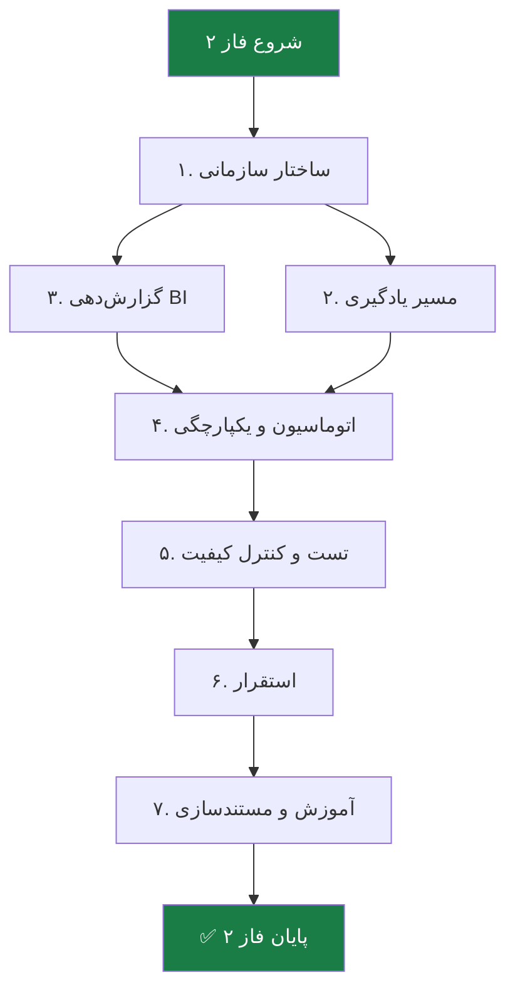

# 📦 فاز ۲ — Enterprise Standard

> [!abstract] خلاصه
> فاز ۲ شامل توسعه ماژول سازمانی نسخه استاندارد است.

## ۷ لایه تحویلی فاز ۲

| # | لایه | فعالیت‌های کلیدی | خروجی‌های اصلی |
|---|---|---|---|
| ۱ | ساختار سازمانی و دسترسی | تعریف دپارتمان‌ها (Hierarchy)، RBAC چندلایه، SSO/LDAP | ساختار درختی سازمان، اتصال AD/LDAP |
| ۲ | مدیریت یادگیری و مسیر شغلی | Learning Paths، Skills | داشبورد پیشرفت فردی |
| ۳ | گزارش‌دهی و BI | موتور گزارش‌ساز داینامیک | داشبوردهای مدیریتی، تحلیل شکاف مهارت |
| ۴ | اتوماسیون و یکپارچگی | Webhook، ERP/HRIS، Workflow | Connector اختصاصی، اتوماسیون انتساب دوره |
| ۵ | تست و کنترل کیفیت | Unit/Integration Tests، UAT | گزارش نتایج تست‌ها |
| ۶ | استقرار و راه‌اندازی | نصب، انتقال داده | محیط LMS عملیاتی |
| ۷ | آموزش و مستندسازی | جلسات آموزشی | User Manual + Admin Guide |

## فلوچانت

## 🔗 پیوندها
- بازگشت: [[05-فعالیت‌های کلیدی و تحویلی]]
- جزئیات: [[Enterprise Standard Layer — لایه سازمانی استاندارد]]
- فاز قبلی: [[فاز ۱ — Core Engine]]
- فاز بعدی: [[فاز ۳ — Academic]]

#فاز-۲ #Enterprise #تحویلی #Phase-2
