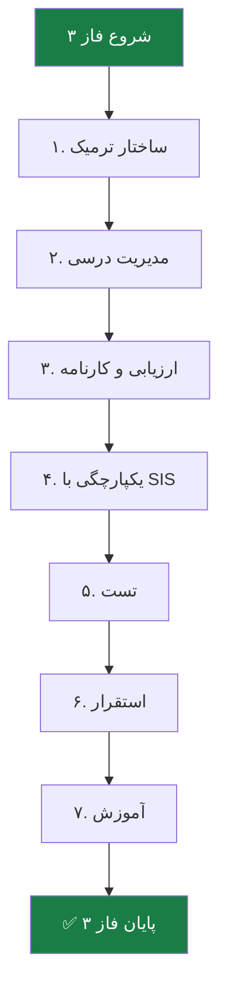

# 📦 فاز ۳ — Academic

> [!abstract] خلاصه
> فاز ۳ شامل توسعه ماژول آکادمیک است.

## ۷ لایه تحویلی فاز ۳

| # | لایه | فعالیت‌های کلیدی | خروجی‌های اصلی |
|---|---|---|---|
| ۱ | ساختار ترمیک و زمانی | تعریف چارت تحصیلی، مدیریت ترم‌ها، بازه‌های انتخاب واحد | تقویم آموزشی، Academic Calendar |
| ۲ | مدیریت فرایندهای درسی | تعریف دروس، پیش‌نیاز/همنیاز، ظرفیت، گروه‌های آموزشی | Courses Catalog، قوانین پیش‌نیاز |
| ۳ | ارزیابی و کارنامه | روش‌های نمره‌دهی، ثبت اعتراض | سیستم محاسبه نمره، پنل نمره‌دهی، کارنامه |
| ۴ | یکپارچگی با SIS | درگاه تبادل داده با گلستان/سجاد/مروارید | کانکتور اختصاصی SIS، انتقال نمرات |
| ۵ | تست و کنترل کیفیت | Unit/Integration Tests، UAT | گزارش نتایج تست‌ها |
| ۶ | استقرار و راه‌اندازی | نصب، انتقال داده | محیط LMS عملیاتی |
| ۷ | آموزش و مستندسازی | جلسات آموزشی | User Manual + Admin Guide |

## فلوچانت

## 🔗 پیوندها
- بازگشت: [[05-فعالیت‌های کلیدی و تحویلی]]
- جزئیات: [[Academic Layer — لایه آکادمیک]]
- فاز قبلی: [[فاز ۲ — Enterprise Standard]]
- فاز بعدی: [[فاز ۴ — Enterprise Smart]]

#فاز-۳ #Academic #تحویلی #Phase-3
