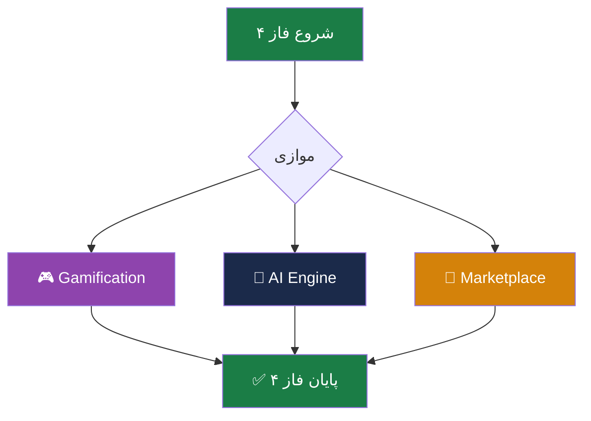

# 📦 فاز ۴ — Enterprise Smart

> [!abstract] خلاصه
> فاز ۴ شامل توسعه ماژول‌های هوشمند سازمانی است: Gamification، AI Engine و Marketplace.

## ۳ موتور فاز ۴

### ۴-۱. Gamification Engine (۹ زیرماژول)
- موتور امتیازدهی (Point Engine)
- سیستم نشان (Badge/Achievement)
- سطح‌بندی (Level/Progress)
- لیدربورد (Leaderboard)
- قوانین پاداش (Reward Rules)
- شخصی‌سازی تجربه
- داشبورد مدیران
- اعلان‌ها و محرک‌های رفتاری
- قوانین ضدتقلب

### ۴-۲. AI Engine (۵ زیرماژول)
- موتور پیشنهاددهی (Recommender)
- تحلیل شکاف مهارتی (Skill-Gap)
- پشتیبانی هوشمند (AI Tutor/Chatbot)
- ارزیابی و تشخیص تقلب (Proctoring)
- داشبورد پیش‌بینی (Predictive Analytics)

### ۴-۳. Marketplace (۷ قابلیت)
- تعریف درصد کمیسیون
- تسویه حساب
- گزارشات فروش
- کوپن تخفیف
- امتیازدهی و نظرات
- سبد خرید
- پرداخت آنلاین

## فلوچانت

## 🔗 پیوندها
- بازگشت: [[05-فعالیت‌های کلیدی و تحویلی]]
- جزئیات: [[Enterprise Smart Layer — لایه سازمانی هوشمند]]
- جزئیات: [[بازیوارسازی]]، [[هوش مصنوعی]]، [[پنل فروش Marketplace]]
- فاز قبلی: [[فاز ۳ — Academic]]

#فاز-۴ #Smart #Gamification #AI #Marketplace #تحویلی
