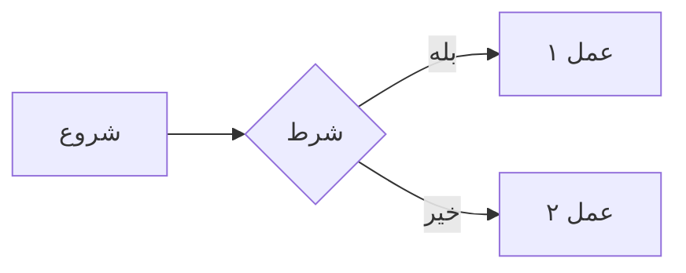

# 🔌 راهنمای پلاگین‌های Obsidian

> [!info] هدف
> این فایل راهنمای نصب و استفاده از پلاگین‌های Obsidian است که برای مشاهده بهتر این Vault طراحی شده است.

---

## 🎯 پلاگین‌های ضروری (Must-Have)

### ۱. Mermaid — برای فلوچارت‌ها
> **وضعیت:** داخلی (نیاز به نصب ندارد)

این پلاگین به‌صورت پیش‌فرض در Obsidian فعال است. فلوچارت‌ها، نمودارهای توالی و نقشه‌های ذهنی را با سینتکس Mermaid نمایش می‌دهد.

**فعال‌سازی:**
1. Settings → Community plugins → Turn on community plugins
2. در بخش Built-in plugins، گزینه **Mermaid** را فعال کنید

**نمونه استفاده:**


---

### ۲. Markmap — برای نقشه‌های ذهنی
> **وضعیت:** پلاگین جامعه (Community Plugin)

نقشه‌های ذهنی تعاملی از متن Markdown می‌سازد.

**نصب:**
1. Settings → Community plugins → Browse
2. جستجو کنید: `Markmap`
3. Install → Enable

**استفاده:**
- فایل MOC اصلی را باز کنید
- روی آیکون Markmap در نوار کناری کلیک کنید
- نقشه ذهنی تعاملی نمایش داده می‌شود

---

### ۳. Dataview — برای جداول پویا
> **وضعیت:** پلاگین جامعه (Community Plugin)

اجازه می‌دهد جداول پویا از روی frontmatter فایل‌ها بسازید.

**نصب:**
1. Settings → Community plugins → Browse
2. جستجو کنید: `Dataview`
3. Install → Enable

**نمونه استفاده:**
````
```dataview
TABLE layer, order
FROM "02_Layers"
SORT order ASC
```
````

---

### ۴. Excalidraw — برای دیاگرام دستی
> **وضعیت:** پلاگین جامعه (Community Plugin)

دیاگرام‌های دست‌ساز با ظاهر اسکچ می‌سازد.

**نصب:**
1. Settings → Community plugins → Browse
2. جستجو کنید: `Excalidraw`
3. Install → Enable

**مزایا:**
- ظاهر طبیعی و دست‌ساز
- پشتیبانی از فارسی و راست‌چین
- امکان embed در فایل‌های Markdown

---

### ۵. Canvas — برای نمایش بصری
> **وضعیت:** داخلی (نیاز به نصب ندارد)

فایل Canvas با فرمت JSON وجود دارد که می‌توانید بصری آن را ببینید.

**استفاده:**
- فایل `RFP LMS مگفا — Canvas.canvas` را باز کنید
- نمودار بصری کلی پروژه را می‌بینید
- می‌توانید node‌ها را جابجا کنید

---

## 🌟 پلاگین‌های پیشنهادی (Recommended)

### ۶. Mind Map — جایگزین Markmap
> **وضعیت:** پلاگین جامعه

نقشه ذهنی با ظاهر متفاوت. اگر Markmap را دوست نداشتید، این را امتحان کنید.

### ۷. Kanban — برای مدیریت پروژه
> **وضعیت:** پلاگین جامعه

اگر می‌خواهید فازهای پروژه را به‌صورت Kanban Board ببینید.

### ۸. Advanced Tables — برای جداول پیچیده
> **وضعیت:** پلاگین جامعه

ویرایش جداول Markdown را راحت‌تر می‌کند. با Tab بین سلول‌ها جابجا شوید.

### ۹. Templater — برای قالب‌ها
> **وضعیت:** پلاگین جامعه

اگر می‌خواهید فایل‌های جدید با قالب از پیش تعیین‌شده بسازید.

### ۱۰. Tasks — برای مدیریت تسک‌ها
> **وضعیت:** پلاگین جامعه

مدیریت تسک‌ها با checkbox و تاریخ سررسید.

---

## 🎨 پلاگین‌های تجربه کاربری

### ۱۱. Calendar — برای تقویم
نمایش تقویم کناری برای مرور فایل‌های روزانه.

### ۱۲. Graph Analysis — تحلیل گراف
تحلیل شبکه‌ای ارتباطات بین فایل‌ها.

### ۱۳. Outliner — برای outline‌ها
نمایش بهتر outline‌ها و list‌های تو در تو.

### ۱۴. Checklists — جمع‌آوری checkbox‌ها
همه checkbox‌های Vault را در یک پنل ببینید.

---

## 📋 مراحل راه‌اندازی سریع

> [!tip] ۵ دقیقه تا تجربه کامل

1. **Obsidian را نصب کنید** (از https://obsidian.md)
2. **Vault را باز کنید**: فایل ZIP را extract کنید، سپس در Obsidian: `Open folder as vault`
3. **Community plugins را فعال کنید**:
   - Settings → Community plugins → Turn on community plugins
4. **پلاگین‌های ضروری را نصب کنید**:
   - Markmap
   - Dataview
   - Excalidraw
5. **شروع کنید**: فایل `01_MOC/MOC — RFP LMS مگفا.md` را باز کنید

---

## 🎯 نکات استفاده

### برای کارکنان غیرفنی
- از **Graph View** (Ctrl+G) برای دیدن کلی پروژه استفاده کنید
- از **Canvas** برای دیدن بصری استفاده کنید
- روی هر لینک کلیک کنید تا به جزئیات بروید
- از **Outline** پنل راست برای پرش به بخش‌ها استفاده کنید

### برای کارکنان فنی
- از **Mermaid** برای دیاگرام‌های فنی استفاده کنید
- از **Dataview** برای گزارش‌های پویا استفاده کنید
- از **Excalidraw** برای طراحی معماری استفاده کنید

### برای مدیران
- از **Canvas** برای ارائه‌های گرافیکی استفاده کنید
- از **Mindmap** برای درک سریع ساختار استفاده کنید
- از **Graph View** برای دیدن وابستگی‌ها استفاده کنید

---

## 🔗 منابع

- [Obsidian Official](https://obsidian.md)
- [Mermaid Documentation](https://mermaid-js.github.io)
- [Markmap Demo](https://markmap.js.org)
- [Dataview Documentation](https://blacksmithgu.github.io/obsidian-dataview)

---

## 📞 پشتیبانی

اگر پلاگینی کار نکرد:
1. بررسی کنید نسخه Obsidian به‌روز باشد
2. پلاگین را disable و دوباره enable کنید
3. Obsidian را ری‌استارت کنید

---

#پلاگین #راهنما #Obsidian #Mermaid #Dataview #Markmap #Canvas
