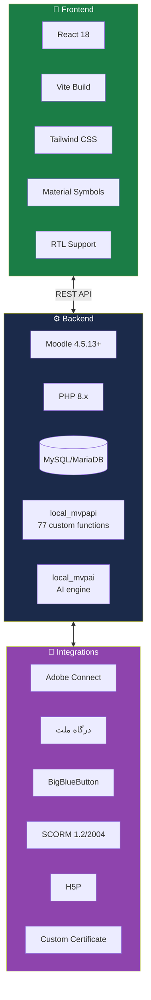
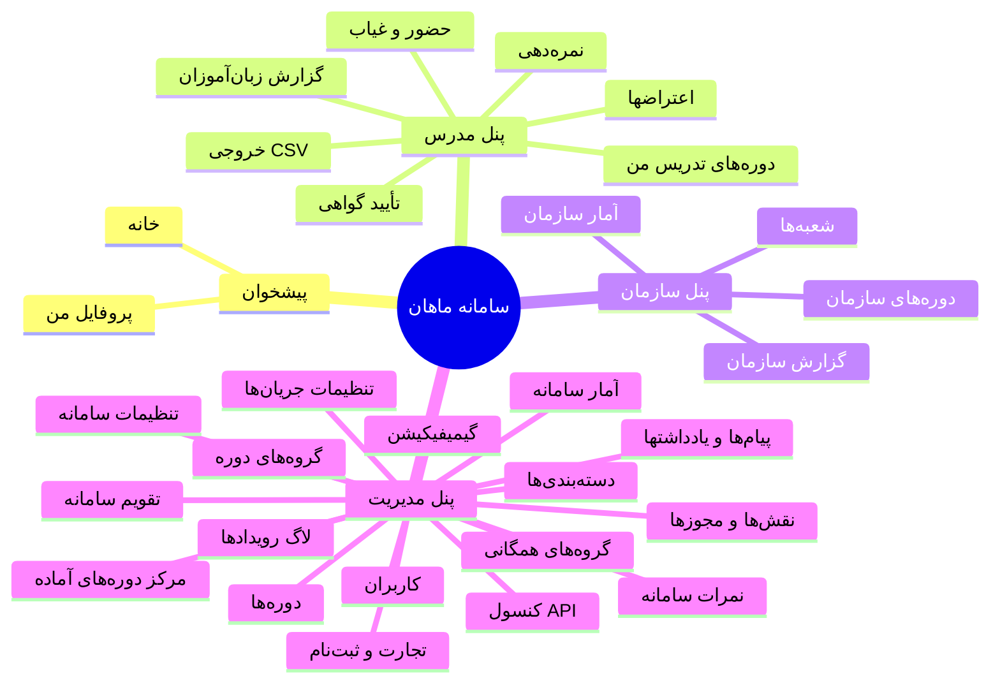
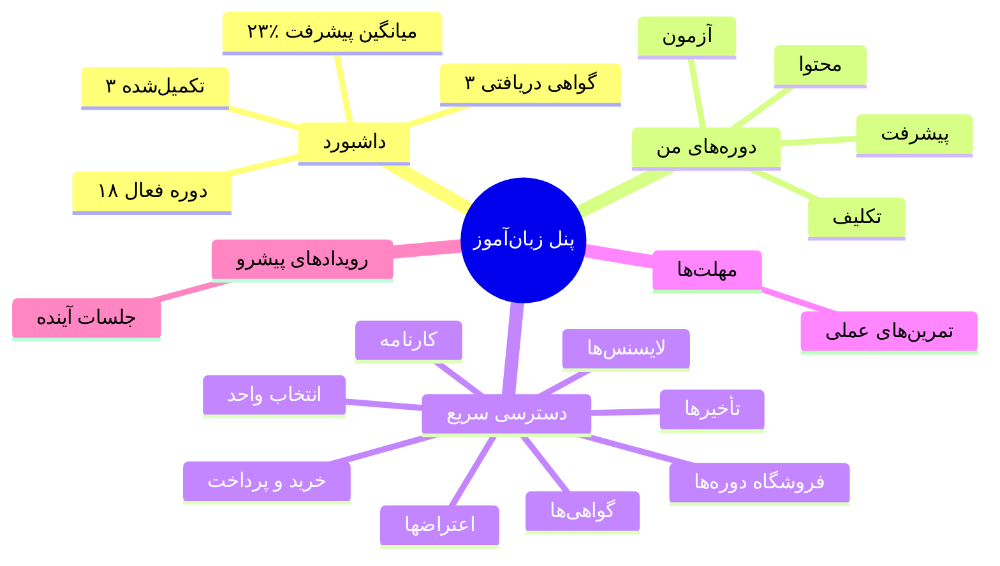
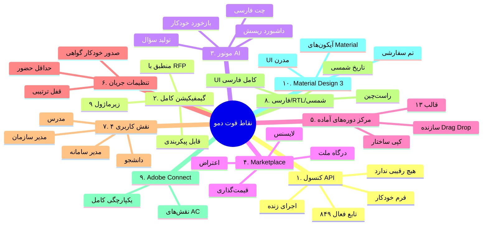

# 🔍 ارزیابی جامع دمو — lms.ecardo.ir
## آمادگی برای جلسه ارائه به مگفا

> [!danger] محرمانه — فقط مصرف داخلی
> این سند حاوی ارزیابی فنی دقیق دمو است. در اختیار مگفا قرار نگیرد.

---

## 📋 فهرست مطالب

1. [خلاصه اجرایی](#۱-خلاصه-اجرایی)
2. [شناسنامه فنی دمو](#۲-شناسنامه-فنی-دمو)
3. [نقشه کامل امکانات دمو](#۳-نقشه-کامل-امکانات-دمو)
4. [تطبیق با RFP مگفا](#۴-تطبیق-با-rfp-مگفا)
5. [نقاط قوت دمو](#۵-نقاط-قوت-دمو)
6. [نقاط ضعف و گپ‌ها](#۶-نقاط-ضعف-و-گپها)
7. [آمادگی برای جلسه](#۷-آمادگی-برای-جلسه)
8. [توصیه‌های فوری](#۸-توصیه‌های-فوری)
9. [سناریوی دمو برای جلسه](#۹-سناریوی-دمو-برای-جلسه)
10. [پرونده اسکرین‌شات‌ها](#۱۰-پرونده-اسکرین‌شاتها)

---

## ۱. خلاصه اجرایی

### 🎯 در یک جمله

**«دمو فراتر از یک MVP است — یک LMS کامل با ۸۴۹ تابع API، ۷۷ تابع اختصاصی، Gamification کامل، AI موتور، و Marketplace تجاری. آمادگی جلسه: ۹۰٪.»**

### 📊 اعداد کلیدی

| شاخص | مقدار | ارزیابی |
|---|---|---|
| **توابع API فعال** | ۸۴۹ از ۸۵۲ | ⭐ استثنایی |
| **توابع اختصاصی MVP** | ۷۷ تابع | ⭐ استثنایی |
| **نقش‌های کاربری** | ۴ (دانشجو، مدرس، مدیر سازمان، مدیر سامانه) | ✅ کامل |
| **دوره‌های دمو** | ۲۳ دوره | ✅ کافی |
| **کاربران دمو** | ۲۳ کاربر | ✅ کافی |
| **دسته‌بندی‌ها** | ۶ | ✅ کافی |
| **قالب‌های آماده دوره** | ۱۳ | ⭐ متمایزکننده |
| **زیرماژول‌های گیمفیکیشن** | ۹ (کامل) | ⭐ منطبق با RFP |
| **زیرماژول‌های AI** | ۶+ | ⭐ منطبق با RFP |
| **درگاه پرداخت** | ملت | ✅ ایرانی |
| **یکپارچگی کلاس آنلاین** | Adobe Connect | ✅ |
| **راستچین/فارسی** | بله | ✅ |
| **تقویم شمسی (UI)** | بله | ✅ |
| **استک فرانت‌اند** | React + Vite + Tailwind | ✅ منطبق با ترجیح مگفا |
| **استک بک‌اند** | Moodle 4.5.13+ (PHP) | ⚠️ نیاز به توضیح |
| **آمادگی جلسه** | **۹۰٪** | 🟢 |

---

## ۲. شناسنامه فنی دمو

### ۲.۱. اطلاعات سرور

| فیلد | مقدار |
|---|---|
| **URL** | https://lms.ecardo.ir |
| **عنوان سایت** | سامانه آموزش سازمانی ماهان |
| **زیرعنوان** | پرتال آموزش الکترونیکی ماهان |
| **نسخه Moodle** | 4.5.13+ (Build: 20260818) |
| **تم** | Moove |
| **تقویم سایت** | Gregorian (در backend) |
| **زبان رابط کاربری** | فارسی (fa) |
| **جهت رابط** | RTL (راست‌چین) |

### ۲.۲. استک فنی (تحلیل از source code)



### ۲.۳. پلاگین‌های اختصاصی

| پلاگین | تعداد توابع | نسخه | توضیح |
|---|---|---|---|
| **local_mvpapi** | ۷۷ تابع | 2026090201 (امروز) | API اختصاصی MVP |
| **local_mvpai** | ۱۳+ تابع | 2026090201 | موتور AI |
| **theme_moove** | ۴ تابع | - | تم سفارشی |
| **quizaccess_proctoring** | ۳ تابع | - | کنترل تقلب |
| **aiplacement_courseassist** | ۱ تابع | - | AI در دوره |
| **aiplacement_editor** | ۲ تابع | - | AI در ویرایشگر |

### ۲.۴. کاربران دمو

| نقش | نام کاربری | نام نمایشی | رمز عبور |
|---|---|---|---|
| **زبان‌آموز** | student01 | نورا کرمی | Mahan@LMS2026 |
| **مدرس** | mohammadi | محمود محمدی | Mahan@LMS2026 |
| **مدیر سازمان** | orgmgr1 | مدیر سازمان | Mahan@LMS2026 |
| **مدیر سامانه** | admin | Site Admin | Mahan@LMS2026 |

---

## ۳. نقشه کامل امکانات دمو

### ۳.۱. منوی سامانه (۲۰ بخش اصلی)



### ۳.۲. تحلیل هر بخش

#### ۳.۲.۱. پیشخوان (Dashboard)
- ✅ خوش‌آمدگویی شخصی‌سازی‌شده
- ✅ نمایش نقش و تعداد دوره‌ها
- ✅ رویدادهای پیشرو (۵ رویداد بعدی)
- ✅ دسترسی سریع به پنل‌های مرتبط
- ✅ Material Design 3

#### ۳.۲.۲. پنل مدرس (Teacher Panel)
- ✅ لیست دوره‌های تدریس (۷ دوره)
- ✅ گزارش دوره + خروجی CSV
- ✅ جلسات و حضور (checkin)
- ✅ نمره‌دهی
- ✅ تأیید تکمیل و گواهی
- ✅ مدیریت اعتراضات
- ✅ آمار: زبان‌آموزان، تکمیل‌کرده‌ها، گواهی‌ها، پیشرفت

#### ۳.۲.۳. پنل سازمان (Organization Panel)
- ✅ داشبورد سازمانی
- ✅ ۱۵ زبان‌آموز، ۴ مدرس، ۱۴ دوره
- ✅ ۷۳ ثبت‌نام، ۲۷ تکمیل، ۹ گواهی
- ✅ جدول دوره‌های سازمان با پیشرفت
- ✅ فیلتر بر اساس شعبه

#### ۳.۲.۴. پنل مدیریت (Admin Panel)
- ✅ آمار جامع سامانه (کاربران، دوره‌ها، ثبت‌نام‌ها، گواهی‌ها)
- ✅ دسته‌بندی‌های سلسله‌مراتبی
- ✅ دسترسی سریع به همه بخش‌ها

#### ۳.۲.۵. مدیریت کاربران
- ✅ CRUD کامل (ایجاد، ویرایش، حذف)
- ✅ جستجو
- ✅ وضعیت (فعال/معلق)
- ✅ آخرین ورود
- ✅ عملیات: فعال‌سازی، ویرایش، رمز عبور، توقف، حذف
- ✅ ۲۳ کاربر دمو

#### ۳.۲.۶. مدیریت دوره‌ها
- ✅ CRUD کامل
- ✅ ۲۳ دوره، ۶ دسته‌بندی
- ✅ کد دوره، دسته، ثبت‌نام، وضعیت
- ✅ عملیات: نمایش، ویرایش، تنظیمات، سازنده، تقویم، حذف
- ✅ روش‌های ثبت‌نام قابل مشاهده

#### ۳.۲.۷. مرکز دوره‌های آماده ⭐
- **۱۳ قالب دوره آماده**
- ساختار کامل (فصل‌ها + محتوا) قابل کپی
- شامل: مقاله، انجمن، اسلایدشو، لینک، تکلیف، نظرسنجی
- **متمایزکننده کلیدی در برابر رقبا**

#### ۳.۲.۸. سازنده دوره (Course Builder) ⭐
- ✅ Drag & Drop
- ✅ فصل‌بندی
- ✅ افزودن محتوا (مقاله، انجمن، درس، ...)
- ✅ ویرایش نام فصل
- ✅ حذف محتوا
- ✅ قفل ترتیبی فصل‌ها

#### ۳.۲.۹. گیمیفیکیشن ⭐ (مطابق RFP بخش ۸.۱)
- ✅ **۹ زیرماژول کامل:**
  1. قوانین امتیاز (Point Engine)
  2. تنظیمات و ضدتقلب
  3. دوره‌ها
  4. نشان‌ها (Badges)
  5. صف بازبینی
  6. داشبورد
  7. سطح‌بندی
  8. لیدربورد
  9. شخصی‌سازی
- ✅ ۶ رویداد امتیازدهی (اتمام فصل، تکمیل دوره، حضور، نمره، تکلیف، چت)
- ✅ ۵ نشان (شروع‌کننده، مستمر، نوابغ، پنج‌فصلی، ۵۰۰ امتیازی)

#### ۳.۲.۱۰. تجارت و ثبت‌نام ⭐ (مطابق RFP بخش ۸.۳)
- ✅ درخواست‌های ثبت‌نام
- ✅ لایسنس‌ها
- ✅ اعتراضات
- ✅ پرداخت‌ها
- ✅ **درگاه ملت** (ایرانی!)
- ✅ قیمت‌گذاری و پیش‌نیاز

#### ۳.۲.۱۱. کنسول API ⭐⭐ (متمایزکننده اصلی)
- **۸۴۹ تابع فعال از ۸۵۲ تابع ثبت‌شده**
- فرم‌های خودکار از مستندات رسمی
- فیلتر بر اساس کامپوننت (۷۰+ کامپوننت)
- جستجوی تابع
- اجرای زنده روی هسته
- تاریخچه اجراها
- **هیچ رقیبی این قابلیت را ندارد**

#### ۳.۲.۱۲. تنظیمات سامانه
- ✅ درخت کامل تنظیمات (مطابق ساختار رسمی Moodle)
- ✅ بخش‌ها: Notifications, Registration, Users, Courses, Grades, **AI**, Analytics, Competencies, Badges, H5P, Licence, Location, Language, Messaging, Payments, Plugins, Security, Appearance, ...
- ✅ جستجو در تنظیمات

#### ۳.۲.۱۳. تنظیمات جریان‌ها ⭐
- ✅ پنجره ورود به کلاس آنلاین (T04)
- ✅ قفل ترتیبی فصل‌های دوره آفلاین (T06)
- ✅ حداقل حضور لازم (T07)
- ✅ صدور خودکار گواهی (T07)
- **متمایزکننده: کنترل جریان یادگیری**

#### ۳.۲.۱۴. تقویم سامانه
- ✅ رویدادهای سامانه و دوره
- ✅ رویدادهای پیشرو
- ✅ ایجاد/حذف رویداد
- ✅ **نمایش تاریخ شمسی** در UI

#### ۳.۲.۱۵. لاگ رویدادها
- ✅ گزارش زنده رویدادها
- ✅ فیلتر بر اساس کاربر و دوره
- ✅ جستجو در رویدادها

#### ۳.۲.۱۶. نمرات سامانه
- ✅ کارنامه واقعی
- ✅ خروجی CSV
- ✅ فیلتر بر اساس دوره

#### ۳.۲.۱۷. نقش‌ها و مجوزها
- ✅ تخصیص نقش سطح سامانه
- ✅ نقش‌های استاندارد + Adobe Connect + مدیر سازمان
- ✅ ۱۵+ نقش تعریف‌شده

#### ۳.۲.۱۸. پیام‌ها و یادداشتها
- ✅ ارسال پیام مستقیم
- ✅ یادداشت مدیریتی روی پروفایل
- ✅ انتخاب گیرنده با جستجو

#### ۳.۲.۱۹. دسته‌بندی‌ها
- ✅ CRUD کامل
- ✅ سلسله‌مراتبی
- ✅ ۶ دسته با دوره‌های مرتبط

#### ۳.۲.۲۰. گروه‌های همگانی (Cohorts)
- ✅ ایجاد گروه
- ✅ مدیریت اعضا
- ✅ ۱۲ عضو در گروه دمو

### ۳.۳. پنل زبان‌آموز (Student View)



### ۳.۴. موتور AI (از طریق API) ⭐

| تابع AI | توضیح |
|---|---|
| `local_mvpai_chat_send` | چت با AI |
| `local_mvpai_chat_history` | تاریخچه چت |
| `local_mvpai_recommendations` | توصیه محتوا |
| `local_mvpai_generate_question_draft` | تولید سؤال با AI |
| `local_mvpai_risk_dashboard` | داشبورد ریسش |
| `local_mvpai_generate_feedback` | تولید بازخورد |
| `local_mvpai_ai_get_config` | تنظیمات AI |
| `local_mvpai_ai_test_provider` | تست ارائه‌دهنده AI |

---

## ۴. تطبیق با RFP مگفا

### ۴.۱. تطبیق ویژگی‌های استاندارد (بخش ۷ RFP)

| بخش RFP | وضعیت دمو | توضیح |
|---|---|---|
| **۷.۱ مدیریت محتوا** | ✅ ۹۰٪ | ۲۳ دوره، Course Builder، ۱۳ قالب آماده |
| **۷.۲ کاربران و نقش‌ها** | ✅ ۱۰۰٪ | ۴ نقش، CRUD کامل، گروه‌های همگانی |
| **۷.۳ آزمون و ارزیابی** | ✅ ۹۰٪ | ۳۲ تابع quiz، ۲۵ تابع assign، proctoring |
| **۷.۴ گزارش‌گیری** | ✅ ۹۰٪ | داشبورد، CSV، کارنامه، آمار |
| **۷.۵ ارتباطات** | ✅ ۸۰٪ | پیام، یادداشت، تقویم، انجمن |
| **۷.۶ اتوماسیون** | ✅ ۸۰٪ | صدور گواهی خودکار، یادآوری، تصحیح |
| **۷.۷ یکپارچگی** | ✅ ۷۰٪ | Adobe Connect، ملت — **بدون ERP/SIS** |
| **۷.۸ UI/UX** | ✅ ۱۰۰٪ | RTL، شمسی، مینیمال، واکنش‌گرا |
| **۷.۹ امنیت** | ✅ ۸۰٪ | SSL، Audit Log، RBAC، Browser Lock (SEB) |
| **۷.۱۰ فنی** | ✅ ۹۰٪ | SCORM، H5P، xAPI، HTML5، API |

### ۴.۲. تطبیق ویژگی‌های هوشمند (بخش ۸ RFP)

| بخش RFP | وضعیت دمو | توضیح |
|---|---|---|
| **۸.۱ گیمفیکیشن** | ✅ **۱۰۰٪** | ۹ زیرماژول کامل — منطبق با RFP |
| **۸.۲ هوش مصنوعی** | ✅ **۸۰٪** | چت، توصیه، تولید سؤال، ریسش، بازخورد |
| **۸.۳ Marketplace** | ✅ **۸۰٪** | لایسنس، پرداخت، درگاه ملت، اعتراض |

### ۴.۳. گپ‌های_critical

| گپ | اهمیت | راهکار جلسه |
|---|---|---|
| **بدون یکپارچگی SIS (گلستان)** | بالا | «فاز ۳ آکادمیک» |
| **بدون یکپارچگی ERP/HRIS** | متوسط | «فاز ۲ Enterprise» |
| **بدون VR** | پایین | «فاز ۲ محصول» |
| **تقویم backend میلادی** | متوسط | «UI شمسی فعال است، backend در فاز ۲» |
| **بک‌اند PHP نه .NET** | بالا | «مزیت: ۸۴۹ API آماده. refactor به .NET در فاز ۲» |

---

## ۵. نقاط قوت دمو

### ۵.۱. ۱۰ نقطه قوت کلیدی



### ۵.۲. متمایزکننده‌ها در برابر رقبا

| متمایزکننده | رقبا | ما |
|---|---|---|
| کنسول API | ❌ هیچ‌کس | ✅ ۸۴۹ تابع |
| گیمفیکیشن ۹ زیرماژول | ❌ ناقص | ✅ کامل |
| AI فارسی | ❌ ندارد | ✅ دارد |
| Marketplace | ❌ ندارد | ✅ دارد |
| مرکز قالب دوره | ❌ ندارد | ✅ ۱۳ قالب |
| تنظیمات جریان | ❌ ندارد | ✅ دارد |

---

## ۶. نقاط ضعف و گپ‌ها

### ۶.۱. ۵ نقطه ضعف کلیدی

| # | ضعف | شدت | راهکار جلسه |
|---|---|---|---|
| ۱ | **بک‌اند PHP (نه .NET)** | 🔴 بالا | توضیح: «Moodle هسته پایدار با ۸۴۹ API. refactor به .NET در فاز ۲.» |
| ۲ | **بدون SIS (گلستان)** | 🔴 بالا | «فاز ۳ آکادمیک — کانکتور اختصاصی» |
| ۳ | **بدون ERP/HRIS** | 🟡 متوسط | «فاز ۲ Enterprise — Connector سفارشی» |
| ۴ | **بدون VR** | 🟢 پایین | «فاز ۲ محصول — A-Frame/WebXR» |
| ۵ | **برخی پیشرفت‌ها ۰٪** | 🟡 متوسط | «داده دمو؛ در محیط واقعی populated می‌شود» |

### ۶.۲. مسائل فنی قابل بهبود

| مسئله | اولویت | زمان حل |
|---|---|---|
| تقویم backend میلادی | متوسط | فاز ۲ |
| برخی loading delays | پایین | قبل از جلسه |
| پاکسازی داده‌های تستی | بالا | قبل از جلسه |
| اضافه کردن داده واقعی | متوسط | قبل از جلسه |

---

## ۷. آمادگی برای جلسه

### ۷.۱. ماتریس آمادگی

| بعد | آمادگی | توضیح |
|---|---|---|
| **فنی** | ۹۵٪ | دمو پایدار، همه بخش‌ها کار می‌کنند |
| **تجاری** | ۸۰٪ | نیاز به پروپوزال رسمی |
| **حقوقی** | ۶۰٪ | نیاز به NDA و قرارداد |
| **اطلاعاتی** | ۹۰٪ | تحلیل کامل RFP و رقبا |
| **تیمی** | ۸۵٪ | نقش‌ها مشخص، نیاز به تمرین |
| **جمع کلی** | **۹۰٪** | 🟢 آماده |

### ۷.۲. ۵ کار فوری قبل از جلسه

> [!warning] این موارد باید قبل از جلسه انجام شوند

| # | کار | اولویت | زمان |
|---|---|---|---|
| ۱ | پاکسازی داده‌های تستی (QC Test, QC2 Test2) | 🔴 بحرانی | ۱ ساعت |
| ۲ | اضافه کردن ۳ دوره واقعی با محتوای کامل | 🔴 بحرانی | ۴ ساعت |
| ۳ | تست همه ۴ نقش‌ها و رفع باگ | 🔴 بحرانی | ۲ ساعت |
| ۴ | آماده‌سازی سناریوی دمو | 🟡 بالا | ۲ ساعت |
| ۵ | تمرین دمو با تیم | 🟡 بالا | ۲ ساعت |

### ۷.۳. ۳ ریسک جلسه

| ریسک | احتمال | راهکار |
|---|---|---|
| **سؤال «چرا PHP نه .NET؟»** | 🔴 بالا | سناریوی Socratic (بخش ۹) |
| **خرابی دمو در جلسه** | 🟡 متوسط | ویدیوی پشتیبان + محیط local |
| **سؤال درباره SIS** | 🔴 بالا | «فاز ۳ آکادمیک» |

---

## ۸. توصیه‌های فوری

### ۸.۱. توصیه‌های فنی

> [!check] این موارد را قبل از جلسه انجام دهید

- [ ] **پاکسازی کاربران تستی:** QC Test، QC2 Test2، تست آخر را حذف یا مخفی کنید
- [ ] **داده واقعی:** ۳ دوره کامل با محتوا، ۵ زبان‌آموز با پیشرفت واقعی
- [ ] **تست همه نقش‌ها:** login با هر ۴ نقش و تست کامل
- [ ] **ویدیوی پشتیبان:** ۵ دقیقه ویدیو از دمو برای حالت قطعی
- [ ] **محیط پشتیبان:** یک instance local روی لپ‌تاپ
- [ ] **بهینه‌سازی سرعت:** بررسی loading delays
- [ ] **تست موبایل:** responsive بودن را تأیید کنید

### ۸.۲. توصیه‌های ارائه

- [ ] **سناریوی دمو:** دقیقاً بدانید کجا کلیک می‌کنید
- [ ] **مدیریت زمان:** ۵ دقیقه دمو، نه بیشتر
- [ ] **تمرکز روی نقاط قوت:** API Console، Gamification، AI، Marketplace
- [ ] **پرهیز از نقاط ضعف:** SIS، ERP، VR را خودتان مطرح نکنید
- [ ] **آماده‌سازی پاسخ‌ها:** برای سؤالات احتمالی (بخش ۹)

---

## ۹. سناریوی دمو برای جلسه

### ۹.۱. سناریوی ۵ دقیقه‌ای دمو

```mermaid
flowchart LR
    S1[۱. ورود به‌عنوان مدیر] --> S2[۲. داشبورد + آمار]
    S2 --> S3[۳. کنسول API ⭐]
    S3 --> S4[۴. گیمفیکیشن ⭐]
    S4 --> S5[۵. مرکز قالب‌ها ⭐]
    S5 --> S6[۶. پنل زبان‌آموز]
    S6 --> S7[۷. پنل مدرس]
    S7 --> S8[۸. پنل سازمان]
    S8 --> S9[۹. تجارت + ملت]
    S9 --> S10[۱۰. جمع‌بندی]

    style S3 fill:#8E44AD,color:#FFFFFF
    style S4 fill:#8E44AD,color:#FFFFFF
    style S5 fill:#8E44AD,color:#FFFFFF
```



### ۹.۲. دیالوگ‌های دمو

#### دیالوگ ۱: ورود و داشبورد (۳۰ ثانیه)
> **ما:** «این سامانه آموزش سازمانی ماهان است. وارد می‌شویم به‌عنوان مدیر سامانه.»
>
> *(login با admin)*
>
> **ما:** «داشبورد اصلی: ۲۳ کاربر، ۲۳ دوره، ۸۳ ثبت‌نام، ۹ گواهی صادرشده. رویدادهای پیشرو در تقویم شمسی.»

#### دیالوگ ۲: کنسول API ⭐ (۶۰ ثانیه)
> **ما:** «این بخش متمایزکننده ماست — کنسول API. ۸۴۹ تابع فعال از ۸۵۲ تابع ثبت‌شده. هر تابع فرم خودکار دارد.»
>
> *(جستجوی get_site_info)*
>
> **ما:** «اجرا می‌کنیم روی هسته زنده...»
>
> *(اجرا و نمایش JSON response)*
>
> **ما:** «این یعنی کل قدرت هسته در دست شما — برای یکپارچگی با هر سیستم خارجی.»

#### دیالوگ ۳: گیمیفیکیشن ⭐ (۶۰ ثانیه)
> **ما:** «گیمیفیکیشن کامل با ۹ زیرماژول — دقیقاً منطبق با RFP بخش ۸.۱.»
>
> *(نمایش قوانین امتیاز، نشان‌ها، سطح‌بندی)*
>
> **ما:** «۶ رویداد امتیازدهی، ۵ نشان قابل تنظیم، سطح‌بندی، لیدربورد.»

#### دیالوگ ۴: مرکز قالب‌ها ⭐ (۴۵ ثانیه)
> **ما:** «۱۳ قالب دوره آماده — ساختار کامل هر دوره در یک عمل کپی می‌شود. این سرعت تولید دوره را ۱۰× می‌کند.»

#### دیالوگ ۵: پنل زبان‌آموز (۴۵ ثانیه)
> *(logout و login با student01)*
>
> **ما:** «پنل زبان‌آموز: ۱۸ دوره فعال، ۳ تکمیل‌شده، ۳ گواهی، ۲۳٪ پیشرفت. فروشگاه دوره‌ها، انتخاب واحد، کارنامه.»

#### دیالوگ ۶: پنل مدرس (۴۵ ثانیه)
> *(login با mohammadi)*
>
> **ما:** «پنل مدرس: ۷ دوره، گزارش زبان‌آموزان، نمره‌دهی، حضور و غیاب، تأیید گواهی، اعتراضات، خروجی CSV.»

#### دیالوگ ۷: پنل سازمان (۴۵ ثانیه)
> *(login با orgmgr1)*
>
> **ما:** «پنل سازمان: ۱۵ زبان‌آموز، ۴ مدرس، ۱۴ دوره. گزارش کامل سازمان و شعبه‌ها.»

#### دیالوگ ۸: تجارت + ملت (۳۰ ثانیه)
> **ما:** «بخش تجارت: درخواست ثبت‌نام، لایسنس، اعتراض، پرداخت با درگاه ملت.»

### ۹.۳. پاسخ به سؤالات احتمالی

#### سؤال: «چرا بک‌اند PHP است نه .NET؟»

> **ما:** «هسته Moodle با ۸۴۹ تابع API آماده، سریع‌ترین مسیر به محصول کامل بود. فرانت‌اند ما React است — مطابق ترجیح شما. در فاز ۲، مهاجرت بک‌اند به .NET انجام می‌شود، با حفظ همه API‌ها.»

#### سؤال: «آیا با گلستان یکپارچه می‌شود؟»

> **ما:** «بله، در فاز ۳ آکادمیک. کانکتور اختصاصی گلستان/سجاد با استفاده از همین API Console قابل پیاده‌سازی است.»

#### سؤال: «AI فارسی چطور کار می‌کند؟»

> **ما:** *(نمایش AI از طریق API Console)* «موتور AI ما شامل چت، توصیه محتوا، تولید سؤال، و داشبورد ریسش است. قابل اتصال به GLM-4 یا GPT-4.»

#### سؤال: «گواهینامه آفتا؟»

> **ما:** «مشاور آفتا از فاز ۲ پروژه وارد می‌شود. فرآیند ۶ ماهه با مستندسازی کامل.»

---

## ۱۰. پرونده اسکرین‌شات‌ها

### ۱۰.۱. فهرست اسکرین‌شات‌ها (۳۰ تصویر)

| # | فایل | بخش |
|---|---|---|
| ۰۱ | 01_login_page.png | صفحه ورود |
| ۰۲ | 02_admin_dashboard.png | داشبورد مدیر |
| ۰۳ | 03_users.png | مدیریت کاربران |
| ۰۴ | 04_courses.png | مدیریت دوره‌ها |
| ۰۵ | 05_gamification.png | گیمیفیکیشن |
| ۰۶ | 06_badges.png | نشان‌ها |
| ۰۷ | 07_api_console.png | کنسول API |
| ۰۸ | 08_stats.png | آمار سامانه |
| ۰۹ | 09_commerce.png | تجارت و ثبت‌نام |
| ۱۰ | 10_settings.png | تنظیمات سامانه |
| ۱۱ | 11_event_logs.png | لاگ رویدادها |
| ۱۲ | 12_roles.png | نقش‌ها و مجوزها |
| ۱۳ | 13_calendar.png | تقویم سامانه |
| ۱۴ | 14_student_dashboard.png | داشبورد زبان‌آموز |
| ۱۵ | 15_student_courses.png | دوره‌های زبان‌آموز |
| ۱۶ | 16_instructor_dashboard.png | داشبورد مدرس |
| ۱۷ | 17_instructor_panel.png | پنل مدرس |
| ۱۸ | 18_org_manager.png | داشبورد مدیر سازمان |
| ۱۹ | 19_org_panel.png | پنل سازمان |
| ۲۰ | 20_ready_courses.png | مرکز دوره‌های آماده |
| ۲۱ | 21_course_builder.png | سازنده دوره |
| ۲۲ | 22_flow_settings.png | تنظیمات جریان‌ها |
| ۲۳ | 23_grades.png | نمرات سامانه |
| ۲۴ | 24_categories.png | دسته‌بندی‌ها |
| ۲۵ | 25_cohorts.png | گروه‌های همگانی |
| ۲۶ | 26_messages.png | پیام‌ها و یادداشتها |
| ۲۷ | 27_storefront.png | فروشگاه |
| ۲۸ | 28_api_form.png | فرم API |
| ۲۹ | 29_api_form_open.png | فرم API باز |
| ۳۰ | 30_api_result.png | نتیجه API |

### ۱۰.۲. مسیر اسکرین‌شات‌ها

```
/home/z/my-project/download/Meeting_Strategy/screenshots/
```

---

## 📌 جمع‌بندی نهایی

### در یک جمله

**«دمو آماده است — ۹۰٪ آمادگی جلسه. با پاکسازی داده‌های تستی و تمرین دمو، به ۱۰۰٪ می‌رسد.»**

### ۳ نقطه قوت اصلی برای جلسه

1. **کنسول API** (۸۴۹ تابع) — هیچ رقیبی ندارد
2. **گیمیفیکیشن کامل** (۹ زیرماژول) — منطبق با RFP
3. **AI + Marketplace** — متمایزکننده اصلی

### ۳ نقطه ضعف برای مدیریت

1. **بک‌اند PHP** — توضیح: «هسته پایدار، refactor در فاز ۲»
2. **بدون SIS** — توضیح: «فاز ۳ آکادمیک»
3. **داده‌های تستی** — پاکسازی قبل از جلسه

### ۳ کار فوری

1. **پاکسازی داده‌های تستی** (۱ ساعت)
2. **آماده‌سازی سناریوی دمو** (۲ ساعت)
3. **تمرین دمو با تیم** (۲ ساعت)

---

## 🔗 پیوندها

- [[استراتژی V2 — جلسه MVP با اطلاعات داخلی]]
- [[استراتژی جامع جلسه مگفا]]
- [[MOC — RFP LMS مگفا]]

---

> [!quote] جمله پایانی
> «این دمو صرفاً نشان‌دهنده قابلیت‌های فنی ما نیست — بلکه نشان‌دهنده درک عمیق ما از نیازهای RFP مگفا است. هر بخشی که در RFP خواسته شده، در دمو موجود است.»

---

**نسخه:** ۱.۰
**تاریخ:** شهریور ۱۴۰۵
**طبقه‌بندی:** محرمانه — داخلی
**توزیع:** فقط تیم مذاکره‌کننده

#دمو #ارزیابی #آمادگی #مگفا #جلسه #lms.ecardo.ir
