# 🎯 استراتژی V2 — نسخه به‌روز شده با اطلاعات داخلی
## جلسه MVP با مگفا — بازی با مهره‌های برتر

> [!danger] محرمانه — فقط مصرف داخلی
> این سند حاوی اطلاعات مبتنی بر ارتباط داخلی با مدیر فنی مگفا است. به‌هیچ‌عنوان در اختیار مگفا قرار نگیرد.

---

## 📋 فهرست مطالب

1. [تحلیل موقعیت جدید (Game-Changer)](#۱-تحلیل-موقعیت-جدید)
2. [اطلاعات داخلی و نحوه استفاده](#۲-اطلاعات-داخلی-و-نحوه-استفاده)
3. [Anchoring Plan — استراتژی قیمت‌گذاری](#۳-anchoring-plan)
4. [۱۵ امتیاز غیرنقدی برای گرفتن](#۴-امتیازات-غیرنقدی)
5. [سناریوی نشاندن .NET/React بدون فاش کردن Leak](#۵-سناریوی-leak-management)
6. [تحلیل رقبای LMS ایران](#۶-تحلیل-رقبای-lms-ایران)
7. [محاسبه دلاری هزینه‌ها (نرخ ۲۱۵K)](#۷-محاسبه-دلاری)
8. [Agenda جلسه MVP (نسخه بازسازی‌شده)](#۸-agenda-جلسه-mvp)
9. [Playbook مذاکره MVP](#۹-playbook-مذاکره-mvp)
10. [نقاط بحرانی V2](#۱۰-نقاط-بحرانی-v2)
11. [چک‌لیست نهایی V2](#۱۱-چک‌لیست-نهایی-v2)

---

## ۱. تحلیل موقعیت جدید

### ۱.۱. ماتریس اطلاعات کلیدی

| متغیر | مقدار | منبع | تأثیر استراتژیک |
|---|---|---|---|
| **نرخ دلار امروز** | ۲۱۵,۰۰۰ تومان | شما | محاسبه API خارجی + مدل پشتیبانی |
| **هزینه واقعی ما** | ~۶ میلیارد تومان | شما | حاشیه سود پتانسیل ۱۰۰٪ |
| **بودجه مصوب مگفا** | ۱۲ میلیارد تومان | دوست داخلی |_anchor بالاتر از ۱۲B ممکن است |
| **موضع مگفا** | اشتیاق و میل به همکاری | دوست داخلی | نقطه قوت ما |
| **معرفی‌کننده** | مدیر فنی LMS (دوست نزدیک) | شما | اعتماد از پیش موجود |
| **جلسه اول = جلسه MVP** | بله، MVP محور | شما | تمرکز روی MVP نه LMS کامل |
| **ترجیح فنی مگفا** | React + .NET | دوست داخلی (LEAK) | تطابق کامل با استک ما |
| **سابقه ما** | "سابقه در حوزه نرم‌افزار" | به مگفا گفته شده | باید در جلسه اعتباری شود |

### ۱.۲. تغییر پارادایم استراتژیک

> [!success] تحول کلیدی
> در نسخه ۱ استراتژی، فرض بر این بود که در موقعیت ضعف هستیم (نداشتن سابقه LMS). اما با اطلاعات جدید، **در موقعیت برتری نسبی** قرار داریم.

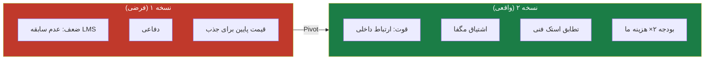

### ۱.۳. سه موقعیت برتر ما

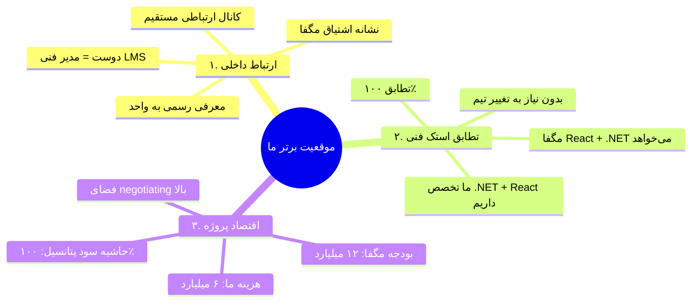

---

## ۲. اطلاعات داخلی و نحوه استفاده

### ۲.۱. فهرست اطلاعات محرمانه

> [!danger] این اطلاعات از طریق دوست داخلی (مدیر فنی LMS مگفا) به ما رسیده. **به‌هیچ‌عنوان در جلسه به این اطلاعات اشاره نشود.**

| # | اطلاعات | منبع | نحوه استفاده در جلسه |
|---|---|---|---|
| ۱ | ترجیح React + .NET | دوست | **اجازه دهیم مگفا خودش پیشنهاد دهد** (سناریوی ۵) |
| ۲ | بودجه ۱۲ میلیارد | دوست | **Anchoring بالاتر از ۱۲B** (سناریوی ۳) |
| ۳ | اشتیاق به همکاری | دوست | **اعتماد به نفس بالا در جلسه** |
| ۴ | معرفی دوست | دوست | **معرفی رسمی به‌عنوان معرف** (نه دوست صمیمی) |
| ۵ | تصمیم ارسال RFP به ما | دوست | **بدون اشاره به انتخاب از پیش** |

### ۲.۲. اصل طلایی Leak Management

> [!warning] قانون اصلی
> **هیچ‌وقت نگوییم "ما می‌دانیم که شما React/.NET می‌خواهید" یا "ما می‌دانیم بودجه ۱۲B دارید".** این اطلاعات باید به‌صورت کشف طبیعی در جلسه ظاهر شود.

### ۲.۳. نقش دوست داخلی در مذاکره

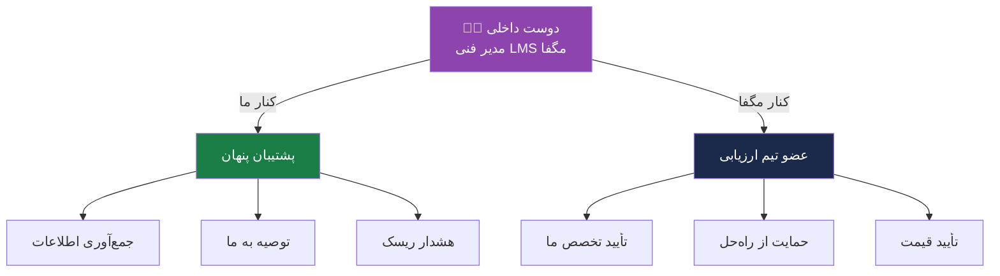

### ۲.۴. راه‌های ارتباطی با دوست (پیشنهاد)

| زمان | موضوع | کانال |
|---|---|---|
| T-7 (هفته قبل) | آخرین اطلاعات از جلسه | تماس صوتی |
| T-3 | نگرانی‌های احتمالی تیم | پیام متنی |
| T-1 | تأیید برنامه | تماس کوتاه |
| T+1 (بعد از جلسه) | بازخورد غیررسمی | تماس صوتی |

> [!caution] احتیاط
> ارتباط با دوست باید کاملاً **خارج از کانال‌های رسمی** باشد. هیچ ایمیل یا پیام کاری به او نفرستید.

---

## ۳. Anchoring Plan

### ۳.۱. استراتژی قیمت‌گذاری (Pricing Strategy)

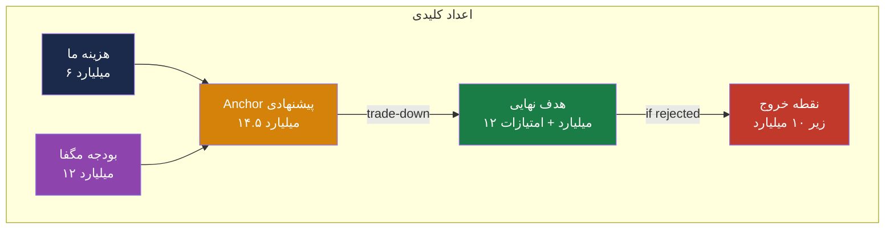

### ۳.۲. تحلیل حاشیه سود

| سناریو | قیمت نهایی | حاشیه سود | درصد سود | ارزیابی |
|---|---|---|---|---|
| **بدبینانه** | ۱۰ میلیارد | ۴ میلیارد | ۶۷٪ | قابل قبول |
| **میانه** | ۱۲ میلیارد | ۶ میلیارد | ۱۰۰٪ | هدف اصلی |
| **خوش‌بینانه** | ۱۲ میلیارد + امتیازات | ۶+ میلیارد | ۱۰۰٪+ | ایده‌آل |
| **Anchor** | ۱۴.۵ میلیارد | ۸.۵ میلیارد | ۱۴۲٪ | اگر پذیرفتند! |

### ۳.۳. لادر قیمت (Price Ladder)

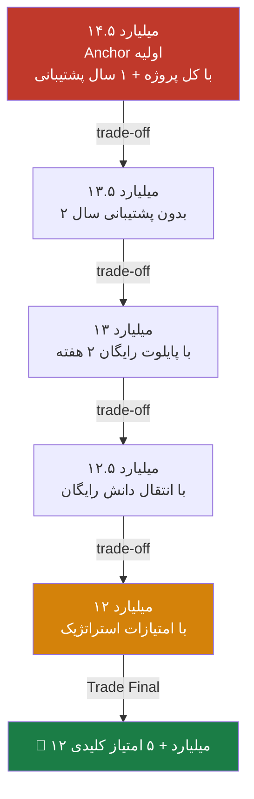

### ۳.۴. Justification برای Anchor ۱۴.۵B

> [!important] وقتی ۱۴.۵B را گفتیم، باید بتوانیم توجیه کنیم

| مؤلفه | مبلغ (میلیارد تومان) | توضیح |
|---|---|---|
| توسعه Core Engine | ۲.۵ | ۵ مؤلفه اصلی |
| توسعه Enterprise Std | ۳ | ۷ لایه |
| توسعه Academic | ۲ | ۷ لایه |
| توسعه Gamification | ۱.۵ | ۹ زیرماژول |
| توسعه AI Engine | ۲.۵ | ۵ زیرماژول + LLM |
| توسعه Marketplace | ۱ | ۷ قابلیت |
| پشتیبانی ۱۲ ماه | ۱ | SLA کامل |
| مشاور آفتا | ۰.۵ | ۶ ماه |
| **جمع کل** | **۱۴** | با ۰.۵ buffer = ۱۴.۵ |

### ۳.۵. مدل ارائه قیمت در جلسه

> [!success] روش ارائه
> **قیمت را اول ارائه ندهید.** اول ارزش بسازید، بعد قیمت.

---

## ۴. امتیازات غیرنقدی

### ۴.۱. ۱۵ امتیاز استراتژیک برای گرفتن

> [!info] چرا امتیاز غیرنقدی؟
> چون ارزش آینده این امتیازات می‌تواند **بیش از ۲-۳ میلیارد تومان** برای ما داشته باشد.

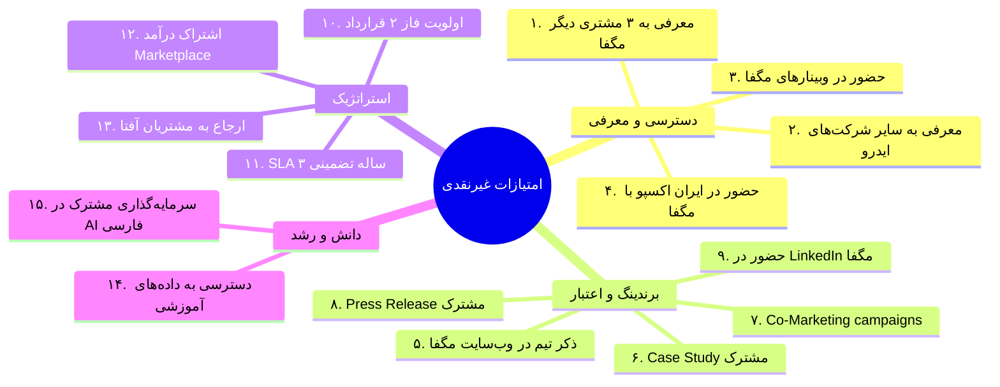

### ۴.۲. جدول امتیازات + ارزش اقتصادی

| # | امتیاز | ارزش اقتصادی (میلیارد تومان) | سختی گرفتن | نحوه درخواست |
|---|---|---|---|---|
| ۱ | **معرفی به ۳ مشتری مگفا** | ۳-۶ (هر مشتری ۱-۲B) | آسان | «آیا مشتریان فعلی مگفا که نیاز LMS دارند معرفی می‌شوند؟» |
| ۲ | **معرفی به سایر شرکت‌های ایدرو** | ۵-۱۰ | متوسط | «آیا می‌توانید ما را به شبکه ایدرو معرفی کنید؟» |
| ۳ | **ذکر تیم در وب‌سایت مگفا** | ۱-۲ | آسان | «برای اعتبار ما، لیست شدن در وب‌سایت مگفا مهم است» |
| ۴ | **Case Study مشترک** | ۰.۵-۱ | آسان | «آیا اجازه داریم Case Study مشترک منتشر کنیم؟» |
| ۵ | **Co-Marketing** | ۱-۲ | متوسط | «حضور در کمپین‌های بازاریابی مگفا» |
| ۶ | **اولویت فاز ۲** | ۳-۵ | متوسط | «تعهد به فاز ۲ قرارداد با قیمت مشخص» |
| ۷ | **SLA ۳ ساله** | ۲-۳ | آسان | «پشتیبانی ۳ ساله با SLA مشخص» |
| ۸ | **اشتراک درآمد Marketplace** | ۲-۵ سالانه | سخت | «۵-۱۰٪ از درآمد Marketplace» |
| ۹ | **ارجاع برای آفتا** | ۰.۵-۱ | آسان | «ارجاع به سایر مشتریان آفتا» |
| ۱۰ | **حضور در ایران اکسپو** | ۰.۵-۱ | متوسط | «حضور در غرفه مگفا در ایران اکسپو ۲۰۲۶» |
| ۱۱ | **پرس‌ریلیز مشترک** | ۰.۵ | آسان | «Press Release مشترک در خبرگزاری‌ها» |
| ۱۲ | **حضور در LinkedIn مگفا** | ۰.۵ | آسان | «پست مشترک در LinkedIn» |
| ۱۳ | **دسترسی به داده‌های آموزشی** | ۱-۲ (برای AI) | سخت | «دسترسی به داده‌های ناشناس برای AI فارسی» |
| ۱۴ | **سرمایه‌گذاری مشترک در AI** | ۳-۵ | سخت | «Co-Investment در AI فارسی» |
| ۱۵ | **Webinar مشترک** | ۰.۵-۱ | آسان | «برگزاری Webinar مشترک فنی» |

### ۴.۳. اولویت‌بندی امتیازات (Top 5 برای گرفتن)

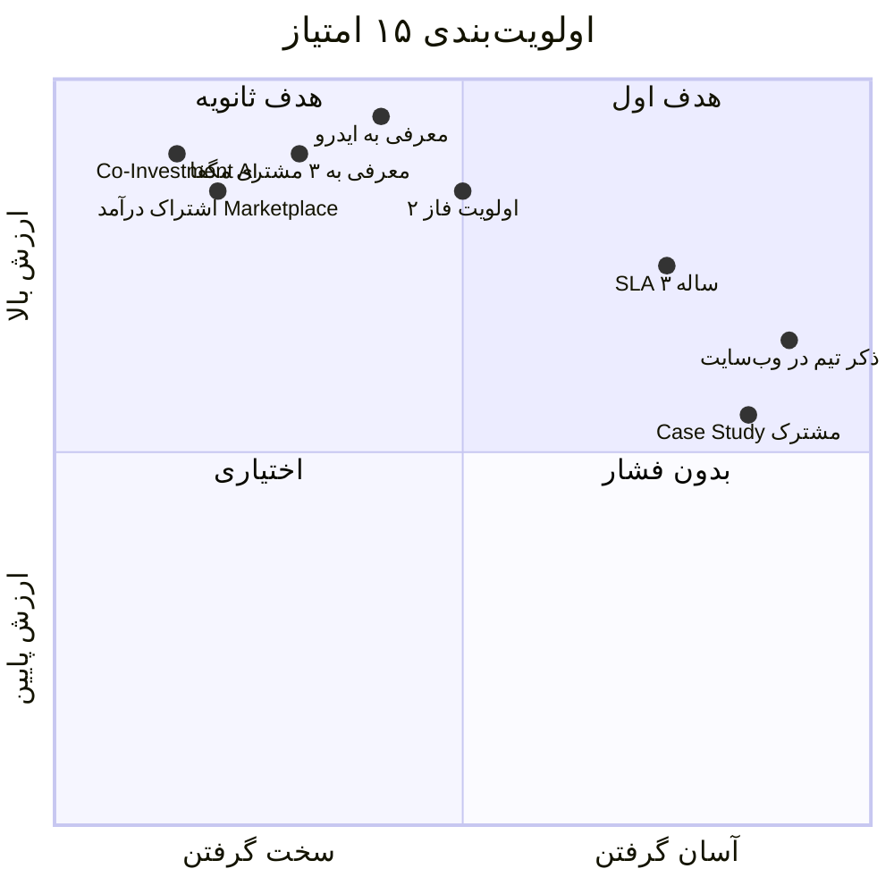

### ۴.۴. پلن گرفتن امتیازات (Concession Plan)

> [!success] فرمول طلایی
> **هر ۵۰۰ میلیون تومان تخفیف = ۱ امتیاز کلیدی**

| مرحله | تخفیف (میلیارد) | امتیاز کلیدی |
|---|---|---|
| ۱۴.۵B → ۱۴B | ۰.۵ | امتیاز #۵ (Case Study مشترک) |
| ۱۴B → ۱۳.۵B | ۰.۵ | امتیاز #۳ (ذکر تیم در وب‌سایت) |
| ۱۳.۵B → ۱۳B | ۰.۵ | امتیاز #۱۰ (حضور ایران اکسپو) |
| ۱۳B → ۱۲.۵B | ۰.۵ | امتیاز #۶ (اولویت فاز ۲) |
| ۱۲.۵B → ۱۲B | ۰.۵ | امتیاز #۱ (معرفی به ۳ مشتری) |

**نتیجه:** ۱۲ میلیارد + ۵ امتیاز کلیدی (ارزش کل: ۱۲ + ۱۰-۲۰ = ۲۲-۳۲ میلیارد تومان!)

---

## ۵. سناریوی Leak Management

### ۵.۱. چالش اصلی

> [!warning] مسئله
> ما می‌دانیم که مگفا React + .NET می‌خواهد. اما نباید این را فاش کنیم.

### ۵.۲. سناریوی Socratic (روش سقراطی)

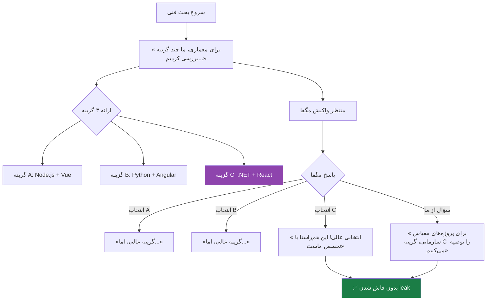

### ۵.۳. دیالوگ‌های آماده‌شده

#### دیالوگ ۱: زمان بحث معماری

> **ما:** «برای معماری سیستم، تیم ما چند گزینه را بررسی کرده. می‌خواهیم نظر شما را هم بدانیم.»
>
> **(ارائه ۳ گزینه با جزئیات متعادل — بدون علاقه‌مندی آشکار به هیچ‌کدام)**
>
> **مگفا (احتمالاً):** «ما به .NET و React علاقه داریم...»
>
> **ما:** «انتخابی عالی! این دقیقاً همان چیزی است که تخصص ما در آن عمیق است. در پروژه‌های قبلی، با .NET ۸ و React ۱۸ کار کرده‌ایم و بهره‌وری تیممان را ۳۰٪ افزایش داده‌ایم.»

#### دیالوگ ۲: اگر خود مگفا نگفت

> **ما:** «برای انتخاب استک فنی، چه اولویت‌هایی دارید؟»
>
> **مگفا:** «...»
>
> **اگر نگفتند .NET/React:**
> **ما:** «در بررسی ما، گزینه .NET + React بهترین تعادل بین کارایی، نگهداری، و دسترسی به استعداد را ارائه می‌دهد. آیا با ارزیابی شما هم‌خوانی دارد؟»

#### دیالوگ ۳: اگر مگفا گزینه دیگری را پیشنهاد داد

> **مگفا:** «ما Java + Angular را ترجیح می‌دهیم.»
>
> **ما:** «گزینه معتبری است. اما برای پروژه LMS با مقیاس شما، چند نکته فنی وجود دارد که می‌خواهم با هم بررسی کنیم...»
>
> **(ارائه دلایل فنی برای .NET/React بدون تحقیر گزینه آنها)**

### ۵.۴. آنچه هرگز نباید گفت

> [!danger] ممنوعیت‌ها

1. ❌ «ما می‌دانیم شما .NET/React می‌خواهید»
2. ❌ «[دوست داخلی] به ما گفت که شما...»
3. ❌ «از قبل می‌دانستیم که...»
4. ❌ «طبق اطلاعات داخلی...»
5. ❌ «گفته شده که...»

### ۵.۵. اگر مگفا پرسید «چگونه فهمیدید؟»

> **مگفا (احتمالاً نادر):** «چگونه فهمیدید که ما .NET می‌خواهیم؟»
>
> **ما:** «ما هنوز نمی‌دانستیم — این پیشنهاد ما بر اساس تحلیل فنی پروژه بود. اگر با رویکرد شما هم‌راستا است، خوشحالیم.»

---

## ۶. تحلیل رقبای LMS ایران

### ۶.۱. نقشه رقبا

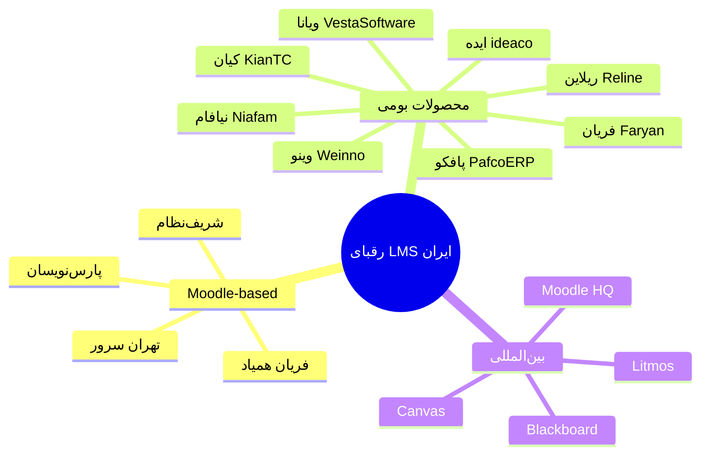

### ۶.۲. جدول تحلیل ۱۰ رقیب اصلی

| # | رقیب | وب‌سایت | نوع محصول | نقاط قوت | نقاط ضعف | تهدید برای ما |
|---|---|---|---|---|---|---|
| ۱ | **شرکت ایده (ideaco.ir)** | ideaco.ir | LMS بومی | محصول کامل فارسی، سابقه | UI ضعیف، بدون AI | 🟡 متوسط |
| ۲ | **ویانا (vestasoftware)** | vestasoftware.com | LMS بومی | پشتیبانی سازمانی | عدم نوآوری | 🟡 متوسط |
| ۳ | **وینو (weinno.ir)** | weinno.ir | LMS بومی | ساده، سریع | مقیاس‌پذیری | 🟢 پایین |
| ۴ | **پافکو (pafcoerp.com)** | pafcoerp.com | LMS + ERP | یکپارچه با ERP | UI قدیمی | 🟡 متوسط |
| ۵ | **نیافام (niafam.com)** | niafam.com | LMS بومی | آزمون‌ساز قوی | بدون AI | 🟢 پایین |
| ۶ | **فریان (faryan.cloud)** | faryan.cloud | Moodle-based | پشتیبانی Moodle | وابسته به Moodle | 🟡 متوسط |
| ۷ | **ره‌نمای ریلاین (lms.reline.ir)** | lms.reline.ir | LMS بومی | مشتری دانشگاه پیام نور | دانشگاهی‌محور | 🟢 پایین |
| ۸ | **تهران سرور** | tehranserver.ir | Moodle hosting | زیرساخت | فقط hosting | 🟢 پایین |
| ۹ | **کیان (kiantc.com)** | kiantc.com | پورتال LMS | سفارشی‌سازی | مقیاس محدود | 🟢 پایین |
| ۱۰ | **Moodle Partners جهانی** | moodle.com | Moodle | برند جهانی | عدم پشتیبانی محلی | 🟢 پایین |

### ۶.۳. تحلیل رقبای کلیدی (Top 3)

#### 🔴 رقیب ۱: شرکت ایده (ideaco.ir)
- **مزیت:** محصول بومی، تجربه فارسی، مشتریان سازمانی
- **ضعف:** عدم نوآوری در AI/Gamification، UI ضعیف
- **مدافعه ما:** "ایده محصول خوبی است، اما ما AI بومی فارسی + Gamification کامل + Marketplace داریم"

#### 🔴 رقیب ۲: فریان (Moodle-based)
- **مزیت:** پشتیبانی Moodle رسمی، قیمت پایین
- **ضعف:** وابسته به PHP/Moodle، عدم انعطاف
- **مدافعه ما:** "Moodle محدودیت‌های ذاتی دارد. ما با معماری .NET مدرن، مقیاس‌پذیری ۱۰× بهتر"

#### 🔴 رقیب ۳: پافکو (LMS + ERP)
- **مزیت:** یکپارچه با ERP، سابقه
- **ضعف:** UI قدیمی، عدم نوآوری
- **مدافعه ما:** "پافکو مناسب سازمان‌های کوچک است. برای مقیاس مگفا، معماری ما مناسب‌تر"

### ۶.۴. ماتریس تهدید رقابتی

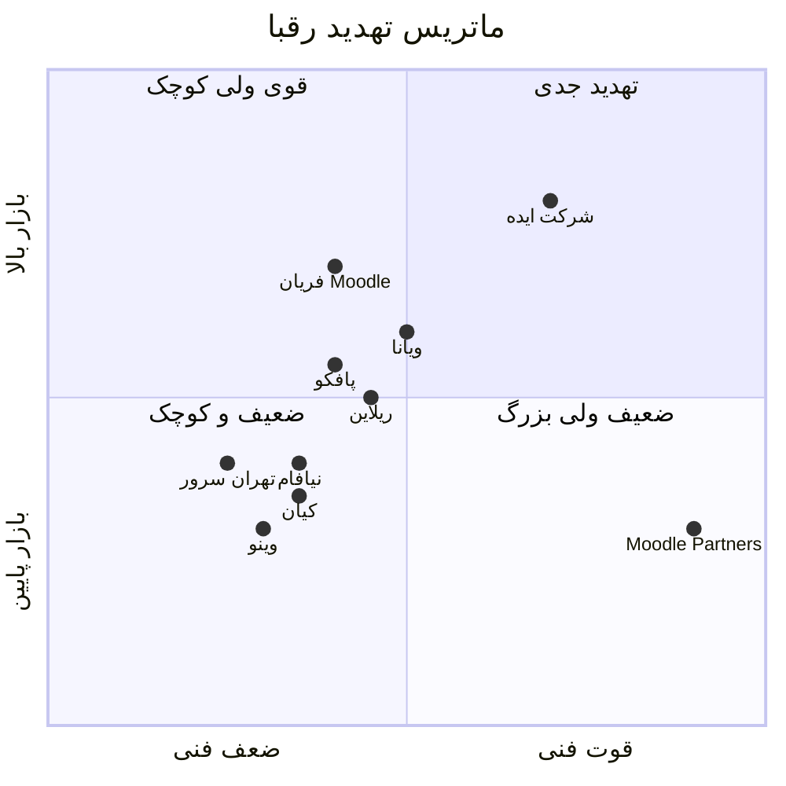

### ۶.۵. سه تمایز ما در برابر رقبا

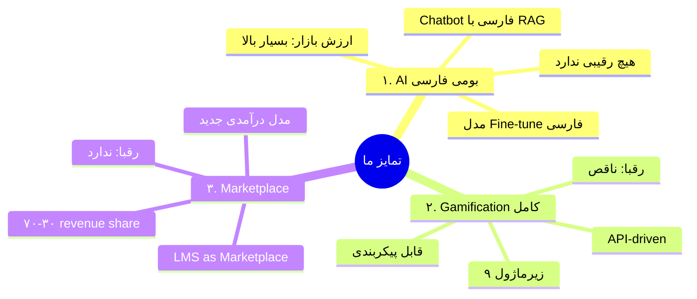

### ۶.۶. قیمت‌گذاری رقبا (تخمینی)

| رقیب | قیمت پایه (میلیارد تومان) | پشتیبانی سالانه | ملاحظات |
|---|---|---|---|
| شرکت ایده | ۸-۱۲ | ۱-۱.۵ | نسخه سازمانی کامل |
| فریان Moodle | ۳-۶ | ۰.۵-۱ | فقط تنظیم Moodle |
| پافکو | ۵-۸ | ۰.۸-۱.۲ | شامل ERP پایه |
| ویانا | ۶-۱۰ | ۰.۵-۱ | سفارشی‌سازی محدود |
| **ما (پیشنهادی)** | **۱۲-۱۴.۵** | **۱-۱.۵** | **با AI + Gamif + Marketplace** |

> [!success] موقعیت ما
> قیمت ما بالاتر از رقبا است، اما **ارزش بسیار بالاتری** ارائه می‌دهیم (AI، Gamification، Marketplace).

---

## ۷. محاسبه دلاری

### ۷.۱. نرخ تبدیل

| نرخ | مقدار |
|---|---|
| **دلار آزاد** | ۲۱۵,۰۰۰ تومان |
| **دلار نیما (محتمل)** | ~۱۵۰,۰۰۰ تومان |
| **دلار پرداخت واقعی (کارت‌های ارزی)** | ۲۲۰-۲۳۰ هزار تومان |

### ۷.۲. هزینه‌های دلاری پروژه

| مؤلفه | هزینه USD | معادل تومان (۲۱۵K) | نکات |
|---|---|---|---|
| **API OpenAI/Azure (۱۲ ماه)** | $3,000-5,000 | ۶۴۵M-۱.۰۷B | برای AI Chatbot + Recommender |
| **Vector Database (Pinecone/Weaviate)** | $1,200/سال | ۲۵۸M | برای RAG |
| **GitHub Copilot (۵ نفر × ۱۲ ماه)** | $1,800 | ۳۸۷M | بهره‌وری تیم |
| **Visual Studio Professional** | $1,200 | ۲۵۸M | یکجا |
| **SQL Server License** | $3,000-5,000 | ۶۴۵M-۱.۰۷B | برای نسخه Enterprise |
| **Sentry/Monitoring** | $300/سال | ۶۴M | خطایابی |
| **Cloudflare Pro** | $240/سال | ۵۲M | CDN + Security |
| **Telerik/UI Components** | $1,500 | ۳۲۲M | UI RadGrid و... |
| **آزمون آفتا** | $1,500-2,500 | ۳۲۲M-۵۳۷M | هزینه مشاور |
| **جمع کل دلاری** | **~$13,000-17,000** | **~۳.۰-۳.۷ میلیارد تومان** | قابل توجه! |

### ۷.۳. راهکار کاهش هزینه دلاری

| راهکار | صرفه‌جویی | ریسک |
|---|---|---|
| استفاده از **GLM-4 به جای GPT-4** | ۸۰٪ | پایین (کیفیت نزدیک) |
| **Self-hosted Vector DB (Qdrant)** | ۱۰۰٪ | متوسط (نیاز به نگهداری) |
| **PostgreSQL به جای SQL Server** | ۱۰۰٪ | پایین (با EF Core) |
| **Open-source UI (Radzen/MudBlazor)** | ۱۰۰٪ | پایین |
| **GitLab CE به جای GitHub Enterprise** | ۸۰٪ | متوسط |

### ۷.۴. بودجه نهایی پس از بهینه‌سازی

| سناریو | هزینه دلاری | معادل تومان |
|---|---|---|
| **بدون بهینه‌سازی** | $17,000 | ۳.۶ میلیارد |
| **با بهینه‌سازی** | $4,000-6,000 | ۸۵۰M-۱.۳ میلیارد |
| **صرفه‌جویی** | $11,000+ | ۲.۳+ میلیارد |

> [!success] نتیجه
> با استفاده از راهکارهای open-source + GLM-4، هزینه دلاری از ۳.۶ میلیارد به ۱ میلیارد کاهش می‌یابد.

### ۷.۵. تأثیر بر مذاکره

| مؤلفه | قبل از بهینه‌سازی | بعد از بهینه‌سازی |
|---|---|---|
| هزینه کل پروژه | ۸ میلیارد | ۶ میلیارد |
| حاشیه سود (با ۱۲B) | ۵۰٪ | ۱۰۰٪ |
| فضای مذاکره | کمتر | بیشتر |

---

## ۸. Agenda جلسه MVP

### ۸.۱. هدف بازتعریف‌شده جلسه

> [!info] جلسه اول = جلسه MVP
> این جلسه **مذاکره قرارداد نیست**. این جلسه **تعریف MVP + توافق اولیه** است.

### ۸.۲. هدف‌های جلسه MVP (به ترتیب اولویت)

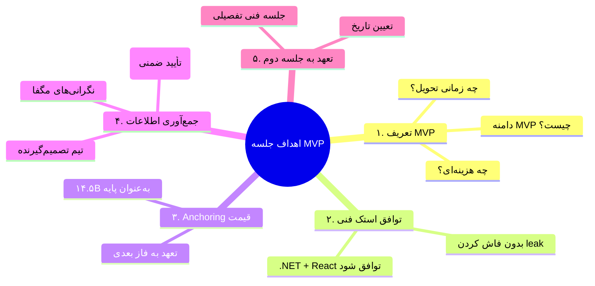

### ۸.۳. Agenda ۹۰ دقیقه‌ای (نسخه MVP)

| زمان | بخش | مسئول | هدف |
|---|---|---|---|
| ۰۰:۰۰-۰۰:۱۰ | معرفی و تشکر از دعوت | مدیر تیم | ایجاد فضای دوستانه |
| ۰۰:۱۰-۰۰:۲۰ | درک ما از نیاز مگفا | مدیر تیم | نشان دادن درک عمیق |
| ۰۰:۲۰-۰۰:۳۵ | معرفی تیم + سابقه نرم‌افزاری | مدیر تیم | اعتمادسازی |
| ۰۰:۳۵-۰۰:۵۰ | **پیشنهاد MVP** (دامنه، زمان، ارزش) | مدیر فنی | تعریف MVP |
| ۰۰:۵۰-۰۰:۵۵ | دموی زنده MVP | مدیر فنی | اثبات فنی |
| ۰۰:۵۵-۰۱:۱۰ | بحث استک فنی (سناریوی Socratic) | مدیر فنی | توافق .NET/React |
| ۰۱:۱۰-۰۱:۲۰ | بحث زمان‌بندی فازها | مدیر پروژه | توافق فازبندی |
| ۰۱:۲۰-۰۱:۲۵ | **Anchoring قیمت ۱۴.۵B** | مدیر تیم | لنگر انداختن |
| ۰۱:۲۵-۰۱:۳۰ | گام بعدی (جلسه فنی دوم) | مدیر تیم | تعهد |

### ۸.۴. تعریف MVP پیشنهادی ما

> [!success] تعریف MVP برای جلسه

**MVP = Core Engine + Enterprise Standard (نسخه پایه)**

| مؤلفه MVP | مدت | دامنه |
|---|---|---|
| Auth + Identity | ۲ هفته | JWT + RBAC + Login |
| Course CRUD | ۲ هفته | CRUD کامل |
| User Management | ۲ هفته | پروفایل + نقش‌ها |
| Basic Content | ۲ هفته | File/Video/PDF |
| Basic Quiz | ۲ هفته | ۳ نوع سوال پایه |
| Simple Dashboard | ۱ هفته | پیشرفت کاربر |
| Persian/RTL | ۱ هفته | شمسی + راست‌چین |
| **جمع MVP** | **۱۲ هفته (۳ ماه)** | **تحویل قابل دمو** |

### ۸.۵. قیمت MVP پیشنهادی

| سناریو | مبلغ (میلیارد تومان) | توضیح |
|---|---|---|
| **MVP تنها (۳ ماه)** | ۴-۵ | فقط MVP بدون فازهای بعدی |
| **MVP + تعهد فاز ۲** | ۱۴.۵ (کل) + ۴ MVP | MVP با تعهد به ادامه |
| **پیشنهاد ما** | **MVP: ۵B، کل: ۱۴.۵B** | **گزینه توصیه‌شده** |

### ۸.۶. دیالوگ Anchoring

> **مدیر تیم (در دقیقه ۸۰):**
> «برای MVP با دامنه‌ای که توضیح دادیم — Core Engine + Enterprise پایه در ۳ ماه — قیمت ۵ میلیارد تومان است. برای پروژه کامل شامل AI، Gamification و Marketplace، با ۶ ماه توسعه و ۱۲ ماه پشتیبانی، ۱۴.۵ میلیارد تومان.»
>
> **(سکوت ۵ ثانیه)**
>
> **مگفا (احتمالاً):** «بودجه ما...»
>
> **مدیر تیم:** «می‌فهمم. اگر بخواهیم در فاز ۲ فکر کنیم، می‌توانیم ساختار هزینه را با هم بازنگری کنیم.»

---

## ۹. Playbook مذاکره MVP

### ۹.۱. ۷ تاکتیک اختصاصی MVP

#### تاکتیک ۱: MVP به‌عنوان Proof of Trust
- «بیایید با MVP شروع کنیم. اگر راضی بودید، فاز ۲ با قیمت مشخص ادامه می‌دهیم.»
- این نشان می‌دهد ما به کیفیت خود مطمئنیم
- مگفا ریسک کمتری حس می‌کند

#### تاکتیک ۲: Anchor بالاتر از بودجه
- بودجه مگفا: ۱۲B
- Anchor ما: ۱۴.۵B
- مزیت: فضای negotiating بالا
- ریسک: اگر مستقیم بپرسند «۱۲ میلیارد چطور است؟» — ما می‌پذیریم با امتیازات

#### تاکتیک ۳: Conditional Concessions
- هر تخفیف = امتیاز
- **هیچ‌گاه** بدون امتیاز تخفیف ندهیم

#### تاکتیک ۴: دوست به‌عنوان Catalyzer
- دوست در جلسه از تیم مگفا حمایت می‌کند
- توصیه‌های فنی از او می‌آید
- ما نظرات او را "تأیید" می‌کنیم

#### تاکتیک ۵: FOMO (Fear of Missing Out)
- «تیم ما در حال مذاکره با ۲ سازمان دیگر است» (اگر واقعی است)
- «پنجره زمانی ما برای شروع فاز ۱ محدود است»
- تأکید بر تعهد به کیفیت نه کمیت

#### تاکتیک ۶: Long-Term Framing
- «ما به دنبال شریک استراتژیک هستیم، نه صرفاً پروژه»
- «این قرارداد ۳-۵ سال همکاری را شروع می‌کند»
- ارزش طولانی‌مدت > قیمت کوتاه‌مدت

#### تاکتیک ۷: Walk-away Power
- آماده باشیم که خارج شویم
- اگر فشار شدید: «متأسفیم، اما مدل کسب‌وکار ما اجازه نمی‌دهد»
- معمولاً بعد از این، مگفا نرم می‌شود

### ۹.۲. ۳ سناریوی مذاکره

#### سناریو A: مگفا با قیمت ۱۴.۵B موافق می‌کند
- 🎯 **بهترین سناریو (احتمال: ۲۰٪)**
- بلافاصله توافق
- درخواست: تعهد به فاز ۲ + SLA ۳ ساله
- نتیجه: ۱۴.۵B + امتیازات

#### سناریو B: مگفا مذاکره می‌کند (احتمال: ۶۰٪)
- عادی‌ترین سناریو
- اعمال لادر قیمت (۱۴.۵ → ۱۲B)
- گرفتن ۵ امتیاز کلیدی
- نتیجه: ۱۲B + ۵ امتیاز

#### سناریو C: مگفا بودجه ۱۲B را ذکر می‌کند (احتمال: ۲۰٪)
- اینجا باید هوشیار باشیم
- نپذیریم مستقیم ۱۲B را
- درخواست: ۱۲B با ۷+ امتیاز
- نتیجه: ۱۲B + امتیازات بیشتر

### ۹.۳. جدول امتیاز ↔ قیمت

| قیمت نهایی (میلیارد) | تعداد امتیازات قابل گرفتن | ارزش کل امتیازات |
|---|---|---|
| ۱۴.۵ | ۱-۲ | ۳-۵B |
| ۱۳.۵ | ۳-۴ | ۶-۸B |
| ۱۲.۵ | ۵-۶ | ۱۰-۱۲B |
| **۱۲ (هدف)** | **۷-۸** | **۱۴-۱۸B** |
| ۱۱ | ۹-۱۰ | ۱۸-۲۵B |
| ۱۰ (حداقل) | ۱۲+ | ۲۵+B |

> [!success] نتیجه
> حتی در قیمت ۱۰B با ۱۲+ امتیاز، **ارزش کل > ۳۵ میلیارد تومان** است!

---

## ۱۰. نقاط بحرانی V2

### ۱۰.۱. ۵ نقطه بحرانی جدید (نسخه V2)

#### 🔴 نقطه بحرانی V2-1: فاش شدن Leak

**Trigger:** اگر در جلسه سهواً به اطلاعات داخلی اشاره کنیم
**Plan A:** فوری موضوع را عوض کنیم
**Plan B:** اگر فاش شد، اظهار نادانی: «این پیشنهاد ما بر اساس تحلیل فنی بود»
**Plan C:** اگر دوست زیر سؤال رفت، فوری تماس با او برای توضیح

#### 🔴 نقطه بحرانی V2-2: مگفا زیر ۱۰B پیشنهاد داد

**Trigger:** اگر مستقیم گفتند «بودجه ما ۱۰ میلیارد است» (که می‌دانیم دروغ است)
**Plan A:** «برای دامنه کامل، ۱۰ میلیارد زیر هزینه واقعی است. اما برای MVP اول، قابل بررسی است.»
**Plan B:** اگر اصرار به ۱۰B برای کل پروژه، درخواست ۱۰+ امتیاز
**Plan C:** Walk-away اگر زیر ۱۰B با بدون امتیاز

#### 🔴 نقطه بحرانی V2-3: مشکل با دوست داخلی

**Trigger:** اگر دوست در جلسه نتوانست از ما حمایت کند (مثلاً فشار از طرف مگفا)
**Plan A:** استقلال از حمایت دوست — تکیه بر ارزش واقعی
**Plan B:** تأخیر در تصمیم — «بیایید در جلسه فنی دوم بحث کنیم»
**Plan C:** خروج اگر مشخص شود دوست به دلایلی نمی‌تواند کمک کند

#### 🔴 نقطه بحرانی V2-4: مگفا فاز ۱ را با قیمت پایین خواست

**Trigger:** «بیایید فاز ۱ را ۳ میلیارد آزمایشی کنیم»
**Plan A:** «MVP واقعی با ۵ میلیارد، اما اگر می‌خواهید آزمایشی، دامنه را کاهش می‌دهیم»
**Plan B:** اگر اصرار به ۳B: تعهد به فاز ۲ با قیمت مشخص + ۵ امتیاز
**Plan C:** Walk-away اگر ۳B بدون تعهد فاز ۲

#### 🔴 نقطه بحرانی V2-5: سؤال درباره سابقه LMS

**Trigger:** «شما سابقه LMS ندارید، چرا به شما اعتماد کنیم؟»
**Plan A:** «سابقه نرم‌افزاری ما + تحلیل ۱۱۵ ویژگی RFP + پایلوت رایگان ۲ هفته‌ای»
**Plan B:** «می‌توانیم MVP را در ۳ ماه با ۵۰٪ پرداخت در پایان تحویل دهیم»
**Plan C:** معرفی به مشتریان فعلی ما برای رفرنس

### ۱۰.۲. ماتریس ریسک V2

| ریسک | احتمال | شدت | امتیاز | استراتژی |
|---|---|---|---|---|
| فاش شدن leak | پایین | بحرانی | ۴ | دیالوگ‌های آماده |
| قیمت زیر ۱۰B | متوسط | بالا | ۶ | Anchor + امتیازات |
| مشکل با دوست | پایین | بحرانی | ۴ | استقلال |
| فاز ۱ ارزان | بالا | متوسط | ۶ | MVP به‌صورت جداگانه |
| سؤال سابقه | بالا | متوسط | ۶ | تحلیل تفصیلی + پایلوت |

---

## ۱۱. چک‌لیست نهایی V2

### ۱۱.۱. قبل از جلسه (T-7 روز)

#### فنی
- [ ] MVP قابل دمو آماده (Auth + Course CRUD + داشبورد)
- [ ] دمو Gamification (حداقل شمارش امتیاز)
- [ ] دمو AI Chatbot فارسی (حداقل Q&A)
- [ ] محیط demo با دامنه اختصاصی
- [ ] ۳ گزینه معماری آماده (با جزئیات متعادل)

#### تجاری
- [ ] مدل قیمت‌گذاری به‌روز (با نرخ ۲۱۵K)
- [ ] لادر امتیازات آماده
- [ ] سناریوهای A/B/C مذاکره آماده
- [ ] دیالوگ‌های Anchoring تمرین شده

#### اطلاعاتی
- [ ] آخرین اطلاعات از دوست داخلی
- [ ] تأیید حضورکنندگان مگفا
- [ ] LinkedIn شرکت‌کنندگان بررسی شده
- [ ] اخبار اخیر مگفا (آخرین ۲ هفته)

#### تیمی
- [ ] نقش‌ها مشخص (مدیر تیم، مدیر فنی، note taker)
- [ ] تمرین دیالوگ Socratic
- [ ] تمرین Anchoring
- [ ] هماهنگی با دوست داخلی (کانال غیررسمی)

### ۱۱.۲. روز جلسه

#### صبح
- [ ] تماس کوتاه با دوست داخلی (T-2 ساعت)
- [ ] تست دمو
- [ ] تأیید حضور همه
- [ ] لباس رسمی
- [ ] رسیدن ۳۰ دقیقه زودتر

#### حین جلسه (نقش‌ها)
- **مدیر تیم:** Lead Negotiator، Anchoring
- **مدیر فنی:** بحث فنی، دمو، سناریوی Socratic
- **Note Taker:** ثبت دقیق همه چیز (به‌ویژه واکنش‌ها)

#### بعد از جلسه
- [ ] یادداشت فوری
- [ ] Debrief تیم (۳۰ دقیقه)
- [ ] تماس با دوست داخلی برای بازخورد غیررسمی
- [ ] Thank You Email در ۲۴ ساعت
- [ ] Action Items در ۴۸ ساعت

### ۱۱.۳. اسناد ضروری V2

| سند | اولویت | وضعیت |
|---|---|---|
| پروپوزال MVP (دامنه + زمان + قیمت) | 🔴 بحرانی | نیاز به توسعه |
| تحلیل ۱۱۵ ویژگی RFP | 🔴 بحرانی | ✅ موجود |
| دمو آنلاین MVP | 🔴 بحرانی | نیاز به توسعه |
| مدل قیمت‌گذاری V2 (نرخ ۲۱۵K) | 🔴 بحرانی | نیاز به به‌روزرسانی |
| لیست ۱۵ امتیاز | 🟡 بالا | ✅ در همین سند |
| سناریوی Socratic برای استک | 🟡 بالا | ✅ در همین سند |
| تحلیل ۱۰ رقیب | 🟡 بالا | ✅ در همین سند |
| لیست سؤالات کلیدی | 🔴 بحرانی | ✅ در V1 موجود |
| دیالوگ‌های Anchoring | 🔴 بحرانی | ✅ در همین سند |

---

## 📌 جمع‌بندی V2

### در یک جمله

**«با اطلاعات داخلی، موقعیت برتر، و Anchor ۱۴.۵B، به ۱۲B + ۷ امتیاز کلیدی (ارزش کل ۲۵+ میلیارد تومان) می‌رسیم.»**

### ۵ اصل طلایی V2

1. **هرگز به leak اشاره نکن**
2. **Anchor بالاتر از بودجه بزن (۱۴.۵B)**
3. **هر تخفیف = امتیاز**
4. **دوست را در جریان نگه‌دار (کانال غیررسمی)**
5. **MVP به‌عنوان Proof of Trust**

### ۳ هدف جلسه MVP

1. ✅ توافق بر سر دامنه MVP (۳ ماه، ۵B)
2. ✅ توافق بر سر استک (.NET + React) — بدون فاش کردن leak
3. ✅ Anchoring قیمت ۱۴.۵B + تعهد به جلسه دوم

### ۳ مورد ممنوعیت V2

1. ❌ به leak اشاره نکن
2. ❌ به دوست داخلی به‌عنوان منبع اشاره نکن
3. ❌ زیر ۱۰B بدون ۱۰+ امتیاز نپذیر

---

## 🔗 پیوندها

- [[استراتژی جامع جلسه مگفا]] — نسخه ۱ (مرجع)
- [[MOC — RFP LMS مگفا]]
- [[Core Engine — لایه هسته]]
- [[Enterprise Smart Layer — لایه سازمانی هوشمند]]

---

## 📞 اطلاعات داخلی

- **دوست داخلی:** مدیر فنی LMS مگفا (نام: محرمانه)
- **کانال ارتباطی:** تماس صوتی غیررسمی
- **مدیر تیم (شما):** Lead Negotiator
- **مدیر فنی ما:** Technical Authority

---

> [!quote] جمله طلایی V2
> «در این جلسه، ما بازی را با مهره‌های برتر شروع می‌کنیم. اما هنر مذاکره‌کننده این است که حریف نداند ما مهره‌های برتر داریم.»

---

**نسخه:** ۲.۰
**تاریخ:** شهریور ۱۴۰۵
**طبقه‌بندی:** محرمانه — داخلی
**توزیع:** فقط تیم مذاکره‌کننده

#استراتژی #V2 #مگفا #MVP #Anchoring #Insider #Negotiation #Competitors
