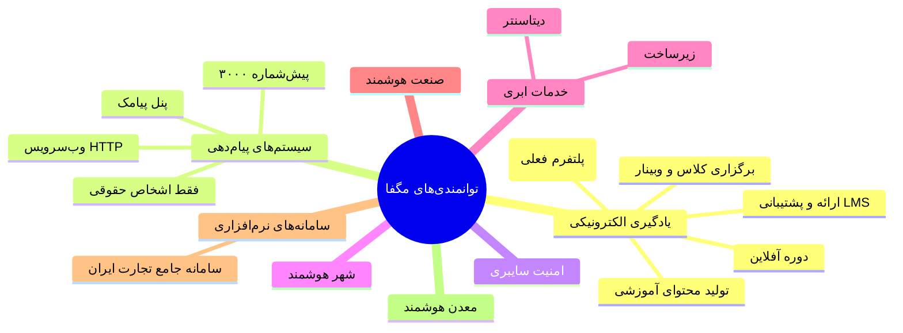
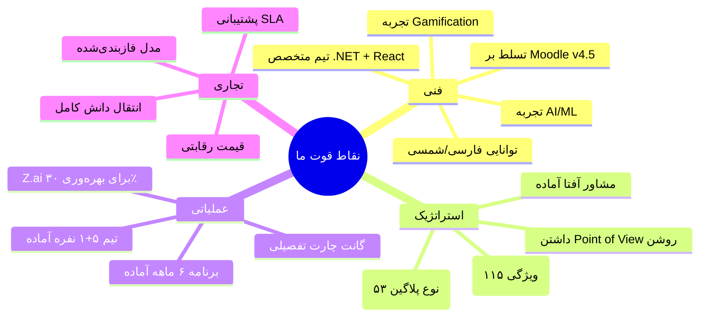
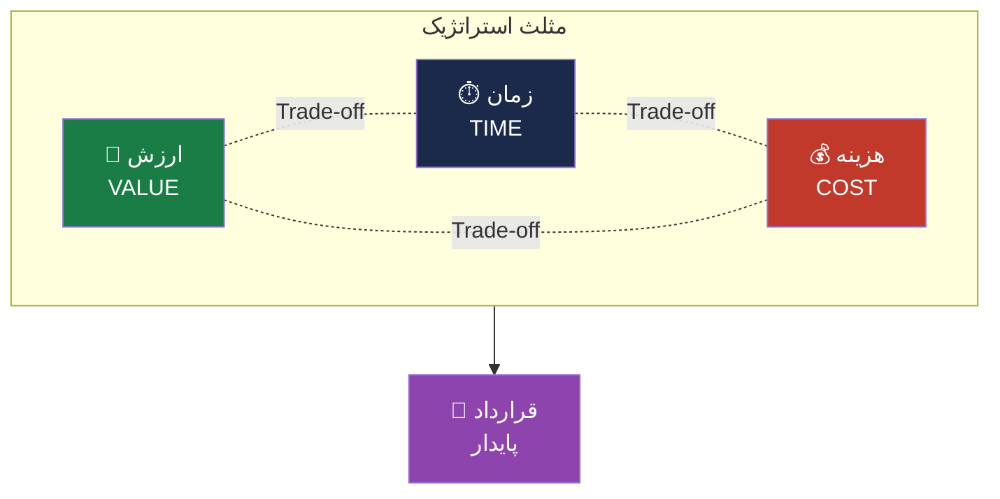
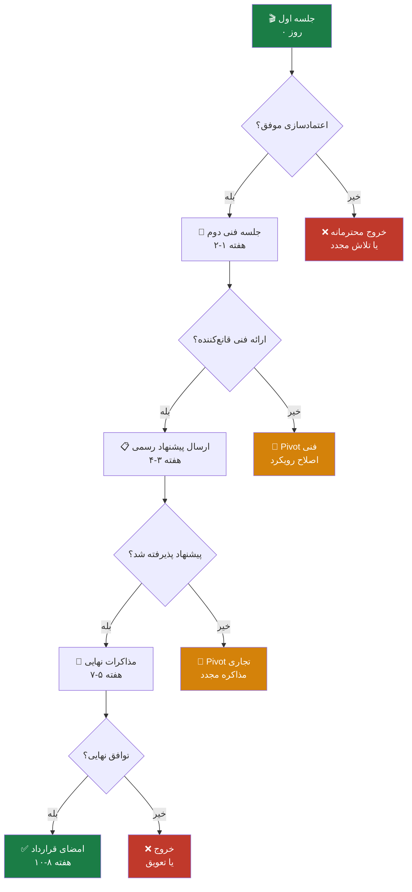
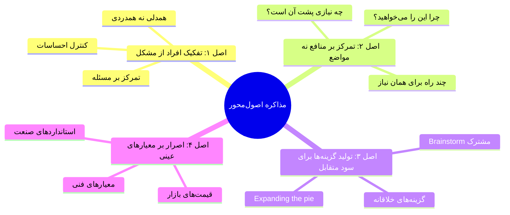
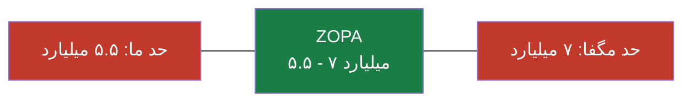

# 🎯 استراتژی جامع جلسه و مذاکره با شرکت مگفا
## پروژه طراحی و توسعه LMS هوشمند — RFP نسخه ۳.۰

> [!warning] طبقه‌بندی
> **محرمانه — فقط برای مصرف داخلی تیم**
> این سند حاوی استراتژی مذاکره، نقاط بحرانی، BATNA و تاکتیک‌های مذاکره است. در اختیار مگفا قرار نگیرد.

---

## 📋 فهرست مطالب

1. [خلاصه اجرایی](#۱-خلاصه-اجرايی)
2. [پروفایل شرکت مگفا (Company Profile)](#۲-پروفایل-شرکت-مگفا)
3. [تحلیل RFP از لنز مذاکره](#۳-تحلیل-rfp-از-لنز-مذاکره)
4. [تحلیل SWOT موقعیت ما](#۴-تحلیل-swot-موقعیت-ما)
5. [استراتژی اصلی (Master Strategy)](#۵-استراتژی-اصلی)
6. [نقاط بحرانی + الترناتیوها](#۶-نقاط-بحرانی--الترناتیوها)
7. [Playbook مذاکره (روش و جزئیات)](#۷-playbook-مذاکره)
8. [پیش‌نیازها و زیرساخت](#۸-پیش‌نیازها-و-زیرساخت)
9. [اسناد مورد نیاز (مجموع کامل)](#۹-اسناد-مورد-نیاز)
10. [برنامه جلسه (Meeting Run-down)](#۱۰-برنامه-جلسه)
11. [نقاط Pivot و Fail-Safe](#۱۱-نقاط-pivot-و-fail-safe)
12. [چک‌لیست نهایی مدیر تیم](#۱۲-چک‌لیست-نهایی-مدیر-تیم)

---

## ۱. خلاصه اجرایی

### 🎯 هدف نهایی
**امضای قرارداد طراحی و توسعه LMS هوشمند مگفا با شرایط پایدار، حاشیه سود ≥ ۲۵٪، و تحویل فازبندی‌شده در ۶-۱۲ ماه.**

### 🎯 هدف جلسه اول
- **NOT قرارداد** — بلکه ایجاد اعتماد، درک دقیق نیاز، و تمایز از رقبا
- **YES به جلسه دوم فنی** با حضور تیم فنی مگفا
- **YES به دریافت اطلاعات تکمیلی** (بانک اطلاعاتی، نمونه‌ها، دسترسی به کاربران)

### 🎯 پیش‌بینی زمان رسیدن به قرارداد
| مرحله | مدت |
|---|---|
| جلسه اول (این جلسه) | روز ۰ |
| جلسه فنی دوم | ۱-۲ هفته بعد |
| ارسال پیشنهاد فنی-مالی رسمی | ۳-۴ هفته بعد |
| مذاکرات نهایی | ۵-۷ هفته بعد |
| امضای قرارداد | ۸-۱۰ هفته بعد |

### 🎯 موقعیت استراتژیک ما
- **مزیت رقابتی اصلی:** پشتیبانی کامل از زبان فارسی/تقویم شمسی + AI بومی + Gamification + Marketplace
- **نقطه ضعف اصلی:** نداشتن سابقه LMS در مقیاس سازمانی (اما سابقه فنی قوی)
- **زِوزا:** استفاده از Moodle به‌عنوان پایه منطقی + بازطراحی به .NET/React

---

## ۲. پروفایل شرکت مگفا

### ۲.۱. شناسنامه شرکت

| فیلد | مقدار |
|---|---|
| **نام کامل** | مرکز گسترش فناوری اطلاعات (مگفا) — MAGFA |
| **نام اولیه (۱۳۶۰)** | شرکت "پویندان" |
| **تاریخ ثبت** | ۱۳۶۰/۰۲/۰۹ (۴۵ سال سابقه) |
| **شماره ثبت** | ۴۰۴۰۸ در اداره کل ثبت شرکت‌ها و مالکیت صنعتی تهران |
| **تاریخچه تغییر نام** | پویندان (۱۳۶۰) → مرکز تحقیقات و خدمات خودکفایی ایران (۱۳۶۰/۱۲/۱۵) → مرکز تحقیقات گسترش (۱۳۸۰/۱۱/۱۵) → **مرکز گسترش فناوری اطلاعات (مگفا)** |
| **مالکیت** | **تابع سازمان گسترش و نوسازی صنایع ایران (ایدرو - IDRO)** |
| **نوع شرکت** | دولتی (یکی از بزرگ‌ترین شرکت‌های دولتی فاوا) |
| **آدرس** | تهران، خیابان دکتر بهشتی، بین اندیشه و سهروردی، پلاک ۶۵ (محله نیلوفر) — کدپستی: ۱۵۵۹۶۱۵۶۱۳ |
| **تلفن** | ۰۲۱-۸۳۳۶۶ |
| **نمابر** | ۰۲۱-۸۸۷۶۳۳۴۲ |
| **ایمیل** | info@magfa.com |
| **وب‌سایت اصلی** | https://magfa.com |
| **وب‌سایت مگاموز** | https://magamooz.com (پلتفرم آموزش الکترونیکی فعلی) |

### ۲.۲. توانمندی‌ها و حوزه‌های فعالیت

مگفا یک شرکت چند-محصولی است. این موضوع برای مذاکره حیاتی است:

### ۲.۳. اخبار و تحولات اخیر (Signal intelligence)

> [!important] نکات مهم استراتژیک
> این موارد از اخبار عمومی مگفا استخراج شده‌اند و برای مذاکره حیاتی هستند:

| تاریخ | خبر | تأثیر بر مذاکره |
|---|---|---|
| **خرداد ۱۴۰۲** | مگفا در آستانه ورود به **باشگاه ۱۰۰۰ میلیاردی‌ها** | شرکت در حال رشد است، توان مالی بالا، اما حساسیت به ROI |
| **خرداد ۱۴۰۲** | اعلام احیای واحد یادگیری الکترونیکی (eLearning) | یعنی RFP ما بخشی از یک استراتژی احیای سازمانی است — فرصت استراتژیک |
| **اردیبهشت ۱۴۰۳** | ارائه ۳ میلیون خدمت به کاربران سامانه جامع تجارت ایران | توان فنی بالا در مقیاس سازمانی |
| **خرداد ۱۴۰۴** | تفاهم‌نامه با سازمان فناوری اطلاعات ایران برای هوشمندسازی صنایع | روابط دولتی قوی، اما ممکن است رقبای دولتی هم وجود داشته باشند |
| **اسفند ۱۴۰۳** | حضور در نمایشگاه Iran Expo 2025 | رویکرد بین‌المللی، حساسیت به کیفیت |

### ۲.۴. فرهنگ سازمانی مگفا (فرضیه‌های مذاکره‌ای)

> [!caution] این موارد فرضیه هستند. در جلسه اول باید validate شوند.

1. **دولتی بودن** → فرآیند خرید طولانی، حساسیت به قیمت، تأخیر در پرداخت‌ها محتمل است
2. **قدیمی بودن (۴۵ سال)** → احتمالاً ساختار سلسله‌مراتبی، تصمیم‌گیری چندمرحله‌ای
3. **چند-محصولی بودن** → واحد یادگیری الکترونیکی یکی از چند واحد است، بودجه محدود
4. **احیای eLearning** → تمایل به نشان دادن موفقیت سریع، پذیرش ریسک
5. **دارای پلتفرم magamooz.com فعلی** → احتمالاً نارضایتی از آن، یا تمایل به جایگزینی
6. **روابط دولتی قوی** → ممکن است رقبای دولتی هم در مدار باشند

### ۲.۵. احتمالاً چه کسی در جلسه خواهد بود؟

بر اساس نوع RFP و ساختار مگفا، احتمالاً این افراد در جلسه حضور دارند:

| نقش احتمالی | وظیفه در مذاکره | نگرانی اصلی |
|---|---|---|
| **مدیر واحد یادگیری الکترونیکی** | تصمیم‌گیرنده نهایی | ROI، تحویل به‌موقع، کیفیت |
| **مدیر فنی / CTO** | ارزیابی فنی | معماری، امنیت، نگهداری |
| **کارشناس آموزشی** | ارزیابی کاربری | UX، تطابق با نیازهای آموزشی |
| **مدیر پروژه** | ارزیابی مدیریت پروژه | روش‌شناسی، ریسک، گزارش‌دهی |
| **نماینده حقوقی/مالی** | ارزیابی قرارداد | قیمت، شرایط پرداخت، ضمانت |
| **نماینده منابع انسانی** | ارزیابی شایستگی | سابقه، اعتبار، رزومه |

---

## ۳. تحلیل RFP از لنز مذاکره

### ۳.۱. خواسته‌های آشکار مگفا (Explicit Wants)

از RFP v3.0 این موارد مستقیماً خواسته شده:

1. **سامانه LMS هوشمند** با معماری ماژولار
2. **پشتیبانی کامل فارسی + تقویم شمسی** (این گاپ بزرگ بازار است)
3. **سه نسخه:** استاندارد سازمانی، استاندارد آکادمیک، هوشمند سازمانی
4. **Gamification + AI + Marketplace** (نسخه هوشمند)
5. **یکپارچگی با گلستان/مروارید/سجاد** (نسخه آکادمیک)
6. **یکپارچگی با ERP/HRIS** (نسخه سازمانی)
7. **گواهینامه اَفتا** (الزام رسمی)
8. **SCORM 1.2 + 2004 + xAPI + HTML5** (استانداردهای فنی)
9. **استقرار On-Premise یا Cloud** (انعطاف)
10. **زمان‌بندی Gantt + برآورد هزینه به تفکیک فاز** (درخواست پیشنهاد)

### ۳.۲. خواسته‌های پنهان مگفا (Implicit Wants)

این موارد در RFP مستقیم نیست اما از تحلیل متون استخراج می‌شود:

1. **رهایی از پلتفرم فعلی magamooz.com** — احتمالاً Moodle قدیمی است که مشکلات دارد
2. **ایجاد جریان درآمدی جدید** — در بخش ۲-۳ RFP صراحتاً ذکر شده
3. **تثبیت برند مگفا در EdTech** — ذکر شده در ۲-۳
4. **مزیت رقابتی پایدار** — ذکر شده در ۲-۳
5. **بازار بزرگ‌تر (دانشگاه + سازمان)** — ذکر شده در بخش ۴
6. **فرهنگ‌سازی نوآوری** — مگفا می‌خواهد نوآور به‌نظر برسد
7. **انتقال دانش به تیم داخلی مگفا** — احتمالاً می‌خواهند بلندمدت خودشان نگه دارند
8. **پشتیبانی طولانی‌مدت** — سازمان دولتی، نیاز به SLA چندساله

### ۳.۳. نقاط حساس RFP (Red Flags)

> [!danger] این موارد در جلسه باید دقیق پرسیده شوند

| # | نقطه حساس | ریسک | راهکار مذاکره‌ای |
|---|---|---|---|
| ۱ | **زمان تحویل مشخص نیست** (فقط Gantt خواسته) | ممکن است انتظار ۶ ماهه داشته باشند | در جلسه بپرسید: «بازه زمانی مطلوب شما چیست؟» |
| ۲ | **بودجه مشخص نیست** | ممکن است بسیار محدود باشد | در جلسه بپرسید: «بازه بودجه‌ای شما چیست؟» |
| ۳ | **تیم داخلی مگفا** مشخص نیست | ممکن است بخواهند خودشان توسعه دهند | بپرسید: «آیا تیم داخلی توسعه دارید؟» |
| ۴ | **پلتفرم فعلی magamooz.com** چیست؟ | احتمالاً Moodle است — باید بدانیم چه نارضایتی‌هایی دارند | بپرسید: «نقاط ضعف پلتفرم فعلی چیست؟» |
| ۵ | **مشتریان هدف** مشخص نیستند | دانشگاه‌ها یا سازمان‌ها؟ ترتیب؟ | بپرسید: «مشتری پایلوت کیست؟» |
| ۶ | **الزام آفتا** مشخص نیست (زمان؟) | ممکن است قبل از تحویل لازم باشد | بپرسید: «مهلت دریافت آفتا؟» |
| ۷ | **مدل مالکیت** مشخص نیست | On-Premise یا SaaS؟ | بپرسید: «مدل استقرار مطلوب؟» |
| ۸ | **پشتیبانی پس از تحویل** | ممکن است бесплатexpect | بپرسید: «انتظار از پشتیبانی؟» |

### ۳.۴. نقاط قوت RFP (برای ما فرصت است)

| نقطه قوت RFP | فرصت برای ما |
|---|---|
| تأکید بر AI | ما می‌توانیم با AI بومی فارسی متمایز شویم |
| تأکید بر Gamification | ۹ زیرماژول کامل — نشان تخصص |
| تأکید بر Marketplace | مزیت رقابتی منحصربه‌فرد |
| تأکید بر فارسی/شمسی | بزرگترین گاپ بازار |
| تأکید بر یکپارچگی | فرصت فروش Cross-Sell خدمات یکپارچگی |

---

## ۴. تحلیل SWOT موقعیت ما

### ۴.۱. Strengths (نقاط قوت)

### ۴.۲. Weaknesses (نقاط ضعف)

| ضعف | شدت | راهکار جبران |
|---|---|---|
| عدم سابقه LMS در مقیاس بزرگ | بالا | ارائه MVP + دمو زنده + تست رایگان ۲ هفته‌ای |
| عدم داشتن گواهینامه آفتا فعلی | بالا | مشاور آفتا + تعهد زمان‌بندی شده |
| تیم کوچک (۵+۱ نفر) | متوسط | تأکید بر کیفیت نه کمیت + Z.ai |
| نداشتن سابقه با سازمان‌های دولتی | متوسط | همکاری با مشاور آشنا با فرآیند دولتی |
| نداشتن مشتری پایلوت گلستان/سجاد | بالا | پیشنهاد پایلوت رایگان با یک دانشگاه |
| عدم آشنایی مگفا با ما | بالا | معرفی قوی + رزومه + دمو |

### ۴.۳. Opportunities (فرصت‌ها)

1. **احیای eLearning در مگفا** — تمایل به نوآوری
2. **نارضایتی از پلتفرم فعلی** — فرصت جایگزینی
3. **بازار EdTech ایران رو به رشد** — مگفا می‌خواهد سهم بگیرد
4. **گاپ فارسی/شمسی** — هیچ LMS خوبی این را کامل ندارد
5. **AI فارسی** — فرصت متمایزسازی
6. **Marketplace** — مدل درآمدی جدید برای مگفا
7. **پس از قرارداد اول، فرصت فازهای ۲-۴** — درآمد طولانی‌مدت

### ۴.۴. Threats (تهدیدها)

| تهدید | احتمال | شدت | راهکار دفاعی |
|---|---|---|---|
| **Moodle Partner رسمی** (مثل شریف‌نظام، پارس‌نویسان) | بالا | بالا | تأکید بر .NET + AI بومی + گاپ فارسی |
| **شرکت‌های دولتی همکار مگفا** | بالا | بالا | تمایز با مدل تجاری متفاوت |
| **RFP از قبل تصمیم‌گیری شده** (Rubber Stamp) | متوسط | بحرانی | پرسش مستقیم در جلسه + آمادگی خروج |
| **بودجه محدود مگفا** | بالا | بالا | فازبندی + مدل SaaS |
| **زمان خیلی کوتاه (۳-۴ ماه)** | متوسط | بالا | MVP در ۳ ماه + فازهای بعدی |
| **رقبای بین‌المللی (Moodle HQ، Blackboard)** | پایین | بالا | تأکید بر پشتیبانی محلی + فارسی |
| **تیم داخلی مگفا بخواهد خودش توسعه دهد** | متوسط | متوسط | پیشنهاد Co-Development + انتقال دانش |

---

## ۵. استراتژی اصلی

### ۵.۱. مأموریت استراتژیک

> [!quote] مأموریت
> «تبدیل شدن به شریک استراتژیک مگفا در حوزه EdTech، نه صرفاً یک پیمانکار پروژه‌ای.»

این تغییر زاویه دید از "پروژه" به "شراکت" است. مزایا:
- قیمت بالاتر قابل توجیه است
- فرصت فازهای بعدی (Maintenance، Phase 2، Cross-Sell)
- انعطاف در مذاکره (تطویل زمان به جای کاهش قیمت)
- اعتبار برند ما افزایش می‌یابد

### ۵.۲. مثلث استراتژیک (Strategic Triangle)

### ۵.۳. موضع اولیه ما (Opening Position)

| بعد | موضع اولیه | حداقل قابل قبول | نقطه خروج (Walk-away) |
|---|---|---|---|
| **قیمت کل (۶ ماه + پشتیبانی ۱ سال)** | ۸ میلیارد تومان | ۵.۵ میلیارد تومان | زیر ۴.۵ میلیارد |
| **زمان تحویل MVP** | ۴ ماه | ۵ ماه | ۶ ماه |
| **پیش‌پرداخت** | ۴۰٪ | ۳۰٪ | زیر ۲۰٪ |
| **پشتیبانی پس از تحویل** | ۱۲ ماه رایگان + SLA | ۶ ماه رایگان + SLA | کمتر از ۳ ماه |
| **مالکیت کد** | مشترک (با حق استفاده مگفا) | مالکیت مگفا با حق استفاده ما | مالکیت انحصاری مگفا |
| **انتشار دانش** | ۲۰ ساعت آموزش | ۱۰ ساعت آموزش | بدون انتقال دانش |

### ۵.۴. مسیر اصلی استراتژی (Master Path)

### ۵.۵. ۵ محور استراتژی (5 Strategic Pillars)

#### محور ۱: تخصص فنی (Technical Authority)
- نشان دادن عمق فنی (۱۱۵ ویژگی RFP را مستقیم تحلیل کرده‌ایم)
- دموی زنده از MVP
- معماری تمیز (Clean Architecture) قابل دفاع

#### محور ۲: درک کسب‌وکار مگفا (Business Empathy)
- نشان دادن درک از ضرورت پروژه (احیای eLearning، باشگاه ۱۰۰۰ میلیاردی)
- درک چالش‌های دولتی بودن
- درک رقابت EdTech

#### محور ۳: شراکت استراتژیک (Strategic Partnership)
- نه صرفاً پیمانکار، بلکه شریک رشد
- تعهد به فازهای بعدی
- اشتراک در موفقیت (پاداش عملکرد)

#### محور ۴: مدیریت ریسک (Risk Management)
- شناسایی ۱۰ ریسک کلیدی
- راهکار کاهش برای هرکدام
- ضمانت‌های اجرایی

#### محور ۵: تمایز رقابتی (Competitive Differentiation)
- **AI بومی فارسی** — هیچ رقیبی این را ندارد
- **Gamification کامل** — ۹ زیرماژول
- **Marketplace** — مدل درآمدی جدید
- **پشتیبانی شمسی/RTL** — استاندارد طلایی

---

## ۶. نقاط بحرانی + الترناتیوها

### ۶.۱. ۱۰ نقطه بحرانی استراتژی

> [!danger] هرکدام از این موارد می‌تواند کل مذاکره را به شکست بکشاند. برای هرکدام Plan B داشته باشید.

#### 🔴 نقطه بحرانی ۱: زمان تحویل

**ریسک:** مگفا انتظار ۳-۴ ماهه داشته باشد (که غیرممکن است).

**Trigger:** اگر در جلسه گفتند «تا ۳ ماه»، خطر جدی است.

**Plan A (مسیر اصلی):** فازبندی با MVP در ۴ ماه + فاز کامل در ۸-۱۰ ماه.

**Plan B (الترناتیو):** اگر اصرار به ۳ ماه:
- کاهش دامنه MVP به Core Engine + ۳ ماژول اصلی
- تأکید بر افزایش هزینه ۳۰٪ برای اضافه‌کاری
- تعهد به فازهای بعدی به‌صورت مجزا

**Plan C (Walk-away):** اگر اصرار به زیر ۳ ماه با دامنه کامل، خروج محترمانه. «متأسفیم، ما کیفیت را فدای زمان نمی‌کنیم.»

---

#### 🔴 نقطه بحرانی ۲: بودجه (قیمت)

**ریسک:** بودجه مگفا کمتر از ۴ میلیارد تومان باشد.

**Trigger:** اگر اشاره به «رقبا با قیمت کمتر» کردند یا بودجه را زیر ۴ میلیارد گفتند.

**Plan A:** ۶ میلیارد برای ۶ ماه + ۱.۵ میلیارد پشتیبانی سالانه = ۷.۵ میلیارد کل.

**Plan B (الترناتیو):** اگر بودجه ۴-۵ میلیارد:
- فازبندی به ۲ فاز (Core + Enterprise Std = ۴ میلیارد، فاز Smart = قرارداد جداگانه)
- مدل SaaS: هزینه پایین راه‌اندازی + اشتراک ماهانه
- Co-Financing: مگفا هزینه مشاور آفتا را بدهد، ما هزینه توسعه را

**Plan C (Walk-away):** زیر ۳.۵ میلیارد = زیر هزینه واقعی ما → خروج.

---

#### 🔴 نقطه بحرانی ۳: گواهینامه آفتا

**ریسک:** مگفا آفتا را قبل از تحویل نهایی بخواهد (که ۶+ ماه زمان می‌برد).

**Trigger:** اگر گفتند «بدون آفتا پول نهایی را نمی‌دهیم».

**Plan A:** مشاور آفتا از فاز ۲ پروژه شروع می‌کند، در پایان فاز ۳ آفتا آماده است.

**Plan B (الترناتیو):** قرارداد جداگانه برای آفتا:
- فاز ۱: توسعه + تحویل (بدون آفتا)
- فاز ۲: دریافت آفتا (قرارداد جداگانه)

**Plan C:** تعهد مشاور آفتا با ضمانت‌نامه بانکی.

---

#### 🔴 نقطه بحرانی ۴: یکپارچگی با گلستان/سجاد

**ریسک:** API گلستان مستندات ندارد، توسعه Connector ممکن است ۳+ ماه طول بکشد.

**Trigger:** اگر مگفا گفتند «گلستان را در فاز ۱ می‌خواهیم».

**Plan A:** SIS Connector در فاز ۳ (Academic) — که زمان کافی است.

**Plan B (الترناتیو):** اگر اصرار به فاز ۱:
- پایلوت با یک دانشگاه مشخص (مثلاً دانشگاه مگفا)
- توسعه Connector به‌صورت قرارداد جداگانه
- دریافت مستندات گلستان از مگفا (آن‌ها باید تأمین کنند)

**Plan C:** تعویق فاز آکادمیک به قرارداد Phase 2.

---

#### 🔴 نقطه بحرانی ۵: کپی‌رایت Moodle

**ریسک:** Moodle تحت GPL است. بازطراحی به .NET باید از کد Moodle کپی نکند.

**Trigger:** اگر مگفا از نظر حقوقی سؤال کرد یا رقیب این موضوع را مطرح کرد.

**Plan A:** تأکید بر Clean Room Implementation — ما فقط منطق را فهمیدیم، کد را از صفر نوشتیم.

**Plan B (الترناتیو):** استفاده از پلاگین‌های Moodle تحت لایسنس سازگار (MIT/Apache) با اعتبار مناسب.

**Plan C:** مشاور حقوقی مالکیت فکری برای تأیید.

---

#### 🔴 نقطه بحرانی ۶: تیم کوچک (۵+۱ نفر)

**ریسک:** مگفا نگران شود که تیم ما برای پروژه بزرگ کافی نیست.

**Trigger:** اگر پرسیدند «چند نفر روی پروژه کار می‌کنند؟» و وقتی ۵ نفر گفتیم، تعجب کردند.

**Plan A:** تأکید بر کیفیت نه کمیت + Z.ai بهره‌وری ۳۰٪ + مشاور آفتا.

**Plan B (الترناتیو):** اگر اصرار به تیم بزرگ‌تر:
- افزودن ۲ نفر پاره‌وقت (QA + UI/UX)
- شراکت با یک شرکت فرعی برای پشتیبانی
- تعهد به استخدام در صورت نیاز

**Plan C:** ضمانت‌نامه اجرایی — اگر نتوانستیم تحویل دهیم، ضرر مگفا جبران می‌شود.

---

#### 🔴 نقطه بحرانی ۷: پشتیبانی پس از تحویل

**ریسک:** مگفا انتظار پشتیبانی رایگان ۲+ سال داشته باشد.

**Trigger:** اگر گفتند «۲ سال پشتیبانی رایگان جزو شروط است».

**Plan A:** ۶ ماه رایگان + قرارداد سالانه SLA با هزینه ۱۵٪ قیمت پروژه.

**Plan B (الترناتیو):** ۱۲ ماه رایگان + قرارداد سالانه با هزینه ۱۸٪.

**Plan C:** ۲۴ ماه رایگان + افزایش قیمت کل به ۸.۵ میلیارد (جبران هزینه پشتیبانی).

---

#### 🔴 نقطه بحرانی ۸: استقلال فنی مگفا (On-Premise)

**ریسک:** مگفا بخواهد On-Premise نصب کند و خودشان نگهداری کنند → نیاز به انتقال دانش سنگین.

**Trigger:** اگر گفتند «روی سرورهای خودمان نصب می‌کنیم».

**Plan A:** On-Premise + ۴۰ ساعت انتقال دانش + مستندسازی کامل.

**Plan B (الترناتیو):** Hybrid: On-Premise + Cloud Backup + ما مدیریت می‌کنیم.

**Plan C:** Cloud-first + بعداً Migration به On-Premise اگر مگفا اصرار کرد.

---

#### 🔴 نقطه بحرانی ۹: رقبای از پیش انتخاب‌شده

**ریسک:** RFP صرفاً فرمالیته باشد و رقیب از قبل انتخاب شده باشد.

**Trigger:** اگر در جلسه:
- سؤالات تند و چالشی پرسیدند (نه کنجکاوی)
- روی جزئیات فنی که فقط یک رقیب خاص می‌داند اصرار کردند
- زمان پاسخ کوتاه دادند
- صحبت از «رضایت کاربران فعلی» کردند

**Plan A:** پرسش مستقیم اما محترمانه: «آیا هنوز در مرحله ارزیابی گزینه‌ها هستید یا شرکتی انتخاب شده؟»

**Plan B (الترناتیو):** اگر فهمیدیم رقیب انتخاب شده:
- تأکید بر تمایز ما (AI بومی فارسی)
- پیشنهاد پایلوت رایگان ۲ هفته‌ای
- پیشنهاد Co-Development با رقیب انتخاب شده

**Plan C (Walk-away):** اگر کاملاً مشخص است که بازی باخت است، خروج با اعتبار حفظ شده. «از فرصت ممنونیم، اگر در آینده نیاز بود...»

---

#### 🔴 نقطه بحرانی ۱۰: پرداخت‌ها (نقدینگی)

**ریسک:** مگفا به‌خاطر دولتی بودن، پرداخت‌ها با تأخیر باشد.

**Trigger:** اگر گفتند «پرداخت بر اساس مراحل مالی سازمان» (که معمولاً ۳+ ماه تأخیر).

**Plan A:** ۴۰٪ پیش‌پرداخت + ۳۰٪ میانه + ۳۰٪ پایان.

**Plan B (الترناتیو):** اگر پیش‌پرداخت کم:
- ۲۵٪ پیش + ۲۵٪ تحویل MVP + ۲۵٪ فاز ۲ + ۲۵٪ پایان
- ضمانت‌نامه بانکی برای تأمین نقدینگی
- شرط جریمه تأخیر پرداخت

**Plan C:** اگر زیر ۲۰٪ پیش‌پرداخت، خروج. ما نقدینگی کافی نداریم.

---

### ۶.۲. ماتریس ریسک مذاکره

| ریسک | احتمال | شدت | امتیاز ریسک | استراتژی پاسخ |
|---|---|---|---|---|
| ۱. زمان خیلی کوتاه | بالا | بحرانی | ۹ | Pivot به فازبندی |
| ۲. بودجه محدود | بالا | بحرانی | ۹ | Pivot به مدل SaaS |
| ۳. آفتا قبل از تحویل | متوسط | بالا | ۶ | Pivot به قرارداد جداگانه |
| ۴. یکپارچگی گلستان زودرس | متوسط | بالا | ۶ | Pivot به فاز ۳ |
| ۵. مسئله کپی‌رایت Moodle | پایین | متوسط | ۳ | Clean Room + مشاور حقوقی |
| ۶. نگرانی از تیم کوچک | متوسط | متوسط | ۴ | تأکید بر کیفیت + Z.ai |
| ۷. پشتیبانی رایگان طولانی | بالا | متوسط | ۶ | Plan A با قرارداد SLA |
| ۸. On-Premise ضروری | بالا | متوسط | ۶ | Plan A با انتقال دانش |
| ۹. رقیب از قبل انتخاب شده | متوسط | بحرانی | ۸ | پرسش مستقیم + Pivot |
| ۱۰. پرداخت با تأخیر | بالا | متوسط | ۶ | پیش‌پرداخت بالا + جریمه |

---

## ۷. Playbook مذاکره

### ۷.۱. چارچوب مذاکره: Harvard Method (Principled Negotiation)

### ۷.۲. BATNA (Best Alternative to Negotiated Agreement)

**BATNA ما:**
- اگر مگفا توافق نکرد → تمرکز روی مشتریان خصوصی LMS (دانشگاه‌های آزاد، آموزشگاه‌ها)
- توسعه MVP مستقل و عرضه به بازار EdTech ایران
- پیشنهاد به سازمان‌های دیگر با RFP مشابه

**BATNA مگفا (تخمین):**
- انتخاب Moodle Partner رسمی (شریف‌نظام، پارس‌نویسان)
- توسعه داخلی توسط تیم مگفا
- رقبای بین‌المللی (با قیمت بالاتر و پشتیبانی ضعیف)

### ۷.۳. ZOPA (Zone of Possible Agreement)

### ۷.۴. تاکتیک‌های مذاکره (Tactics)

#### تاکتیک ۱: Anchoring (لنگر انداختن)

**روش:** اولین عدد را ما می‌گوییم، نه مگفا.
- پیشنهاد اول: ۸ میلیارد تومان
- شفاف: «این بر اساس تحلیل تفصیلی ۱۱۵ ویژگی RFP است»
- با توجیه: «میانگین بازار برای پروژه‌های مشابه ۱۰-۱۲ میلیارد است»

**نکته:** اگر مگفا اول عدد گفت، آن را discount کنیم و بعد از نظرمان بگوییم.

#### تاکتیک ۲: Concession Ladder (نردبان امتیاز)

هر امتیاز ما، باید با امتیاز مگفا معاوضه شود:

| امتیاز ما | در برابر امتیاز مگفا |
|---|---|
| کاهش قیمت ۱۰٪ | افزایش پیش‌پرداخت از ۳۰٪ به ۴۰٪ |
| افزایش زمان ۲ هفته | کاهش دامنه یک ماژول次要 |
| پشتیبانی رایگان ۱۲ ماه | تعهد به فاز ۲ قرارداد |
| انتقال دانش رایگان | معرفی به ۲ مشتری دیگر مگفا |

#### تاکتیک ۳: Trade-off Matrix

> [!important] قانون طلایی
> **هیچ امتیاز رایگان ندهیم.** هر امتیاز باید با چیزی معاوضه شود.

#### تاکتیک ۴: Walk-away Power (قدرت خروج)

- باید واقعاً آماده خروج باشیم
- اگر مگفا بفهمد که مجبور به توافق هستیم، ضعیف می‌شویم
- نقطه خروج: زیر ۴.۵ میلیارد یا زیر ۲۰٪ پیش‌پرداخت

#### تاکتیک ۵: Building Block (ساختن بلوک به بلوک)

موافقت‌های کوچک → توافق بزرگ:
1. اول توافق بر سر فازبندی
2. بعد توافق بر سر استانداردها
3. بعد توافق بر سر SLA
4. بعد توافق بر سر قیمت

#### تاکتیک ۶: Empathy Mapping

در جلسه، نقش هر فرد مگفا را درک کنیم:
- **مدیر واحد:** به دنبال موفقیت شخصی و ROI
- **مدیر فنی:** به دنبال معماری قابل دفاع
- **حقوقی:** به دنبال ریسک حداقل
- **مالی:** به دنبال بودجه مناسب

برای هرکدام پیام مناسب داشته باشیم.

#### تاکتیک ۷: Silence (سکوت)

بعد از گفتن قیمت یا موضع مهم، **سکوت کنید**.
- مگفا مجبور به پاسخ است
- سکوت نشان‌دهنده اعتماد به نفس است
- اگر عذرخواهی کنیم، ضعیف می‌شویم

### ۷.۵. نقش‌ها در تیم مذاکره‌کننده ما

| نقش | فرد | وظیفه |
|---|---|---|
| **Lead Negotiator** | مدیر تیم (شما) | رهبری مذاکره، تصمیم‌گیری نهایی |
| **Technical Authority** | مدیر فنی | پاسخ سؤالات فنی، دمو |
| **SME (AI/Gamification)** | متخصص AI | توضیح تمایز فنی |
| **Commercial Analyst** | مدیر پروژه | محاسبات آنی، تجاری |
| **Note Taker** | کارشناس | ثبت دقیق همه چیز |

> [!warning] قبل از جلسه
> نقش‌ها را مشخص کنید. **دو نفر همزمان صحبت نکنند.** تصمیم‌گیری نهایی فقط با Lead Negotiator.

### ۷.۶. آنچه نباید بگوییم (Forbidden Topics)

> [!danger] این موارد هرگز در جلسه نباید مطرح شوند

1. ❌ «ما تجربه LMS در این مقیاس نداریم»
2. ❌ «تیم ما کوچک است»
3. ❌ «ممکن است نتوانیم در زمان تحویل کنیم»
4. ❌ «Moodle را کپی می‌کنیم» (حتی به‌صورت شوخی)
5. ❌ «رقبای دیگر چه پیشنهاد داده‌اند؟»
6. ❌ «قیمت ما پایین‌تر از رقبا است» (ضعف نشان می‌دهد)
7. ❌ «می‌توانیم روی قیمت تخفیف بدهیم» (در ابتدای مذاکره)
8. ❌ جزئیات فنی که مگفا نفهمد
9. ❌ سؤالات تحقیرآمیز به مگفا
10. ❌ قول قطعی بدون مشورت تیم

### ۷.۷. آنچه باید بگوییم (Key Messages)

> [!success] این پیام‌ها باید در جلسه منتقل شوند

1. ✅ «ما RFP شما را در ۱۱۵ ویژگی تحلیل کرده‌ایم»
2. ✅ «Moodle v4.5 را به‌عنوان مرجع شناختیم، اما از صفر بازطراحی می‌کنیم»
3. ✅ «AI بومی فارسی ما متمایزکننده است»
4. ✅ «ما بر شراکت استراتژیک تأکید می‌کنیم، نه صرفاً پروژه»
5. ✅ «گواهینامه آفتا را با مشاور رسمی دنبال می‌کنیم»
6. ✅ «انتقال دانش بخش جدایی‌ناپذیر قرارداد است»
7. ✅ «Z.ai بهره‌وری ما را ۳۰٪ افزایش می‌دهد»
8. ✅ «پایلوت رایگان برای اعتمادسازی» (در صورت لزوم)

---

## ۸. پیش‌نیازها و زیرساخت

### ۸.۱. پیش‌نیازهای فنی (Technical Prerequisites)

| # | پیش‌نیاز | وضعیت | اقدام لازم |
|---|---|---|---|
| ۱ | MVP قابل دمو (حداقل Auth + Course CRUD) | ❌ | توسعه ۲ هفته‌ای قبل از جلسه |
| ۲ | دمو از Gamification | ❌ | توسعه نمونه ۳ روزه |
| ۳ | دمو از AI Chatbot فارسی | ❌ | توسعه نمونه ۵ روزه |
| ۴ | محیط demo با دامنه اختصاصی | ❌ | راه‌اندازی |
| ۵ | مستندات فنی (Architecture Doc) | ✅ | موجود (Obsidian Vault) |
| ۶ | مقایسه Moodle vs راه‌حل ما | ✅ | موجود |
| ۷ | استانداردهای فنی (SCORM, xAPI) | ✅ | توضیح داده شده |
| ۸ | معماری امنیتی | ❌ | توسعه سند ۱ روزه |
| ۹ | مدل داده (ERD) | ❌ | توسعه ۲ روزه |
| ۱۰ | سناریوی پایلوت | ❌ | نوشتن سناریو |

### ۸.۲. پیش‌نیازهای تجاری (Commercial Prerequisites)

| # | پیش‌نیاز | وضعیت | اقدام لازم |
|---|---|---|---|
| ۱ | لیست حقوقی شرکت | ❌ | آماده‌سازی |
| ۲ | رزومه شرکت + پروژه‌ها | ❌ | آماده‌سازی |
| ۳ | پروپوزال رسمی (Draft) | ❌ | نوشتن Draft اولیه |
| ۴ | مدل قیمت‌گذاری تفصیلی | ✅ | موجود (فایل اکسل) |
| ۵ | گانت چارت ۶-۱۲ ماهه | ✅ | موجود (فایل اکسل) |
| ۶ | پیش‌نویس قرارداد | ❌ | مشاور حقوقی |
| ۷ | لیست رفرنس‌ها | ❌ | جمع‌آوری |
| ۸ | کاتالوگ خدمات | ❌ | طراحی |
| ۹ | مدل SLA | ❌ | نوشتن |
| ۱۰ | لیست تیم + رزومه | ❌ | جمع‌آوری |

### ۸.۳. پیش‌نیازهای حقوقی (Legal Prerequisites)

| # | پیش‌نیاز | وضعیت | اقدام لازم |
|---|---|---|---|
| ۱ | مشاور حقوقی قرارداد | ❌ | معرفی/استخدام |
| ۲ | مشاور آفتا | ❌ | معرفی |
| ۳ | قرارداد NDA | ❌ | آماده‌سازی |
| ۴ | قرارداد Co-Development (در صورت نیاز) | ❌ | Draft |
| ۵ | ضمانت‌نامه بانکی | ❌ | هماهنگی با بانک |
| ۶ | بیمه مسئولیت حرفه‌ای | ❌ | استعلام |
| ۷ | تأییدیه مالیاتی | ❌ | اخذ |
| ۸ | تأییدیه تأمین اجتماعی | ❌ | اخذ |

### ۸.۴. پیش‌نیازهای اطلاعاتی (Information Prerequisites)

> [!important] قبل از جلسه باید این اطلاعات را جمع‌آوری کنیم

| # | اطلاعات | منبع |
|---|---|---|
| ۱ | پلتفرم فعلی magamooz.com چیست؟ (احتمالاً Moodle) | بررسی دستی |
| ۲ | چه نارضایتی‌هایی دارد؟ (با کاربران صحبت کنیم) | شبکه‌ای |
| ۳ | چه کسی تصمیم‌گیرنده نهایی است؟ | LinkedIn |
| ۴ | بودجه مصوب چقدر است؟ | فرضیه |
| ۵ | چه رقبایی دعوت شده‌اند؟ | فرضیه |
| ۶ | آیا مشاور مگفا وجود دارد؟ | شبکه‌ای |
| ۷ | آیا مگفا با Moodle Partner کار کرده؟ | LinkedIn |
| ۸ | اخبار اخیر مگفا | وب‌سایت |
| ۹ | ساختار سازمانی مگفا | LinkedIn |
| ۱۰ | فرهنگ سازمانی مگفا | شبکه‌ای |

---

## ۹. اسناد مورد نیاز

### ۹.۱. اسناد قبل از جلسه (Pre-Meeting)

| # | سند | فرمت | مسئول | اولویت |
|---|---|---|---|---|
| ۱ | پروپوزال اجرایی (Executive Brief) | PDF | مدیر تیم | 🔴 بحرانی |
| ۲ | رزومه شرکت | PDF | مدیر تیم | 🔴 بحرانی |
| ۳ | کاتالوگ خدمات | PDF | بازاریابی | 🟡 بالا |
| ۴ | نمونه پروژه‌های مشابه | PDF | مدیر پروژه | 🟡 بالا |
| ۵ | لیست تیم + رزومه | PDF | HR | 🟡 بالا |
| ۶ | تحلیل RFP (۱۱۵ ویژگی) | PDF | مدیر فنی | 🔴 بحرانی |
| ۷ | مقایسه Moodle vs راه‌حل ما | PDF | مدیر فنی | 🟡 بالا |
| ۸ | دمو آنلاین MVP | URL | تیم فنی | 🔴 بحرانی |
| ۹ | سؤالات کلیدی برای مگفا | Word | مدیر تیم | 🔴 بحرانی |
| ۱۰ | Agenda جلسه (پیشنهادی) | Word | مدیر تیم | 🟡 بالا |

### ۹.۲. اسناد حین جلسه (In-Meeting)

| # | سند | فرمت | مسئول |
|---|---|---|---|
| ۱ | Presentation اصلی (۲۰ اسلاید) | PPTX | مدیر تیم |
| ۲ | دموی زنده | Web | مدیر فنی |
| ۳ | معماری سیستم (نمودار) | PDF | مدیر فنی |
| ۴ | نمونه گانت چارت | PDF | مدیر پروژه |
| ۵ | لیست سؤالات مگفا (پیش‌بینی) | Word | مدیر تیم |
| ۶ | چک‌لیست امتیازات مذاکره | Word | مدیر تیم |
| ۷ | نقطه خروج (Walk-away criteria) | Word | مدیر تیم |
| ۸ | Notebook برای یادداشت | - | Note Taker |

### ۹.۳. اسناد بعد از جلسه (Post-Meeting)

| # | سند | فرمت | زمان تحویل |
|---|---|---|---|
| ۱ | صورت‌جلسه (Meeting Minutes) | PDF | ۲۴ ساعت |
| ۲ | Thank You Email | Email | ۲۴ ساعت |
| ۳ | Action Items Tracker | Excel | ۴۸ ساعت |
| ۴ | پروپوزال فنی-مالی رسمی | PDF | ۲-۳ هفته |
| ۵ | Gantt Chart تفصیلی | Excel | ۲-۳ هفته |
| ۶ | پیش‌نویس قرارداد | Word | ۴-۵ هفته |
| ۷ | مدل SLA | PDF | ۴-۵ هفته |
| ۸ | ضمانت‌نامه بانکی | Bank | ۶-۷ هفته |
| ۹ | لیست پایلوت‌ها | PDF | ۶-۷ هفته |
| ۱۰ | مدرک گواهینامه آفتا (شروع فرآیند) | - | ۸-۱۰ هفته |

### ۹.۴. اسناد داخلی ما (Internal Documents)

| # | سند | توضیح |
|---|---|---|
| ۱ | استراتژی مذاکره (همین سند) | مرجع اصلی |
| ۲ | BATNA Analysis | سند داخلی |
| ۳ | Pricing Model | اکسل موجود |
| ۴ | Risk Register | سند داخلی |
| ۵ | Competitor Analysis | تحقیق شده |
| ۶ | Negotiation Playbook | همین سند |
| ۷ | Walk-away Criteria | در همین سند |

---

## ۱۰. برنامه جلسه

### ۱۰.۱. قبل از جلسه (T-1 هفته)

| روز | اقدام |
|---|---|
| T-7 | تأیید شرکت از مگفا |
| T-7 | ارسال Agenda پیشنهادی |
| T-5 | رزرو سالن/لینک آنلاین |
| T-5 | ارسال پروپوزال اجرایی مقدماتی |
| T-3 | تمرین presentation با تیم |
| T-3 | تست دمو فنی |
| T-2 | آماده‌سازی اسناد چاپی |
| T-1 | جمع‌بندی نهایی |
| T-1 | بررسی LinkedIn شرکت‌کنندگان مگفا |

### ۱۰.۲. روز جلسه (T-0)

#### پیش از جلسه (T-2 ساعت)
- 🏢 رسیدن به محل ۳۰ دقیقه زودتر
- 💻 تست دمو و اینترنت
- 👔 لباس رسمی
- 📋 آخرین مرور نقش‌ها
- 🧘 آرامش روانی

#### Agenda جلسه (۹۰ دقیقه پیشنهادی)

| زمان | بخش | مسئول | هدف |
|---|---|---|---|
| ۰۰:۰۰-۰۰:۱۰ | معرفی و Small Talk | مدیر تیم | ایجاد فضای دوستانه |
| ۰۰:۱۰-۰۰:۲۰ | معرفی مگفا (آنچه فهمیدیم) | مدیر تیم | نشان دادن درک |
| ۰۰:۲۰-۰۰:۳۵ | معرفی تیم و توانمندی‌ها | مدیر تیم | اعتمادسازی |
| ۰۰:۳۵-۰۰:۵۰ | ارائه راه‌حل ما (نقاط متمایز) | مدیر فنی | تمایز |
| ۰۰:۵۰-۰۰:۵۵ | دموی زنده | مدیر فنی | اثبات فنی |
| ۰۰:۵۵-۰۱:۱۰ | پرسش از مگفا (سؤالات کلیدی) | مدیر تیم | جمع‌آوری اطلاعات |
| ۰۱:۱۰-۰۱:۲۰ | بحث فازبندی و زمان‌بندی | مدیر پروژه | توافق اولیه |
| ۰۱:۲۰-۰۱:۲۵ | بحث تجاری (مفهومی، نه عدد) | مدیر تیم | توافق اولیه |
| ۰۱:۲۵-۰۱:۳۰ | جمع‌بندی و گام بعدی | مدیر تیم | تعهد به جلسه دوم |

#### بعد از جلسه (T+1 ساعت)
- 📝 یادداشت‌های فوری
- ☕ جلسه داخلی تیم (Debrief)
- 📧 Thank You Email در ۲۴ ساعت
- 📋 Action Items در ۴۸ ساعت

### ۱۰.۳. ۱۰ سؤال کلیدی برای پرسیدن از مگفا

> [!success] این سؤالات حیاتی هستند. از آن‌ها استفاده کنید.

| # | سؤال | هدف |
|---|---|---|
| ۱ | «از پلتفرم فعلی magamooz.com چه نارضایتی‌هایی دارید؟» | درک مشکل واقعی |
| ۲ | «بازه زمانی مطلوب شما برای تحویل چیست؟» | درک محدودیت زمان |
| ۳ | «بازه بودجه‌ای شما تقریباً چیست؟» | درک محدودیت مالی |
| ۴ | «مشتری پایلوت شما کیست؟» | درک اولویت بازار |
| ۵ | «مدل استقرار مطلوب؟ On-Premise یا Cloud؟» | درک نیاز فنی |
| ۶ | «آیا تیم داخلی توسعه دارید؟» | درک انتقال دانش |
| ۷ | «مهلت دریافت گواهینامه آفتا؟» | درک محدودیت آفتا |
| ۸ | «انتظار از پشتیبانی پس از تحویل؟» | درک SLA |
| ۹ | «آیا هنوز در مرحله ارزیابی گزینه‌ها هستید؟» | درک رقابت |
| ۱۰ | «چه کسی تصمیم‌گیرنده نهایی است؟» | درک فرآیند خرید |

### ۱۰.۴. ۱۰ سؤال احتمالی مگفا + پاسخ‌های آماده

| # | سؤال احتمالی | پاسخ آماده |
|---|---|---|
| ۱ | «چند نفر تیم شماست؟» | «۵ نیرو تمام‌وقت + مشاور آفتا + بهره‌وری ۳۰٪ با AI» |
| ۲ | «سابقه LMS در این مقیاس؟» | «تیم سابقه فنی عمیق دارد + پروژه پایلوت آماده» |
| ۳ | «چرا Moodle کپی نکنیم؟» | «Moodle بهینه نیست + ما معماری مدرن .NET/React داریم + AI بومی» |
| ۴ | «گواهینامه آفتا؟» | «مشاور رسمی + تعهد زمان‌بندی + فرآیند از فاز ۲ شروع می‌شود» |
| ۵ | «یکپارچگی با گلستان؟» | «در فاز ۳ انجام می‌شود + پایلوت با یک دانشگاه» |
| ۶ | «پشتیبانی چقدر؟» | «۶ ماه رایگان + SLA سالانه با هزینه ۱۵٪» |
| ۷ | «مالکیت کد؟» | «مالکیت مگفا + حق استفاده ما برای پایه (مشترک)» |
| ۸ | «اگر نتوانستید تحویل دهید؟» | «ضمانت‌نامه بانکی + گانت چارت دقیق + گزارش هفتگی» |
| ۹ | «قیمت تقریبی؟» | «پس از تحلیل تفصیلی، فازبندی شده — حدود ۶-۸ میلیارد کل» |
| ۱۰ | «رقبای دیگر شما؟» | «ما با کسی مقایسه نمی‌کنیم — روی ارزش تمرکز می‌کنیم» |

---

## ۱۱. نقاط Pivot و Fail-Safe

### ۱۱.۱. نقاط Pivot (تغییر رویکرد)

> [!warning] این نقاطی هستند که باید روش مذاکره را تغییر دهیم

#### Pivot Point 1: اگر فهمیدیم رقیب انتخاب شده
**Trigger:** پاسخ منفی به سؤال ۹
**Action:**
- توقف ارائه اصلی
- پیشنهاد پایلوت رایگان ۲ هفته‌ای
- تأکید بر تمایز AI فارسی
- درخواست جلسه فنی جداگانه با تیم فنی مگفا

#### Pivot Point 2: اگر بودجه خیلی محدود بود
**Trigger:** بودجه زیر ۴ میلیارد
**Action:**
- پیشنهاد مدل SaaS (هزینه راه‌اندازی پایین + اشتراک)
- فازبندی به ۲ قرارداد مجزا
- کاهش دامنه MVP

#### Pivot Point 3: اگر زمان خیلی کوتاه بود
**Trigger:** زمان زیر ۴ ماه
**Action:**
- MVP در ۳ ماه (فقط Core + Enterprise Std)
- تأکید بر افزایش هزینه ۳۰٪
- تعهد فاز بعدی به‌صورت قرارداد جداگانه

#### Pivot Point 4: اگر مگفا اصرار به Moodle داشت
**Trigger:** «چرا Moodle را کپی/بومی نمی‌کنید؟»
**Action:**
- توضیح کپی‌رایت GPL
- مزایای .NET (Performance، Type safety، اکوسیستم)
- نمونه‌های موفق migration از Moodle

#### Pivot Point 5: اگر تیم مگفا فنی قوی بود
**Trigger:** سؤالات فنی عمیق از معماری
**Action:**
- حضور فعال مدیر فنی
- بحث معماری Clean Architecture
- دمو از کد واقعی

#### Pivot Point 6: اگر تیم مگفا غیرفنی بود
**Trigger:** سؤالات تجاری بیشتر از فنی
**Action:**
- تمرکز روی ROI و ارزش
- دموی ساده و بصری
- پرهیز از اصطلاحات فنی

### ۱۱.۲. نقاط Fail-Safe (خروج ایمن)

> [!danger] این نقاطی هستند که باید از مذاکره خارج شویم

#### Fail-Safe 1: تحقیر یا عدم احترام
**Trigger:** مگفا به تیم ما توهین کند یا تحقیر کند
**Action:** «متأسفم، فکر می‌کنم فرهنگ سازمانی ما همخوانی ندارد. با احترام خروج می‌کنیم.»

#### Fail-Safe 2: درخواست رشوه یا غیرقانونی
**Trigger:** هرگونه اشاره به پرداخت غیررسمی
**Action:** قطع فوری مذاکره + خروج + مستندسازی

#### Fail-Safe 3: نقض NDA رقیب
**Trigger:** مگفا اطلاعات رقیب را با ما به اشتراک بگذارد
**Action:** «متأسفم، این غیراخلاقی است. نمی‌توانیم ادامه دهیم.»

#### Fail-Safe 4: شروط غیرمنطقی
**Trigger:** پیش‌پرداخت زیر ۲۰٪ + پشتیبانی ۳ سال رایگان + مالکیت انحصاری
**Action:** «این شروط با مدل کسب‌وکار ما همخوانی ندارد. می‌توانیم در صورت بازنگری ادامه دهیم.»

#### Fail-Safe 5: شکست دمو فنی
**Trigger:** دمو کار نکند و نتوانیم سریع بازیابی کنیم
**Action:** «عرض می‌کنم، این بخش نیاز به محیط بهتر دارد. در جلسه دوم نسخه کامل را ارائه می‌دهیم.» + خروج از آن بخش

### ۱۱.۳. Matrix تصمیم‌گیری بعد از جلسه

| سناریو | اقدام |
|---|---|
| موفقیت کامل (همه چیز خوب) | ارسال پروپوزال رسمی در ۲ هفته |
| موفقیت نسبی (برخی نگرانی‌ها) | جلسه دوم فنی در ۱-۲ هفته |
| نتایج مختلط (برخی نقاط ضعف) | پیگیری + ارسال اطلاعات تکمیلی |
| شکست نسبی (نگرانی جدی) | مذاکره مجدد + Pivot |
| شکست کامل (خروج) | Thank You Email + حفظ رابطه |

---

## ۱۲. چک‌لیست نهایی مدیر تیم

### ۱۲.۱. چک‌لیست قبل از جلسه (T-1 هفته)

> [!check] قبل از جلسه، این موارد را تأیید کنید

#### فنی
- [ ] MVP قابل دمو آماده است
- [ ] دمو از Gamification آماده است
- [ ] دمو از AI Chatbot فارسی آماده است
- [ ] محیط demo با دامنه اختصاصی آماده است
- [ ] معماری سیستم مستند شده است
- [ ] مقایسه Moodle vs راه‌حل ما آماده است

#### تجاری
- [ ] پروپوزال اجرایی آماده است
- [ ] رزومه شرکت آماده است
- [ ] لیست تیم + رزومه آماده است
- [ ] مدل قیمت‌گذاری آماده است
- [ ] گانت چارت آماده است

#### حقوقی
- [ ] مشاور حقوقی معرفی شده
- [ ] مشاور آفتا معرفی شده
- [ ] NDA آماده است
- [ ] پیش‌نویس قرارداد در حال تهیه است

#### اطلاعاتی
- [ ] تحلیل RFP (۱۱۵ ویژگی) آماده است
- [ ] تحلیل Moodle v4.5 آماده است
- [ ] اطلاعات شرکت مگفا جمع‌آوری شده
- [ ] LinkedIn شرکت‌کنندگان بررسی شده
- [ ] BATNA و ZOPA مشخص شده

#### سازمانی
- [ ] نقش‌های تیم مذاکره‌کننده مشخص شده
- [ ] تمرین presentation انجام شده
- [ ] سؤالات کلیدی آماده است
- [ ] پاسخ‌های آماده برای سؤالات احتمالی
- [ ] نقطه خروج مشخص است

### ۱۲.۲. چک‌لیست روز جلسه (T-0)

#### صبح
- [ ] مرور نهایی اسناد
- [ ] تست دمو
- [ ] تأیید حضور همه اعضا
- [ ] لباس رسمی
- [ ] رسیدن ۳۰ دقیقه زودتر

#### حین جلسه
- [ ] معرفی اولیه (۱۰ دقیقه)
- [ ] درک مگفا (۱۰ دقیقه)
- [ ] معرفی تیم (۱۰ دقیقه)
- [ ] ارائه راه‌حل (۱۵ دقیقه)
- [ ] دمو (۵ دقیقه)
- [ ] پرسش از مگفا (۱۵ دقیقه)
- [ ] بحث فازبندی (۱۰ دقیقه)
- [ ] بحث تجاری (۵ دقیقه)
- [ ] جمع‌بندی (۵ دقیقه)
- [ ] تعهد به گام بعدی

#### بعد از جلسه
- [ ] یادداشت فوری
- [ ] Debrief تیم
- [ ] Thank You Email در ۲۴ ساعت
- [ ] Action Items در ۴۸ ساعت

### ۱۲.۳. چک‌لیست بعد از جلسه (T+1 هفته)

- [ ] صورت‌جلسه ارسال شده
- [ ] پیگیری برای جلسه دوم
- [ ] آماده‌سازی پروپوزال رسمی
- [ ] رفع نگرانی‌های مطرح شده
- [ ] به‌روزرسانی استراتژی بر اساس جلسه

---

## 📌 جمع‌بندی نهایی

### موفقیت در یک جمله
**«با ترکیب تخصص فنی عمیق، درک کسب‌وکار مگفا، و شراکت استراتژیک، به توافقی می‌رسیم که برای هر دو طرف پایدار و سودآور باشد.»**

### ۳ اصل طلایی

1. **هرگز بدون BATNA وارد مذاکره نشو**
2. **هرگز امتیاز رایگان نده**
3. **هرگز از کیفیت نکش**

### ۳ مورد ممنوعیت

1. **قول قطعی بدون مشورت تیم نده**
2. **رقبا را تحقیر نکن**
3. **اگر شکست قطعی است، با اعتبار خارج شو**

---

## 🔗 پیوندها

- [[MOC — RFP LMS مگفا]]
- [[Core Engine — لایه هسته]]
- [[Enterprise Smart Layer — لایه سازمانی هوشمند]]
- [[07-ویژگی‌های نسخه هوشمند سازمانی]]

---

## 📞 اطلاعات تماس داخلی

- **مدیر تیم (شما):** [تکمیل شود]
- **مدیر فنی:** [تکمیل شود]
- **مشاور آفتا:** [تکمیل شود]
- **مشاور حقوقی:** [تکمیل شود]

---

> [!quote] جمله پایانی
> «در مذاکره، قوی‌ترین نفر کسی نیست که بلندتر صحبت می‌کند، بلکه کسی است که می‌داند کی ساکت بماند.»

---

**نسخه:** ۱.۰
**تاریخ:** شهریور ۱۴۰۵
**طبقه‌بندی:** محرمانه — داخلی
**توزیع:** فقط تیم مذاکره‌کننده

#استراتژی #مذاکره #مگفا #جلسه #قرارداد #BATNA #ZOPA
