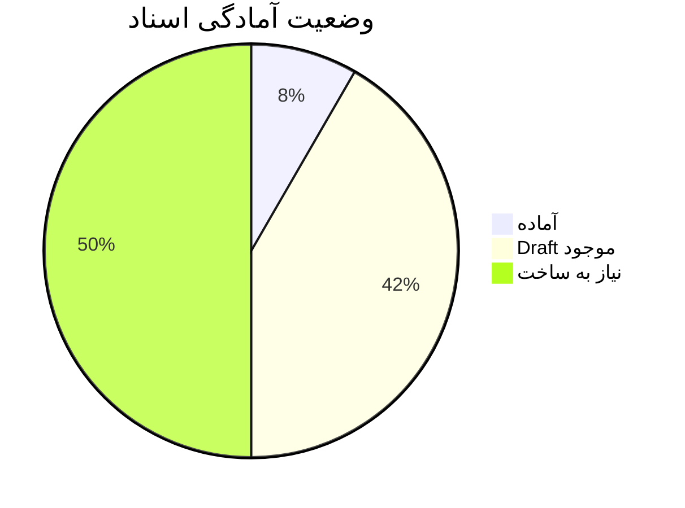

# 📋 فهرست اسناد جلسه مگفا + وضعیت آمادگی

> [!info] هدف
> این فهرست تمام اسنادی است که باید برای جلسه با مگفا آماده کنیم. هر سند را یکی‌یکی با هم می‌سازیم.

---

## 🎯 فهرست ۱۲ سند جلسه

### اولویت‌بندی بر اساس ضرورت

| ردیف | سند | اولویت | وضعیت | زمان ساخت |
|---|---|---|---|---|
| ۱ | **پروپوزال اجرایی (Executive Brief)** | 🔴 بحرانی | ❌ | ۲ ساعت |
| ۲ | **رزومه شرکت (Company Profile)** | 🔴 بحرانی | ❌ | ۱.۵ ساعت |
| ۳ | **دستور جلسه (Meeting Agenda)** | 🔴 بحرانی | ❌ | ۳۰ دقیقه |
| ۴ | **سناریوی دمو (Demo Script)** | 🔴 بحرانی | ❌ | ۱ ساعت |
| ۵ | **معرفی تیم (Team Introduction)** | 🔴 بحرانی | ❌ | ۱ ساعت |
| ۶ | **پیشنهاد تجاری-مالی (Commercial Proposal)** | 🟡 بالا | 🟡Draft | ۲ ساعت |
| ۷ | **برنامه زمان‌بندی (Gantt Chart)** | 🟡 بالا | ✅ موجود | ۳۰ دقیقه |
| ۸ | **سند معماری فنی (Technical Architecture)** | 🟡 بالا | 🟡Draft | ۲ ساعت |
| ۹ | **رجیستر ریسک (Risk Register)** | 🟢 متوسط | 🟡Draft | ۱ ساعت |
| ۱۰ | **پاسخ به سؤالات احتمالی (Q&A)** | 🟢 متوسط | 🟡Draft | ۱.۵ ساعت |
| ۱۱ | **پیش‌نویس NDA** | 🟢 متوسط | ❌ | ۳۰ دقیقه |
| ۱۲ | **پیش‌نویس SLA** | 🟢 پایین | ❌ | ۱ ساعت |

---

## 📊 وضعیت کلی آمادگی

- **آماده:** ۱ سند (۸٪)
- **Draft موجود:** ۵ سند (۴۲٪)
- **نیاز به ساخت:** ۶ سند (۵۰٪)

**زمان کل مورد نیاز:** ~۱۳ ساعت

---

## 📝 توضیح هر سند

### ۱. پروپوزال اجرایی (Executive Brief) ⭐ شروع از این

> [!success] سند اول — پایه همه چیز
> این سند، چکیده ۲-۳ صفحه‌ای است که به مدیر مگفا نشان می‌دهیم. شامل: معرفی ما، درک نیاز، راه‌حل، تمایز، و خواسته جلسه.

**فرمت:** PDF / Word
**مخاطب:** مدیر واحد یادگیری الکترونیکی مگفا
**طول:** ۲-۳ صفحه
**زبان:** فارسی

---

### ۲. رزومه شرکت (Company Profile)

**فرمت:** PDF
**طول:** ۵-۸ صفحه
**محتوا:**
- معرفی شرکت
- تاریخچه
- توانمندی‌ها
- پروژه‌های انجام‌شده
- تیم کلیدی
- مشتریان
- گواهینامه‌ها

---

### ۳. دستور جلسه (Meeting Agenda)

**فرمت:** Word (یک صفحه)
**محتوا:**
- زمان جلسه
- شرکت‌کنندگان از طرف ما
- شرکت‌کنندگان از طرف مگفا
- ۹۰ دقیقه برنامه
- اهداف جلسه
- خواسته‌های ما از جلسه

---

### ۴. سناریوی دمو (Demo Script)

**فرمت:** Word
**طول:** ۳-۵ صفحه
**محتوا:**
- سناریوی ۵ دقیقه‌ای
- دقیقاً کجا کلیک می‌کنیم
- چه می‌گوییم در هر مرحله
- پلن B اگر دمو خراب شد

---

### ۵. معرفی تیم (Team Introduction)

**فرمت:** PDF
**طول:** ۲-۳ صفحه
**محتوا:**
- عکس + رزومه هر عضو تیم
- نقش هر کدام در پروژه
- تجربه مرتبط

---

### ۶. پیشنهاد تجاری-مالی (Commercial Proposal)

**فرمت:** PDF
**طول:** ۳-۵ صفحه
**محتوا:**
- قیمت کل: ۱۴.۵ میلیارد (Anchor)
- فازبندی: MVP ۵B + فاز ۲ ۹.۵B
- مدل پرداخت: ۴۰/۳۰/۳۰
- پشتیبانی: ۱۲ ماه رایگان + SLA سالانه
- امتیازات غیرنقدی مورد نظر

---

### ۷. برنامه زمان‌بندی (Gantt Chart)

**فرمت:** Excel (موجود از قبل)
**وضعیت:** ✅ آماده (نیاز به به‌روزرسانی جزئی)

---

### ۸. سند معماری فنی (Technical Architecture)

**فرمت:** PDF
**طول:** ۵-۱۰ صفحه
**محتوا:**
- نمودار معماری کلی
- استک تکنولوژی
- مدل داده
- امنیت
- مقیاس‌پذیری

---

### ۹. رجیستر ریسک (Risk Register)

**فرمت:** Excel
**طول:** ۱۰-۱۵ ریسک
**محتوا:**
- ریسک‌های فنی
- ریسک‌های تجاری
- ریسک‌های زمان‌بندی
- راهکار کاهش هر کدام

---

### ۱۰. پاسخ به سؤالات احتمالی (Q&A)

**فرمت:** Word
**طول:** ۲۰ سؤال + پاسخ
**محتوا:**
- سؤالات فنی احتمالی
- سؤالات تجاری
- سؤالات تیم
- سؤالات رقبا

---

### ۱۱. پیش‌نویس NDA

**فرمت:** Word
**طول:** ۲ صفحه
**محتوا:**
- تعهد محرمانگی
- مدت زمان
- جریمه نقض

---

### ۱۲. پیش‌نویس SLA

**فرمت:** PDF
**طول:** ۲-۳ صفحه
**محتوا:**
- سطح خدمات پشتیبانی
- زمان پاسخ
- زمان حل مسئله
- آپ‌تایم تضمینی

---

## 🎯 ترتیب ساخت اسناد

> [!warning] ترتیب مهم است — هر سند پایه سند بعدی است

```mermaid
flowchart LR
    D1[۱. پروپوزال اجرایی] --> D2[۲. رزومه شرکت]
    D2 --> D3[۳. دستور جلسه]
    D3 --> D4[۴. سناریوی دمو]
    D4 --> D5[۵. معرفی تیم]
    D5 --> D6[۶. پیشنهاد تجاری]
    D6 --> D7[۷. گانت چارت]
    D7 --> D8[۸. معماری فنی]
    D8 --> D9[۹. رجیستر ریسک]
    D9 --> D10[۱۰. Q&A]
    D10 --> D11[۱۱. NDA]
    D11 --> D12[۱۲. SLA]

    style D1 fill:#8E44AD,color:#FFFFFF
    style D2 fill:#1B7D46,color:#FFFFFF
    style D3 fill:#1B2A4A,color:#FFFFFF
```

---

## 🎯 سند اول: پروپوزال اجرایی

> [!success] از اینجا شروع می‌کنیم

### ساختار پیشنهادی پروپوزال اجرایی

| بخش | محتوا | طول |
|---|---|---|
| ۱. صفحه عنوان | نام شرکت ما + لوگو + تاریخ | ۱ صفحه |
| ۲. خلاصه اجرایی | ۳ پاراگراف | نیم صفحه |
| ۳. معرفی ما | ۱ پاراگراف | نیم صفحه |
| ۴. درک نیاز مگفا | ۱-۲ پاراگراف | ۱ صفحه |
| ۵. راه‌حل پیشنهادی | ۲-۳ پاراگراف | ۱ صفحه |
| ۶. تمایز از رقبا | ۳ نقطه کلیدی | نیم صفحه |
| ۷. فازبندی + زمان | جدول کوتاه | نیم صفحه |
| ۸. گام بعدی | دعوت به جلسه فنی | نیم صفحه |

### اطلاعاتی که از شما نیاز دارم برای سند ۱

> [!question] لطفاً به این ۱۰ سؤال پاسخ دهید

#### ۱. اطلاعات شرکت شما

| سؤال | پاسخ |
|---|---|
| نام رسمی شرکت شما چیست؟ | ………… |
| نام برند/تجاری (اگر متفاوت است)؟ | ………… |
| سال تأسیس؟ | ………… |
| شماره ثبت؟ | ………… |
| شناسه ملی؟ | ………… |
| آدرس؟ | ………… |
| تلفن؟ | ………… |
| ایمیل؟ | ………… |
| وب‌سایت؟ | ………… |

#### ۲. معرفی کوتاه شرکت (۱ پاراگراف)

> شرکت شما چه می‌کند؟ تخصص اصلی چیست؟

مثال: «شرکت X با تمرکز بر توسعه نرم‌افزارهای سازمانی در حوزه آموزش الکترونیکی...»

#### ۳. تجربه‌های مرتبط

> ۳-۵ پروژه قبلی که مرتبط با LMS / آموزش الکترونیکی / نرم‌افزار سازمانی است

| نام پروژه | مشتری | سال | توضیح کوتاه |
|---|---|---|---|
| مثال: پلتفرم فروشگاهی X | شرکت Y | ۱۴۰۳ | … |
| … | … | … | … |

#### ۴. تیم کلیدی

> چه کسانی در تیم هستند؟

| نقش | نام | تجربه کلیدی |
|---|---|---|
| مدیر تیم / مدیر پروژه | شما؟ | … |
| مدیر فنی | … | … |
| توسعه‌دهنده ۱ | … | … |
| توسعه‌دهنده ۲ | … | … |
| توسعه‌دهنده ۳ | … | … |

#### ۵. چرا مگفا؟

> چرا می‌خواهید با مگفا کار کنید؟ (۱ پاراگراف)

#### ۶. تمایز اصلی شما

> ۳ نقطه قوت اصلی شما در برابر رقبا

۱. …………
۲. …………
۳. …………

#### ۷. مدل همکاری پیشنهادی

| گزینه | انتخاب شما |
|---|---|
| پروژه‌ای (One-time) | ✅/❌ |
| شراکت استراتژیک | ✅/❌ |
| Co-Development | ✅/❌ |
| SaaS | ✅/❌ |

#### ۸. زمان تحویل پیشنهادی

| فاز | مدت |
|---|---|
| MVP | … ماه |
| فاز ۲ | … ماه |
| کل پروژه | … ماه |

#### ۹. پشتیبانی پیشنهادی

| مدت پشتیبانی رایگان | ………… |
| مدل SLA | ………… |

#### ۱۰. گام بعدی مورد نظر شما از جلسه

> بعد از جلسه اول، چه می‌خواهید؟

مثال: «جلسه فنی دوم با حضور تیم فنی مگفا»

---

## ✅ آماده شروع

> [!success] پس از پاسخ به این ۱۰ سؤال، پروپوزال اجرایی را می‌سازم

**فرمت خروجی:** PDF + Word (قابل ویرایش)
**زبان:** فارسی
**طراحی:** حرفه‌ای با لوگو و رنگ سازمانی شما

---

## 🔗 پیوندها

- [[استراتژی V2 — جلسه MVP با اطلاعات داخلی]]
- [[ارزیابی جامع دمو lms.ecardo.ir]]
- [[مقایسه جامع رقبای LMS]]

---

#اسناد #فهرست #آمادگی #جلسه #مگفا
