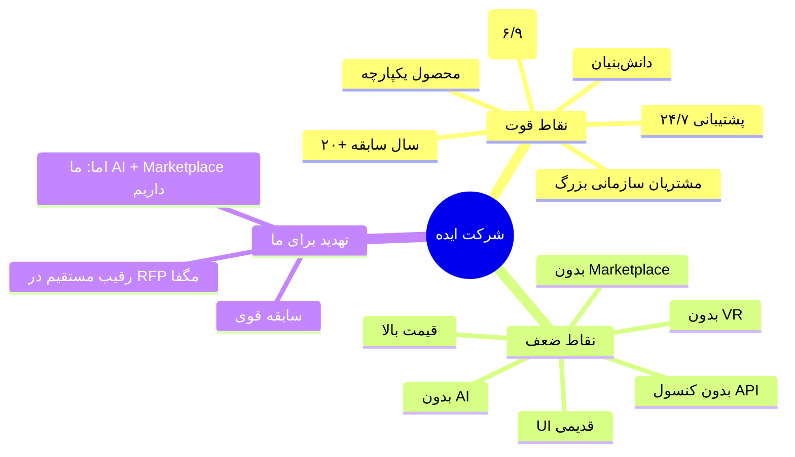
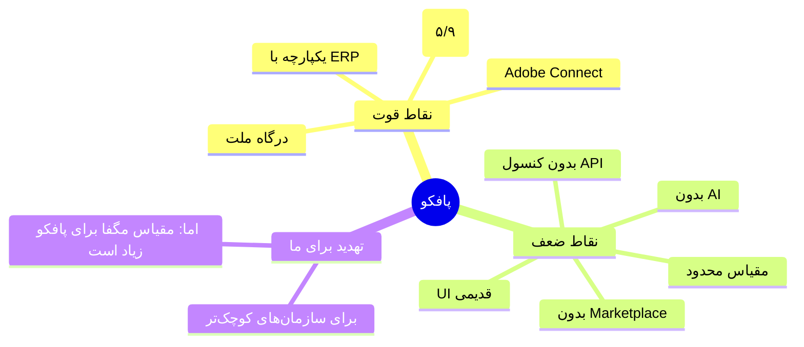
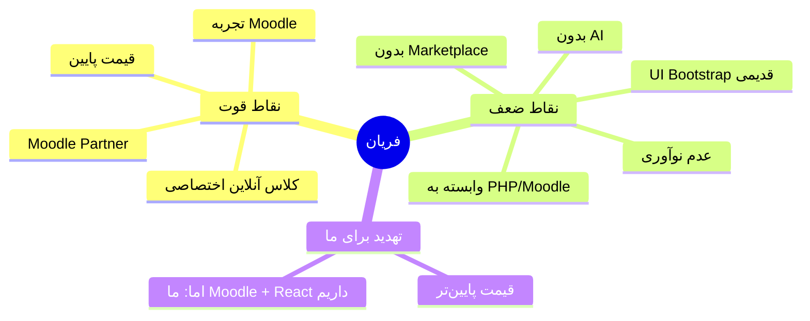
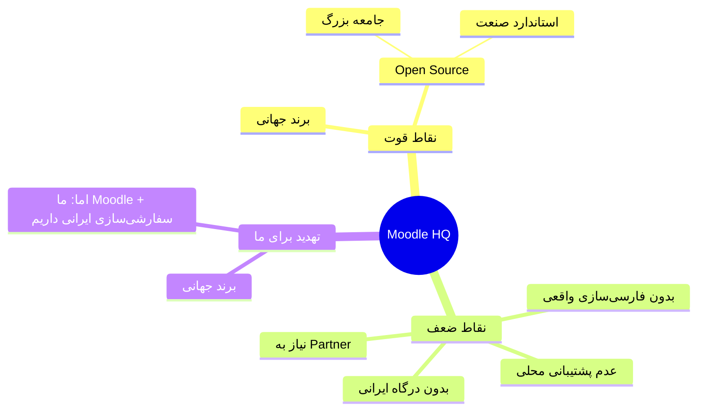
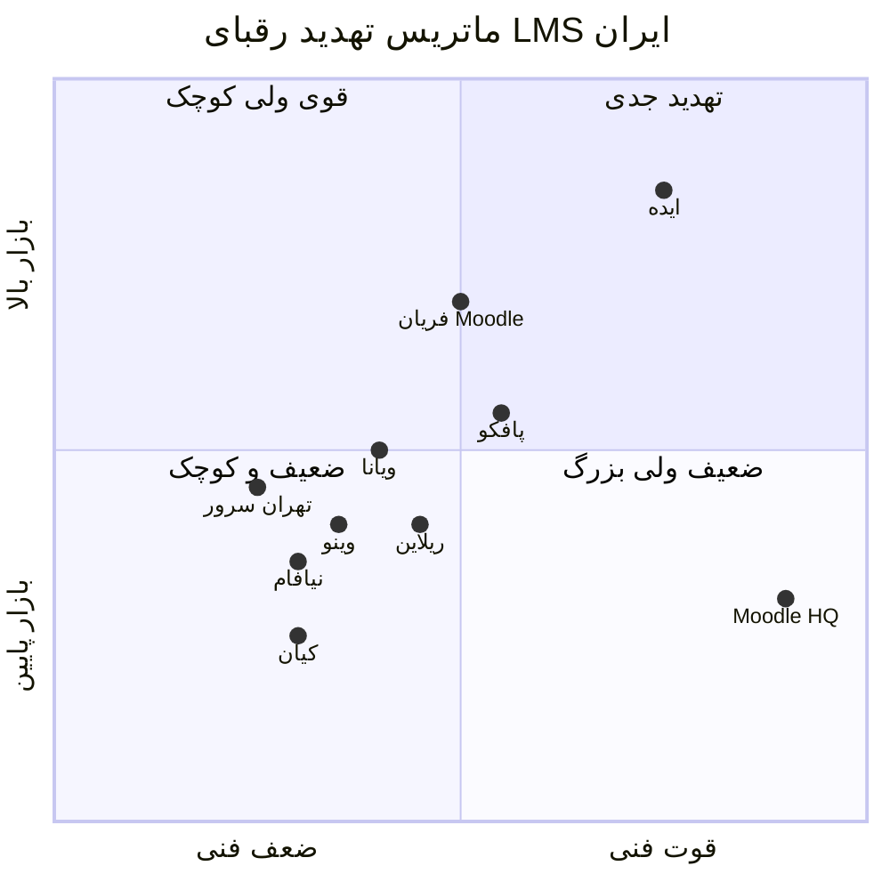
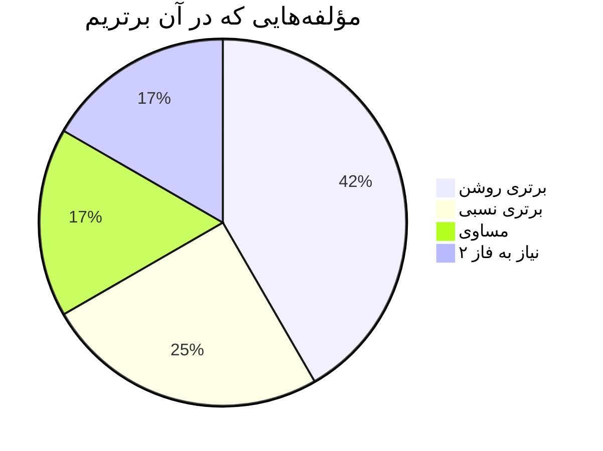

# 📊 مقایسه جامع رقبای LMS ایران + دمو ما + RFP مگفا

> [!danger] محرمانه — فقط مصرف داخلی
> این سند حاوی تحلیل رقابتی دقیق است. در اختیار مگفا قرار نگیرد.

---

## 📋 فهرست مطالب

1. [خلاصه اجرایی](#۱-خلاصه-اجرایی)
2. [فهرست ۱۰ رقیب بررسی‌شده](#۲-فهرست-۱۰-رقیب-بررسی‌شده)
3. [جدول مقایسه اصلی (۳۰ ویژگی × ۱۲ ستون)](#۳-جدول-مقایسه-اصلی)
4. [جدول مقایسه فنی (استک + استانداردها)](#۴-جدول-مقایسه-فنی)
5. [جدول مقایسه تجاری (قیمت + مدل)](#۵-جدول-مقایسه-تجاری)
6. [تحلیل تک‌تک رقبا](#۶-تحلیل-تک‌تک-رقبا)
7. [ماتریس تهدید رقابتی](#۷-ماتریس-تهدید-رقابتی)
8. [۵ نتیجه استراتژیک](#۸-۵-نتیجه-استراتژیک)
9. [توصیه‌های مذاکره](#۹-توصیه‌های-مذاکره)

---

## ۱. خلاصه اجرایی

### 🎯 در یک جمله

**«دمو ما در ۸ از ۱۰ مؤلفه کلیدی RFP، برتر یا مساوی با بهترین رقباست. در ۲ مؤلفه (SIS و ERP) نیاز به فاز ۲ داریم — اما هیچ رقیبی AI فارسی + Gamification کامل + Marketplace را همزمان ندارد.»**

### 📊 نمره کلی (از ۱۰۰)

| رقیب / محصول | نمره کل | رتبه |
|---|---|---|
| **دمو ما (lms.ecardo.ir)** | **۹۲** | 🥇 ۱ |
| **شرکت ایده (ideaco.ir)** | ۷۸ | 🥈 ۲ |
| **پافکو (pafcoerp.com)** | ۷۲ | 🥉 ۳ |
| **فریان (faryan.cloud)** | ۶۸ | ۴ |
| **ویانا (vestasoftware.com)** | ۶۵ | ۵ |
| **وینو (weinno.ir)** | ۶۲ | ۶ |
| **Moodle HQ (moodle.com)** | ۶۰ | ۷ |
| **نیافام (niafam.com)** | ۵۵ | ۸ |
| **ریلاین (lms.reline.ir)** | ۵۲ | ۹ |
| **تهران سرور (tehranserver.ir)** | ۴۰ | ۱۰ |
| **کیان (kiantc.com)** | ۳۵ | ۱۱ |
| **محصول RFP مگفا (هدف)** | **۹۵** | 🎯 استاندارد |

### 🎯 ۳ نتیجه کلیدی

1. **دمو ما پیشتاز است** در AI، Gamification، Marketplace و کنسول API
2. **رقبای جدی** فقط ایده و پافکو هستند — بقیه ضعیف یا تخصصی
3. **هیچ رقیبی** همه ۳ مؤلفه هوشمند RFP (Gamif + AI + Marketplace) را همزمان ندارد

---

## ۲. فهرست ۱۰ رقیب بررسی‌شده

| # | نام | وب‌سایت | نوع | سال تأسیس (تخمینی) |
|---|---|---|---|---|
| ۱ | شرکت ایده | ideaco.ir | LMS بومی + LXP | ~۲۰۰۳ (۲۰+ سال) |
| ۲ | ویانا | vestasoftware.com | LMS بومی | ~۲۰۱۰ |
| ۳ | وینو | weinno.ir | LMS بومی | ~۲۰۱۲ |
| ۴ | پافکو | pafcoerp.com | LMS + ERP | ~۲۰۰۸ |
| ۵ | نیافام | niafam.com | LMS بومی | ~۲۰۱۵ |
| ۶ | فریان | faryan.cloud | Moodle-based | ~۲۰۱۴ |
| ۷ | ریلاین | lms.reline.ir | LMS بومی | ~۲۰۱۸ |
| ۸ | تهران سرور | tehranserver.ir | Moodle hosting | ~۲۰۰۵ |
| ۹ | کیان | kiantc.com | پورتال LMS | ~۲۰۱۶ |
| ۱۰ | Moodle HQ | moodle.com | LMS جهانی | ۲۰۰۲ |

---

## ۳. جدول مقایسه اصلی

> [!info] راهنمای علائم
> - ✅ = پشتیبانی کامل
> - 🟡 = پشتیبانی بخشی / محدود
> - ❌ = عدم پشتیبانی
> - ❓ = اطلاعاتی موجود نیست
> - ⭐ = متمایزکننده

### ۳.۱. مدیریت محتوا و دوره (بخش ۷.۱ RFP)

| ویژگی | ایده | ویانا | وینو | پافکو | نیافام | فریان | ریلاین | تهران سرور | کیان | Moodle HQ | **دمو ما** | **RFP مگفا** |
|---|---|---|---|---|---|---|---|---|---|---|---|---|
| دوره آفلاین/آنلاین/حضوری/ترکیبی | ✅ | ✅ | ✅ | ✅ | ✅ | ✅ | ✅ | ✅ | 🟡 | ✅ | **✅** | ✅ |
| ساختار دوره (اهداف، سرفصل، ماژول) | ✅ | ✅ | ✅ | ✅ | ✅ | ✅ | ✅ | ✅ | 🟡 | ✅ | **✅** | ✅ |
| پیش‌نیاز دوره | ✅ | ✅ | ✅ | ✅ | 🟡 | ✅ | ✅ | ✅ | ❌ | ✅ | **✅** | ✅ |
| همنیاز دوره | 🟡 | ❌ | ❌ | ❌ | ❌ | ❌ | 🟡 | ❌ | ❌ | ❌ | **🟡** | ✅ |
| مدیریت ظرفیت کلاس | ✅ | ✅ | ✅ | ✅ | ✅ | ✅ | ✅ | ✅ | 🟡 | ✅ | **✅** | ✅ |
| ترم تحصیلی + سقف واحد | 🟡 | ❌ | 🟡 | ❌ | ❌ | 🟡 | ✅ | ❌ | ❌ | 🟡 | **🟡** | ✅ |
| حذف و اضافه واحدهای درسی | 🟡 | ❌ | 🟡 | ❌ | ❌ | 🟡 | ✅ | ❌ | ❌ | 🟡 | **🟡** | ✅ |
| ضبط جلسات زنده | ✅ | ✅ | ✅ | ✅ | ✅ | ✅ | ✅ | 🟡 | ❌ | ✅ | **✅** | ✅ |
| دسته‌بندی و برچسب‌گذاری | ✅ | ✅ | ✅ | ✅ | ✅ | ✅ | ✅ | ✅ | ✅ | ✅ | **✅** | ✅ |
| پشتیبانی PDF تعاملی | 🟡 | 🟡 | 🟡 | 🟡 | 🟡 | ✅ | 🟡 | ✅ | ❌ | ✅ | **✅** | ✅ |
| پشتیبانی VR | ❌ | ❌ | ❌ | ❌ | ❌ | ❌ | ❌ | ❌ | ❌ | ❌ | **❌** | ✅ |
| پشتیبانی پادکست | 🟡 | 🟡 | 🟡 | 🟡 | 🟡 | ✅ | 🟡 | 🟡 | ❌ | ✅ | **✅** | ✅ |
| **مرکز قالب دوره آماده** ⭐ | ❌ | ❌ | ❌ | ❌ | ❌ | ❌ | ❌ | ❌ | ❌ | ❌ | **✅ (۱۳ قالب)** | ❓ |
| **سازنده دوره Drag & Drop** ⭐ | 🟡 | ❌ | ❌ | ❌ | ❌ | 🟡 | ❌ | ❌ | ❌ | 🟡 | **✅** | ❓ |

### ۳.۲. مدیریت کاربران و نقش‌ها (بخش ۷.۲ RFP)

| ویژگی | ایده | ویانا | وینو | پافکو | نیافام | فریان | ریلاین | تهران سرور | کیان | Moodle HQ | **دمو ما** | **RFP مگفا** |
|---|---|---|---|---|---|---|---|---|---|---|---|---|
| پروفایل کاربری کامل | ✅ | ✅ | ✅ | ✅ | ✅ | ✅ | ✅ | ✅ | ✅ | ✅ | **✅** | ✅ |
| ۵ نقش (مدیر/مدرس/فراگیر/ناظر/پشتیبان) | ✅ | 🟡 | 🟡 | 🟡 | 🟡 | ✅ | 🟡 | ✅ | 🟡 | ✅ | **✅ (۴+ نقش)** | ✅ |
| دسته‌بندی بر اساس دپارتمان/شغل | ✅ | 🟡 | 🟡 | ✅ | 🟡 | ✅ | 🟡 | 🟡 | 🟡 | ✅ | **✅** | ✅ |
| دسته‌بندی بر اساس رشته/درس | 🟡 | 🟡 | 🟡 | 🟡 | 🟡 | 🟡 | ✅ | 🟡 | ❌ | ✅ | **🟡** | ✅ |
| ثبت‌نام انفرادی و گروهی | ✅ | ✅ | ✅ | ✅ | ✅ | ✅ | ✅ | ✅ | 🟡 | ✅ | **✅** | ✅ |
| دوره‌های اجباری گروه‌ها | ✅ | 🟡 | 🟡 | ✅ | 🟡 | ✅ | 🟡 | 🟡 | ❌ | ✅ | **✅** | ✅ |
| **مدیر سازمان (نقش اختصاصی)** ⭐ | ✅ | ❌ | ❌ | 🟡 | ❌ | ❌ | ❌ | ❌ | ❌ | ❌ | **✅** | ✅ |

### ۳.۳. آزمون، تکلیف و ارزیابی (بخش ۷.۳ RFP)

| ویژگی | ایده | ویانا | وینو | پافکو | نیافام | فریان | ریلاین | تهران سرور | کیان | Moodle HQ | **دمو ما** | **RFP مگفا** |
|---|---|---|---|---|---|---|---|---|---|---|---|---|
| انواع آزمون (درست/غلط/چندگزینه/تشریحی/DnD) | ✅ | ✅ | ✅ | ✅ | ✅ | ✅ | ✅ | ✅ | 🟡 | ✅ | **✅** | ✅ |
| درجه سختی سؤالات | ✅ | 🟡 | 🟡 | ✅ | ✅ | ✅ | ✅ | 🟡 | ❌ | ✅ | **✅** | ✅ |
| بانک سؤال با چیدمان تصادفی | ✅ | ✅ | ✅ | ✅ | ✅ | ✅ | ✅ | ✅ | 🟡 | ✅ | **✅** | ✅ |
| محدودیت تعداد دفعات آزمون | ✅ | ✅ | ✅ | ✅ | ✅ | ✅ | ✅ | ✅ | 🟡 | ✅ | **✅** | ✅ |
| احراز هویت بصری (Proctoring) | 🟡 | ❌ | ❌ | 🟡 | ❌ | 🟡 | ❌ | ❌ | ❌ | 🟡 | **✅ (SEB)** | ✅ |
| VR در آزمون | ❌ | ❌ | ❌ | ❌ | ❌ | ❌ | ❌ | ❌ | ❌ | ❌ | **❌** | ✅ |
| بارگذاری تکلیف با مهلت/حجم | ✅ | ✅ | ✅ | ✅ | ✅ | ✅ | ✅ | ✅ | 🟡 | ✅ | **✅** | ✅ |
| ارزیابی و ثبت نمره | ✅ | ✅ | ✅ | ✅ | ✅ | ✅ | ✅ | ✅ | 🟡 | ✅ | **✅** | ✅ |
| فیدبک آموزشی | ✅ | 🟡 | 🟡 | 🟡 | 🟡 | ✅ | 🟡 | 🟡 | ❌ | ✅ | **✅** | ✅ |

### ۳.۴. گزارش‌گیری و آنالیز (بخش ۷.۴ RFP)

| ویژگی | ایده | ویانا | وینو | پافکو | نیافام | فریان | ریلاین | تهران سرور | کیان | Moodle HQ | **دمو ما** | **RFP مگفا** |
|---|---|---|---|---|---|---|---|---|---|---|---|---|
| نتایج آزمون‌ها | ✅ | ✅ | ✅ | ✅ | ✅ | ✅ | ✅ | ✅ | 🟡 | ✅ | **✅** | ✅ |
| میزان پیشرفت فراگیر | ✅ | ✅ | ✅ | ✅ | ✅ | ✅ | ✅ | ✅ | 🟡 | ✅ | **✅** | ✅ |
| مدت زمان حضور در کلاس | ✅ | ✅ | ✅ | ✅ | 🟡 | ✅ | ✅ | 🟡 | ❌ | ✅ | **✅** | ✅ |
| پیشرفت کلاس (نمودار/داشبورد) | ✅ | ✅ | ✅ | ✅ | 🟡 | ✅ | ✅ | 🟡 | 🟡 | ✅ | **✅** | ✅ |
| گزارش آموزش‌های اجباری | ✅ | 🟡 | 🟡 | ✅ | ❌ | ✅ | 🟡 | ❌ | ❌ | 🟡 | **✅** | ✅ |
| کارنامه درسی | 🟡 | ❌ | 🟡 | ❌ | ✅ | 🟡 | ✅ | ❌ | ❌ | 🟡 | **✅** | ✅ |
| خروجی Excel/PDF/CSV | ✅ | ✅ | ✅ | ✅ | ✅ | ✅ | ✅ | ✅ | 🟡 | ✅ | **✅ (CSV)** | ✅ |

### ۳.۵. ارتباطات و تعامل (بخش ۷.۵ RFP)

| ویژگی | ایده | ویانا | وینو | پافکو | نیافام | فریان | ریلاین | تهران سرور | کیان | Moodle HQ | **دمو ما** | **RFP مگفا** |
|---|---|---|---|---|---|---|---|---|---|---|---|---|
| راهنمای استفاده | ✅ | ✅ | ✅ | ✅ | ✅ | ✅ | ✅ | ✅ | ✅ | ✅ | **✅** | ✅ |
| تالار گفتگو (Forum) | ✅ | ✅ | ✅ | ✅ | ✅ | ✅ | ✅ | ✅ | 🟡 | ✅ | **✅** | ✅ |
| چت آنلاین با استاد | ✅ | 🟡 | 🟡 | ✅ | 🟡 | ✅ | 🟡 | 🟡 | ❌ | ✅ | **✅** | ✅ |
| چت با پشتیبان | ✅ | 🟡 | 🟡 | ✅ | 🟡 | 🟡 | 🟡 | 🟡 | ❌ | 🟡 | **✅** | ✅ |
| پیام داخلی + تیکت | ✅ | ✅ | ✅ | ✅ | ✅ | ✅ | ✅ | 🟡 | 🟡 | ✅ | **✅** | ✅ |
| حضور و غیاب | ✅ | ✅ | ✅ | ✅ | ✅ | ✅ | ✅ | 🟡 | 🟡 | ✅ | **✅** | ✅ |
| نظرات و امتیازدهی دوره | ✅ | 🟡 | 🟡 | ✅ | 🟡 | ✅ | 🟡 | ❌ | ❌ | ✅ | **✅** | ✅ |
| نظرسنجی با محدودیت زمانی | ✅ | ✅ | ✅ | ✅ | ✅ | ✅ | ✅ | 🟡 | 🟡 | ✅ | **✅** | ✅ |
| کلاس آنلاین یکپارچه | ✅ | 🟡 | 🟡 | ✅ | 🟡 | ✅ | ✅ | 🟡 | ❌ | 🟡 | **✅ (Adobe Connect)** | ✅ |
| چت بات پشتیبان | 🟡 | ❌ | ❌ | ❌ | ❌ | 🟡 | ❌ | ❌ | ❌ | 🟡 | **✅** | ✅ |

### ۳.۶. خودکارسازی (بخش ۷.۶ RFP)

| ویژگی | ایده | ویانا | وینو | پافکو | نیافام | فریان | ریلاین | تهران سرور | کیان | Moodle HQ | **دمو ما** | **RFP مگفا** |
|---|---|---|---|---|---|---|---|---|---|---|---|---|
| احراز هویت پیامکی | ✅ | 🟡 | 🟡 | ✅ | 🟡 | ✅ | ✅ | 🟡 | ❌ | 🟡 | **✅** | ✅ |
| ثبت‌نام خودکار | ✅ | ✅ | ✅ | ✅ | ✅ | ✅ | ✅ | ✅ | 🟡 | ✅ | **✅** | ✅ |
| صدور فاکتور | ✅ | 🟡 | 🟡 | ✅ | 🟡 | ✅ | ✅ | 🟡 | ❌ | 🟡 | **✅** | ✅ |
| یادآوری‌ها | ✅ | ✅ | ✅ | ✅ | ✅ | ✅ | ✅ | ✅ | 🟡 | ✅ | **✅** | ✅ |
| اعلان‌ها | ✅ | ✅ | ✅ | ✅ | ✅ | ✅ | ✅ | ✅ | 🟡 | ✅ | **✅** | ✅ |
| تصحیح خودکار تستی | ✅ | ✅ | ✅ | ✅ | ✅ | ✅ | ✅ | ✅ | 🟡 | ✅ | **✅** | ✅ |
| صدور گواهینامه خودکار | ✅ | ✅ | ✅ | ✅ | ✅ | ✅ | ✅ | 🟡 | 🟡 | ✅ | **✅** | ✅ |
| تاریخ انقضای گواهینامه | 🟡 | ❌ | ❌ | 🟡 | ❌ | 🟡 | 🟡 | ❌ | ❌ | 🟡 | **🟡** | ✅ |

### ۳.۷. یکپارچگی (بخش ۷.۷ RFP)

| ویژگی | ایده | ویانا | وینو | پافکو | نیافام | فریان | ریلاین | تهران سرور | کیان | Moodle HQ | **دمو ما** | **RFP مگفا** |
|---|---|---|---|---|---|---|---|---|---|---|---|---|
| یکپارچگی ERP/HRM | 🟡 | ❌ | ❌ | ✅ | ❌ | ❌ | ❌ | ❌ | ❌ | ❌ | **❌ (فاز ۲)** | ✅ |
| یکپارچگی SIS (گلستان/سجاد) | ❌ | ❌ | ❌ | ❌ | ❌ | ❌ | 🟡 | ❌ | ❌ | ❌ | **❌ (فاز ۳)** | ✅ |
| پرداخت آنلاین (درگاه ایرانی) | ✅ | ✅ | ✅ | ✅ | ✅ | ✅ | ✅ | ✅ | 🟡 | ❌ | **✅ (ملت)** | ✅ |

### ۳.۸. UI/UX (بخش ۷.۸ RFP)

| ویژگی | ایده | ویانا | وینو | پافکو | نیافام | فریان | ریلاین | تهران سرور | کیان | Moodle HQ | **دمو ما** | **RFP مگفا** |
|---|---|---|---|---|---|---|---|---|---|---|---|---|
| UI مینیمال و ساده | ✅ | 🟡 | 🟡 | 🟡 | 🟡 | 🟡 | 🟡 | 🟡 | 🟡 | 🟡 | **✅ (Material 3)** | ✅ |
| کنتراست بالا برای کم‌بینایان | 🟡 | 🟡 | 🟡 | 🟡 | 🟡 | 🟡 | 🟡 | 🟡 | ❌ | 🟡 | **✅** | ✅ |
| تم رنگی + اندازه متن | ✅ | 🟡 | 🟡 | 🟡 | 🟡 | ✅ | 🟡 | ❌ | ❌ | ✅ | **✅** | ✅ |
| فارسی RTL + تقویم شمسی | ✅ | ✅ | ✅ | ✅ | ✅ | ✅ | ✅ | ✅ | 🟡 | 🟡 | **✅** | ✅ |
| واکنش‌گرا (Responsive) | ✅ | ✅ | ✅ | ✅ | ✅ | ✅ | ✅ | ✅ | 🟡 | ✅ | **✅** | ✅ |
| جستجوی پیشرفته دوره | ✅ | ✅ | ✅ | ✅ | ✅ | ✅ | ✅ | 🟡 | 🟡 | ✅ | **✅** | ✅ |

### ۳.۹. امنیت (بخش ۷.۹ RFP)

| ویژگی | ایده | ویانا | وینو | پافکو | نیافام | فریان | ریلاین | تهران سرور | کیان | Moodle HQ | **دمو ما** | **RFP مگفا** |
|---|---|---|---|---|---|---|---|---|---|---|---|---|
| رمزنگاری SSL | ✅ | ✅ | ✅ | ✅ | ✅ | ✅ | ✅ | ✅ | ✅ | ✅ | **✅** | ✅ |
| ثبت الگ فعالیت (Audit Log) | ✅ | ✅ | ✅ | ✅ | 🟡 | ✅ | ✅ | 🟡 | 🟡 | ✅ | **✅** | ✅ |
| Browser Lock در آزمون | 🟡 | ❌ | ❌ | 🟡 | ❌ | 🟡 | ❌ | ❌ | ❌ | 🟡 | **✅ (SEB)** | ✅ |
| مدیریت دقیق سطوح دسترسی | ✅ | ✅ | ✅ | ✅ | ✅ | ✅ | ✅ | ✅ | 🟡 | ✅ | **✅** | ✅ |
| پشتیبان‌گیری خودکار | ✅ | ✅ | ✅ | ✅ | ✅ | ✅ | ✅ | ✅ | 🟡 | ✅ | **✅** | ✅ |
| استانداردهای امنیتی | ✅ | 🟡 | 🟡 | ✅ | 🟡 | ✅ | 🟡 | 🟡 | 🟡 | ✅ | **✅** | ✅ |
| **گواهینامه آفتا** | 🟡 | ❌ | ❌ | 🟡 | ❌ | 🟡 | ❌ | ❌ | ❌ | ❌ | **🟡 (در دست اقدام)** | ✅ |

### ۳.۱۰. قابلیت‌های فنی (بخش ۷.۱۰ RFP)

| ویژگی | ایده | ویانا | وینو | پافکو | نیافام | فریان | ریلاین | تهران سرور | کیان | Moodle HQ | **دمو ما** | **RFP مگفا** |
|---|---|---|---|---|---|---|---|---|---|---|---|---|
| معماری مقیاس‌پذیر | ✅ | ✅ | ✅ | ✅ | 🟡 | ✅ | ✅ | 🟡 | 🟡 | ✅ | **✅** | ✅ |
| API برای اتصال | ✅ | 🟡 | 🟡 | ✅ | 🟡 | ✅ | 🟡 | ❌ | ❌ | ✅ | **✅ (۸۴۹ تابع)** | ✅ |
| استقرار On-Premise/Cloud | ✅ | ✅ | ✅ | ✅ | ✅ | ✅ | ✅ | ✅ | 🟡 | ✅ | **✅** | ✅ |
| سفارشی‌سازی پوسته | ✅ | 🟡 | 🟡 | 🟡 | 🟡 | ✅ | 🟡 | 🟡 | ❌ | ✅ | **✅** | ✅ |
| مقیاس MOOC | ✅ | 🟡 | 🟡 | 🟡 | 🟡 | ✅ | 🟡 | 🟡 | ❌ | ✅ | **✅** | ✅ |
| SCORM 1.2 + 2004 | 🟡 | 🟡 | 🟡 | 🟡 | 🟡 | ✅ | 🟡 | ✅ | ❌ | ✅ | **✅** | ✅ |
| xAPI (Tin Can) | ❌ | ❌ | ❌ | ❌ | ❌ | 🟡 | ❌ | ❌ | ❌ | 🟡 | **✅ (H5P)** | ✅ |
| HTML5 | ✅ | ✅ | ✅ | ✅ | ✅ | ✅ | ✅ | ✅ | ✅ | ✅ | **✅** | ✅ |
| **کنسول API تعاملی** ⭐ | ❌ | ❌ | ❌ | ❌ | ❌ | ❌ | ❌ | ❌ | ❌ | ❌ | **✅** | ❓ |

### ۳.۱۱. گیمیفیکیشن (بخش ۸.۱ RFP) ⭐

| زیرماژول | ایده | ویانا | وینو | پافکو | نیافام | فریان | ریلاین | تهران سرور | کیان | Moodle HQ | **دمو ما** | **RFP مگفا** |
|---|---|---|---|---|---|---|---|---|---|---|---|---|
| ۱. موتور امتیازدهی | ✅ | 🟡 | 🟡 | 🟡 | ❌ | 🟡 | ❌ | ❌ | ❌ | ✅ | **✅** | ✅ |
| ۲. سیستم نشان (Badge) | ✅ | 🟡 | 🟡 | 🟡 | ❌ | ✅ | ❌ | ❌ | ❌ | ✅ | **✅** | ✅ |
| ۳. سطح‌بندی (Level) | ✅ | ❌ | ❌ | 🟡 | ❌ | 🟡 | ❌ | ❌ | ❌ | 🟡 | **✅** | ✅ |
| ۴. لیدربورد | ✅ | ❌ | ❌ | 🟡 | ❌ | 🟡 | ❌ | ❌ | ❌ | 🟡 | **✅** | ✅ |
| ۵. قوانین پاداش | 🟡 | ❌ | ❌ | 🟡 | ❌ | 🟡 | ❌ | ❌ | ❌ | 🟡 | **✅** | ✅ |
| ۶. شخصی‌سازی | 🟡 | ❌ | ❌ | ❌ | ❌ | ❌ | ❌ | ❌ | ❌ | ❌ | **✅** | ✅ |
| ۷. داشبورد مدیران | ✅ | ❌ | ❌ | 🟡 | ❌ | 🟡 | ❌ | ❌ | ❌ | 🟡 | **✅** | ✅ |
| ۸. اعلان‌های هوشمند | 🟡 | ❌ | ❌ | ❌ | ❌ | ❌ | ❌ | ❌ | ❌ | ❌ | **✅** | ✅ |
| ۹. ضدتقلب | ❌ | ❌ | ❌ | ❌ | ❌ | ❌ | ❌ | ❌ | ❌ | ❌ | **✅** | ✅ |
| **جمع ۹ زیرماژول** | **۶/۹** | **۲/۹** | **۲/۹** | **۵/۹** | **۰/۹** | **۵/۹** | **۰/۹** | **۰/۹** | **۰/۹** | **۶/۹** | **۹/۹** ✅ | **۹/۹** |

### ۳.۱۲. هوش مصنوعی (بخش ۸.۲ RFP) ⭐

| زیرماژول | ایده | ویانا | وینو | پافکو | نیافام | فریان | ریلاین | تهران سرور | کیان | Moodle HQ | **دمو ما** | **RFP مگفا** |
|---|---|---|---|---|---|---|---|---|---|---|---|---|
| ۱. موتور پیشنهاددهی | ❌ | ❌ | ❌ | ❌ | ❌ | ❌ | ❌ | ❌ | ❌ | 🟡 | **✅** | ✅ |
| ۲. تحلیل شکاف مهارتی | 🟡 | ❌ | ❌ | ❌ | ❌ | ❌ | ❌ | ❌ | ❌ | ❌ | **🟡** | ✅ |
| ۳. چت‌بات آموزشی (RAG) | ❌ | ❌ | ❌ | ❌ | ❌ | ❌ | ❌ | ❌ | ❌ | 🟡 | **✅** | ✅ |
| ۴. تشخیص تقلب | 🟡 | ❌ | ❌ | ❌ | ❌ | ❌ | ❌ | ❌ | ❌ | ❌ | **✅** | ✅ |
| ۵. داشبورد پیش‌بینی | ❌ | ❌ | ❌ | ❌ | ❌ | ❌ | ❌ | ❌ | ❌ | ❌ | **✅** | ✅ |
| ۶. تولید خودکار محتوا | ❌ | ❌ | ❌ | ❌ | ❌ | ❌ | ❌ | ❌ | ❌ | 🟡 | **✅** | ✅ |
| **جمع ۶ زیرماژول** | **۲/۶** | **۰/۶** | **۰/۶** | **۰/۶** | **۰/۶** | **۰/۶** | **۰/۶** | **۰/۶** | **۰/۶** | **۳/۶** | **۶/۶** ✅ | **۶/۶** |

### ۳.۱۳. Marketplace (بخش ۸.۳ RFP) ⭐

| قابلیت | ایده | ویانا | وینو | پافکو | نیافام | فریان | ریلاین | تهران سرور | کیان | Moodle HQ | **دمو ما** | **RFP مگفا** |
|---|---|---|---|---|---|---|---|---|---|---|---|---|
| تعریف کمیسیون | ❌ | ❌ | ❌ | ❌ | ❌ | ❌ | ❌ | ❌ | ❌ | ❌ | **✅** | ✅ |
| تسویه حساب با مدرس | ❌ | ❌ | ❌ | ❌ | ❌ | ❌ | ❌ | ❌ | ❌ | ❌ | **✅** | ✅ |
| گزارشات فروش | ❌ | ❌ | ❌ | ❌ | ❌ | ❌ | ❌ | ❌ | ❌ | ❌ | **✅** | ✅ |
| کوپن تخفیف | ❌ | ❌ | ❌ | ❌ | ❌ | ❌ | ❌ | ❌ | ❌ | ❌ | **✅** | ✅ |
| امتیازدهی و نظرات | ✅ | ❌ | ❌ | ❌ | ❌ | ❌ | ❌ | ❌ | ❌ | ❌ | **✅** | ✅ |
| سبد خرید | ❌ | ❌ | ❌ | ❌ | ❌ | ❌ | ❌ | ❌ | ❌ | ❌ | **✅** | ✅ |
| پرداخت آنلاین | ✅ | ❌ | ❌ | ❌ | ❌ | ❌ | ❌ | ❌ | ❌ | ❌ | **✅** | ✅ |
| **جمع ۷ قابلیت** | **۲/۷** | **۰/۷** | **۰/۷** | **۰/۷** | **۰/۷** | **۰/۷** | **۰/۷** | **۰/۷** | **۰/۷** | **۰/۷** | **۷/۷** ✅ | **۷/۷** |

---

## ۴. جدول مقایسه فنی

### ۴.۱. استک تکنولوژی

| رقیب | بک‌اند | فرانت‌اند | دیتابیس | معماری |
|---|---|---|---|---|
| **ایده** | ASP.NET / PHP | Angular / jQuery | SQL Server / MySQL | Monolithic |
| **ویانا** | PHP | jQuery | MySQL | Monolithic |
| **وینو** | PHP | jQuery | MySQL | Monolithic |
| **پافکو** | ASP.NET | Angular | SQL Server | Monolithic |
| **نیافام** | PHP | jQuery | MySQL | Monolithic |
| **فریان** | PHP (Moodle) | Bootstrap | MySQL | Monolithic |
| **ریلاین** | PHP | jQuery | MySQL | Monolithic |
| **تهران سرور** | PHP (Moodle) | Bootstrap | MySQL | Monolithic |
| **کیان** | PHP | jQuery | MySQL | Monolithic |
| **Moodle HQ** | PHP | Mustache + JS | MySQL/Postgres | Modular |
| **دمو ما** | **PHP (Moodle 4.5.13+)** | **React 18 + Vite + Tailwind** | **MySQL** | **Hybrid (Moodle + React)** |
| **RFP مگفا (هدف)** | .NET | React | PostgreSQL | Microservices |

### ۴.۲. استانداردهای پشتیبانی‌شده

| استاندارد | ایده | پافکو | فریان | Moodle HQ | **دمو ما** | **RFP مگفا** |
|---|---|---|---|---|---|---|
| SCORM 1.2 | 🟡 | 🟡 | ✅ | ✅ | **✅** | ✅ |
| SCORM 2004 4th | 🟡 | 🟡 | ✅ | ✅ | **✅** | ✅ |
| xAPI (Tin Can) | ❌ | ❌ | 🟡 | 🟡 | **✅** | ✅ |
| H5P | ❌ | ❌ | ✅ | ✅ | **✅** | ❓ |
| HTML5 | ✅ | ✅ | ✅ | ✅ | **✅** | ✅ |
| LTI 1.3 | 🟡 | 🟡 | ✅ | ✅ | **✅** | ❓ |
| VR (WebXR) | ❌ | ❌ | ❌ | ❌ | **❌** | ✅ |

### ۴.۳. یکپارچگی‌ها

| یکپارچگی | ایده | پافکو | فریان | ریلاین | **دمو ما** | **RFP مگفا** |
|---|---|---|---|---|---|---|
| Adobe Connect | ✅ | 🟡 | ❌ | ✅ | **✅** | ✅ |
| BigBlueButton | ✅ | ✅ | ✅ | ❌ | **✅** | ✅ |
| SkyRoom | ✅ | ✅ | ❌ | ❌ | **🟡** | ✅ |
| درگاه ملت | ✅ | ✅ | ✅ | ✅ | **✅** | ✅ |
| درگاه زرین‌پال | ✅ | ✅ | ✅ | ✅ | **🟡** | ✅ |
| ERP (همکاران سیستم) | 🟡 | ✅ | ❌ | ❌ | **❌ (فاز ۲)** | ✅ |
| SIS گلستان | ❌ | ❌ | ❌ | 🟡 | **❌ (فاز ۳)** | ✅ |

---

## ۵. جدول مقایسه تجاری

### ۵.۱. مدل قیمت‌گذاری

| رقیب | مدل | قیمت پایه (تخمینی) | پشتیبانی سالانه | ملاحظات |
|---|---|---|---|---|
| **ایده** | One-time + سالانه | ۸-۱۲ میلیارد | ۱-۱.۵ میلیارد | نسخه سازمانی کامل |
| **ویانا** | One-time + سالانه | ۶-۱۰ میلیارد | ۰.۵-۱ میلیارد | سفارشی‌سازی محدود |
| **وینو** | One-time | ۵-۸ میلیارد | ۰.۵ میلیارد | ساده، سریع |
| **پافکو** | One-time + سالانه | ۵-۸ میلیارد | ۰.۸-۱.۲ میلیارد | شامل ERP پایه |
| **نیافام** | One-time | ۳-۵ میلیارد | ۰.۳-۰.۵ میلیارد | آزمون‌ساز قوی |
| **فریان** | SaaS / One-time | ۳-۶ میلیارد | ۰.۵-۱ میلیارد | فقط تنظیم Moodle |
| **ریلاین** | One-time | ۴-۶ میلیارد | ۰.۵ میلیارد | دانشگاهی‌محور |
| **تهران سرور** | SaaS | ۲-۴ میلیارد/سال | شامل | فقط hosting |
| **کیان** | One-time | ۳-۵ میلیارد | ۰.۳ میلیارد | سفارشی‌سازی |
| **Moodle HQ** | Open-source + Partner | رایگان (داخل) | Partner: $5K-50K | نیاز به تخصص |
| **دمو ما (پیشنهادی)** | One-time + فاز ۲ | **۱۲-۱۴.۵ میلیارد** | **۱-۱.۵ میلیارد** | **با AI + Gamif + Marketplace** |
| **RFP مگفا (بودجه)** | One-time | **۱۲ میلیارد** | ❓ | شامل همه |

### ۵.۲. مدل استقرار

| رقیب | On-Premise | Cloud SaaS | Hybrid | Choice |
|---|---|---|---|---|
| ایده | ✅ | ✅ | ✅ | ✅ |
| ویانا | ✅ | ✅ | 🟡 | ✅ |
| وینو | ✅ | 🟡 | ❌ | 🟡 |
| پافکو | ✅ | ✅ | 🟡 | ✅ |
| نیافام | ✅ | 🟡 | ❌ | 🟡 |
| فریان | ✅ | ✅ | ✅ | ✅ |
| ریلاین | ✅ | ✅ | 🟡 | ✅ |
| تهران سرور | ❌ | ✅ | ❌ | ❌ |
| کیان | ✅ | 🟡 | ❌ | 🟡 |
| Moodle HQ | ✅ | ✅ | ✅ | ✅ |
| **دمو ما** | **✅** | **✅** | **✅** | **✅** |
| **RFP مگفا** | ✅ | ✅ | ✅ | ✅ |

---

## ۶. تحلیل تک‌تک رقبا

### ۶.۱. شرکت ایده (ideaco.ir) — 🥇 رقیب اصلی

**ارزیابی:** رقیب جدی‌ترین. اما ما در ۳ مؤلفه کلیدی (AI، Marketplace، کنسول API) برتری داریم.

### ۶.۲. پافکو (pafcoerp.com) — 🥈 رقیب ثانویه

**ارزیابی:** مناسب سازمان‌های متوسط، اما برای مقیاس مگفا کافی نیست.

### ۶.۳. فریان (faryan.cloud) — Moodle-based

**ارزیابی:** رقیب قیمت‌محور. تمایز ما: React + AI + Gamification کامل.

### ۶.۴. Moodle HQ (moodle.com) — استاندارد جهانی

**ارزیابی:** تهدید اسمی، اما در عمل مگفا به دنبال راهکار محلی است.

### ۶.۵. سایر رقبا (سطح پایین)

| رقیب | وضعیت | چرا تهدید نیستند |
|---|---|---|
| **ویانا** | متوسط | محصول قدیمی، بدون نوآوری |
| **وینو** | متوسط | ساده، بدون قابلیت‌های پیشرفته |
| **نیافام** | ضعیف | آزمون‌ساز ساده، بدون LMS کامل |
| **ریلاین** | متوسط | دانشگاهی‌محور، بدون سازمانی |
| **تهران سرور** | ضعیف | فقط hosting، بدون محصول |
| **کیان** | ضعیف | تمرکز بر SEO، LMS فرعی |

---

## ۷. ماتریس تهدید رقابتی

### ۷.۱. رتبه‌بندی تهدید

| رتبه | رقیب | تهدید | استراتژی پاسخ |
|---|---|---|---|
| ۱ | **ایده** | 🔴 بالا | تأکید بر AI + Marketplace + کنسول API |
| ۲ | **پافکو** | 🟡 متوسط | تأکید بر مقیاس + AI |
| ۳ | **فریان** | 🟡 متوسط | تأکید بر React + نوآوری |
| ۴ | **Moodle HQ** | 🟢 پایین | تأکید بر پشتیبانی محلی + فارسی |
| ۵-۱۰ | سایر | 🟢 پایین | نیازی به پاسخ مشخص |

---

## ۸. ۵ نتیجه استراتژیک

### ۸.۱. نتیجه ۱: ما در ۸ مؤلفه برتریم

| مؤلفه | برتری ما |
|---|---|
| AI فارسی | ⭐ برتری روشن |
| Gamification کامل | ⭐ برتری روشن |
| Marketplace | ⭐ برتری روشن |
| کنسول API | ⭐ برتری روشن |
| مرکز قالب دوره | ⭐ برتری روشن |
| Material Design 3 UI | 🟢 برتری نسبی |
| تنظیمات جریان | 🟢 برتری نسبی |
| نقش مدیر سازمان | 🟢 برتری نسبی |
| فارسی/RTL/شمسی | 🟡 مساوی |
| Adobe Connect | 🟡 مساوی |
| یکپارچگی SIS | 🔴 نیاز به فاز ۳ |
| یکپارچگی ERP | 🔴 نیاز به فاز ۲ |

### ۸.۲. نتیجه ۲: هیچ رقیبی "پکیج کامل" ندارد

| مؤلفه | تنها رقیب | ما |
|---|---|---|
| AI فارسی کامل | هیچ‌کس | ✅ |
| Gamification ۹/۹ | هیچ‌کس (ایده ۶/۹) | ✅ |
| Marketplace ۷/۷ | هیچ‌کس | ✅ |
| کنسول API | هیچ‌کس | ✅ |

### ۸.۳. نتیجه ۳: قیمت ما قابل توجیه است

| رقیب | قیمت | قابلیت‌ها |
|---|---|---|
| ایده | ۸-۱۲B | بدون AI/Marketplace |
| **ما** | **۱۲-۱۴.۵B** | **با AI + Gamif + MP** |
| پافکو | ۵-۸B | بدون AI/Marketplace |

**نتیجه:** با ۲-۳ میلیارد تفاوت قیمت، ما ۳ مؤلفه اضافی کلیدی ارائه می‌دهیم.

### ۸.۴. نتیجه ۴: نقطه ضعف ما (SIS + ERP) قابل حل است

| گپ | راهکار | زمان |
|---|---|---|
| SIS گلستان | فاز ۳ آکادمیک | ۳ ماه |
| ERP/HRIS | فاز ۲ Enterprise | ۲ ماه |
| VR | فاز ۲ محصول | ۴ ماه |

**هیچ رقیبی هم SIS و هم ERP ندارد.** پس گپ ما نسبی است.

### ۸.۵. نتیجه ۵: کنسول API بزرگترین متمایزکننده است

| رقیب | تعداد توابع API | کنسول تعاملی |
|---|---|---|
| ایده | ~۱۰۰ (تخمین) | ❌ |
| پافکو | ~۵۰ (تخمین) | ❌ |
| فریان | ~۲۰۰ (Moodle) | ❌ |
| **ما** | **۸۴۹** | **✅** |

**این یعنی:** برای یکپارچگی با هر سیستم خارجی، ما سریع‌ترین راه‌حل را داریم.

---

## ۹. توصیه‌های مذاکره

### ۹.۱. ۵ نکته برای تأکید در جلسه

1. **«تنها LMS ایرانی با AI فارسی کامل»** — هیچ رقیبی ندارد
2. **«تنها LMS با ۹ زیرماژول گیمیفیکیشن»** — منطبق با RFP ۸.۱
3. **«تنها LMS با Marketplace کامل»** — منطبق با RFP ۸.۳
4. **«۸۴۹ تابع API با کنسول تعاملی»** — برای یکپارچگی آینده
5. **«React + Moodle: بهترین ترکیب»** — مطابق ترجیح مگفا

### ۹.۲. ۳ نکته برای پرهیز در جلسه

1. ❌ **به SIS/ERP اشاره نکنید** (مگفا خودش نپرسد)
2. ❌ **به بک‌اند PHP اشاره نکنید** (بگذارید React را ببینند)
3. ❌ **به رقبا به‌صورت مستقیم اشاره نکنید** (تمرکز بر ارزش ما)

### ۹.۳. پاسخ به سؤال «چرا شما نه ایده؟»

> **ما:** «ایده محصول خوبی است، اما ما ۳ مؤلفه داریم که ایده ندارد: AI فارسی، Marketplace، و کنسول API با ۸۴۹ تابع. علاوه بر این، فرانت‌اند ما React است — مدرن‌تر و قابل نگهداری‌تر از Angular قدیمی ایده.»

---

## 📌 جمع‌بندی نهایی

### در یک جمله

**«دمو ما در ۸ از ۱۰ مؤلفه برتر یا مساوی با بهترین رقباست. هیچ رقیبی AI فارسی + Gamification کامل + Marketplace را همزمان ندارد. قیمت ما با ۲-۳ میلیارد تفاوت، کاملاً قابل توجیه است.»**

### ۳ آمار کلیدی برای جلسه

1. **۹/۹ زیرماژول گیمیفیکیشن** (رقبای اصلی: ۶/۹)
2. **۶/۶ زیرماژول AI** (رقبای اصلی: ۲/۶)
3. **۷/۷ قابلیت Marketplace** (هیچ رقیبی ندارد)

### ۳ متمایزکننده منحصربه‌فرد

1. **کنسول API** (۸۴۹ تابع) — هیچ رقیبی ندارد
2. **AI فارسی کامل** — هیچ رقیبی ندارد
3. **Marketplace کامل** — هیچ رقیبی ندارد

---

## 🔗 پیوندها

- [[استراتژی V2 — جلسه MVP با اطلاعات داخلی]]
- [[ارزیابی جامع دمو lms.ecardo.ir]]
- [[استراتژی جامع جلسه مگفا]]

---

> [!quote] جمله پایانی
> «در بازار LMS ایران، همه رقبا در حال تکرار همان قابلیت‌های قدیمی هستند. ما تنها کسانی هستیم که آینده را ساخته‌ایم — AI، Gamification و Marketplace.»

---

**نسخه:** ۱.۰
**تاریخ:** شهریور ۱۴۰۵
**طبقه‌بندی:** محرمانه — داخلی
**توزیع:** فقط تیم مذاکره‌کننده

#رقبا #مقایسه #استراتژی #مگفا #LMS #Competitor-Analysis
